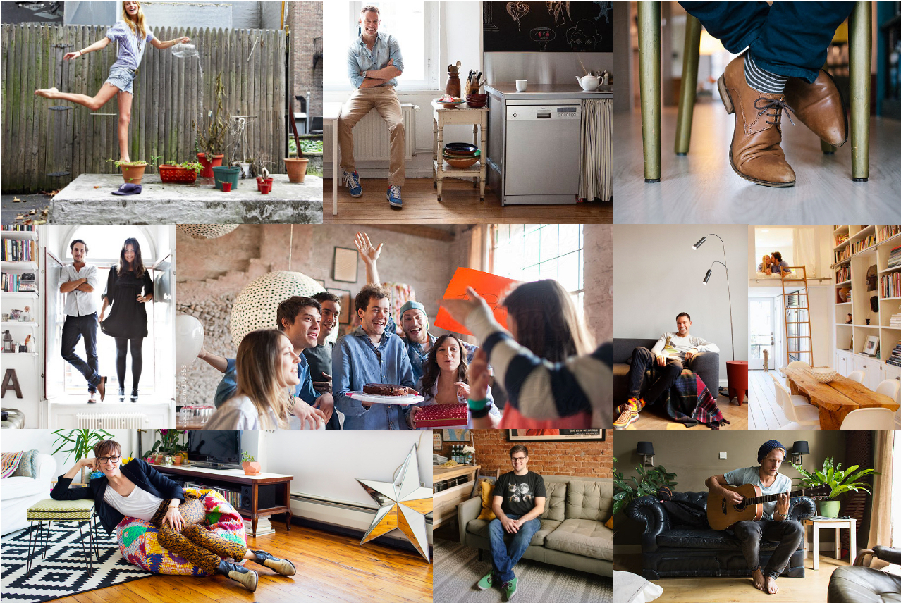
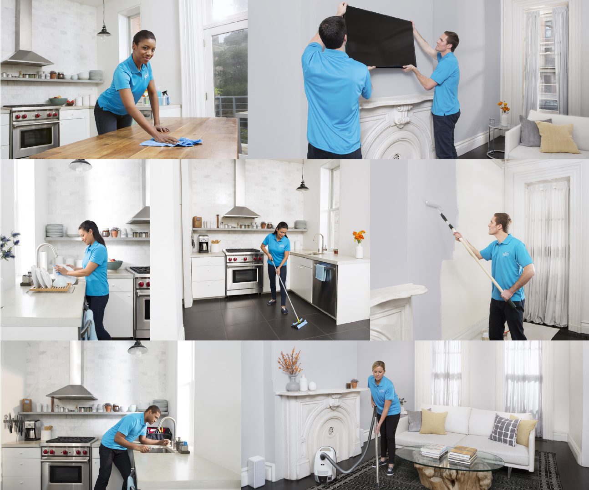

# Brand Guidelines

## Tone & Messaging

The tone of voice is energetic, punchy and clever, and calls on consumers to get their home in order. Never patronizing, alarmist or judgmental, Handy is always positive and optimistic, with an inherent ease. Messaging reflects the brand personality - expert, premium, charismatic and personal. It taps into the true emotional benefits of having a home in great condition, while clearing referencing cleaning or home services as the first, and most important, step.

## Photography

### Marketing

Show people being themselves, sometimes even looking at the camera. A little quirky and a lot of fun. Bring to life the individual. Handy handles your space so that you, as a unique individual can get on with your life and shine. Everyone is enjoying their homes immensely! 

•People enjoying their apartment \(Reading, talking to friends, cooking, eating breakfast in bed, etc\).   
• Young professionals 25-35 years old.   
• Make sure we are representing diversity.   
• Be celebratory. Playful, relaxed – but natural and not posed.   
• Location: living room, kitchen, bedroom, laundry room.   
• Not eclectic, or hipster/Brooklyn. Stay away from vintage.   
• Aspirational apartment but not high-end.   
• Should feel vibrant: bright and optimistic but still feel natural.   
• Should feel clean and organized.   
• Mostly white with accents of color.   
• For use on web horizontal shots are preferred \(with room for cropping\).

### Pros

Show Handy Professionals active and focusing on their jobs, inside a bright home, looking active, with their tools or mops \(and alone or with a happy customer in the vicinity\). Use interesting angles. Aim for a documentary style that follows the best real user experience scenario.

### Services

Photos should be very clear and illustrative of the service it is representing. It should feel authentic \(show tools or finished product\).

