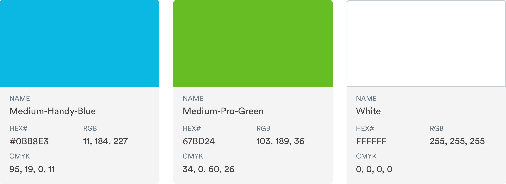
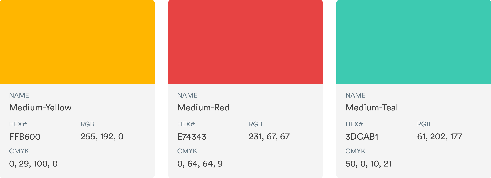
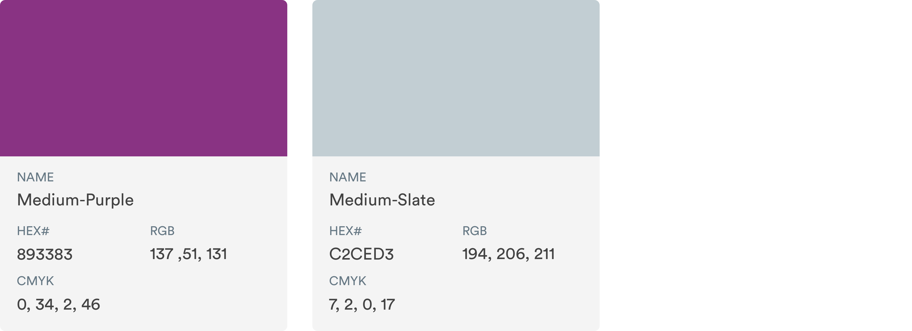
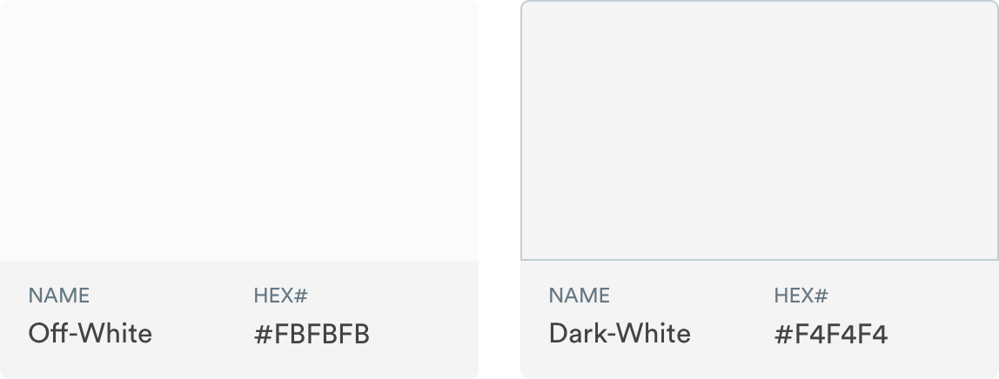
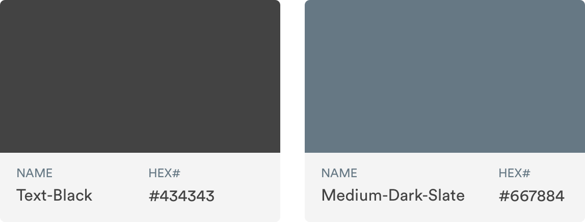
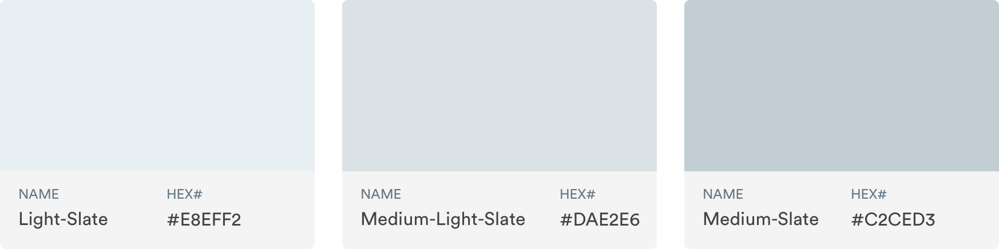

# Color System

## Color Palette

Color helps distinguishes our brand and helps us to create consistent experiences across marketing and products.

### Primary Palette

| Color Name | Hex Code |
| :--- | :--- |
| Medium-Handy-Blue | \#0BB8E3 |
| Medium-Pro-Green | \#67BD24 |
| White | \#FFFFFF |

### Secondary Palette

Our secondary palette contains a variety of colors to keep things interesting. Use in conjunction with our primary palette for more creative work like marketing, email, etc.

| Color Name | Hex Code |
| :--- | :--- |
| Medium-Yellow | \#FFB600 |
| Medium-Red | \#E74343 |
| Medium-Teal | \#3DCAB1 |

| Color Name | Hex Code |
| :--- | :--- |
| Medium-Purple | \#893383 |
| Medium-Slate | \#C2CED3 |

### Supporting Color Use

Off-White: \#FBFBFB  
Uses: Text field interiors.

Dark-White: \#F4F4F4

Text-Black: \#434343  
Uses: All paragraph, header, text

Medium-Dark-Slate: \#667884  
Users: Tertiary text, metadata

Light-Slate: \#E8FF2  
Uses: Lighter divider line - use in lists views or in instances where there is a lot of repeating cells

Medium-Light-Slate: \#DAE2E6  
Uses: Darker divider line - use in more functional instances like sticking headers or section headers.

Medium-Slate: \#C2CED3  
Uses: Input field stroke, filter stroke, radio or checkbox outlines.

### Extended Color Palette































