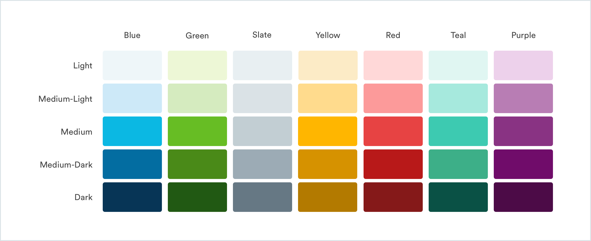

# Color System

## Color System

Color helps distinguishes our brand and helps us to create consistent experiences across the Handy platform

## Blue

| Color | Name | Hex Code | RGB |
| :--- | :--- | :--- | :--- |
|  | Blue-Light | `#EEF6F9` | 238, 246, 249 |
|  | Blue-Medium-Light | `#CDE9F8` | 205, 233, 248 |
|  | Blue-Medium | `#0BB8E3` | 11, 184, 227 |
|  | Blue-Medium-Dark | `#036DA1` | 3, 109, 161 |
|  | Blue-Dark | `#073556` | 7, 53, 86 |

## Green

| Color | Name | Hex Code | RGB |
| :--- | :--- | :--- | :--- |
|  | Green-Light | `#EDF7D6` | 237, 247, 214 |
|  | Green-Medium-Light | `#D5EBBF` | 103, 189, 36 |
|  | Green-Medium | `#67BD24` | 103, 189, 36 |
|  | Green-Medium-Dark | `#4A8A18` | 74, 138, 24 |
|  | Green-Dark | `#215913` | 33, 89, 19 |

## Teal

| Color | Name | Hex Code | RGB |
| :--- | :--- | :--- | :--- |
|  | Teal-Light | `#E0F6F2` | 224, 246, 242 |
|  | Teal-Medium-Light | `#A6E9DD` | 166, 233, 221 |
|  | Teal-Medium | `#3DCAB1` | 61, 202, 177 |
|  | Teal-Medium-Dark | `#3DAF88` | 61, 175, 136 |
|  | Teal-Dark | `#0A5145` | 10, 81, 69 |

## Yellow

| Color | Name | Hex Code | RGB |
| :--- | :--- | :--- | :--- |
|  | Yellow-Light | `#FCEBC6` | 252, 235, 198 |
|  | Yellow-Medium-Light | `#FFDB8D` | 255, 219, 141 |
|  | Yellow-Medium | `#FFB600` | 255, 182, 0 |
|  | Yellow-Medium-Dark | `#D69200` | 214, 146, 0 |
|  | Yellow-Dark | `#B37A00` | 179, 122, 0 |

## Purple

| Color | Name | Hex Code | RGB |
| :--- | :--- | :--- | :--- |
|  | Purple-Light | `#EDD1EB` | 237, 209, 235 |
|  | Purple-Medium-Light | `#B87DB4` | 184, 125, 180 |
|  | Purple-Medium | `#893383` | 137, 51, 131 |
|  | Yellow-Medium-Dark | `#700C6A` | 112, 12, 106 |
|  | Purple-Dark | `#4C0B47` | 76, 11, 71 |

## Red

| Color | Name | Hex Code | RGB |
| :--- | :--- | :--- | :--- |
|  | Red-Light | `#FFD8D8` | 255, 216, 216 |
|  | Red-Medium-Light | `#FC9A9A` | 252, 154, 154 |
|  | Red-Medium | `#E74343` | 231, 67, 67 |
|  | Red-Medium-Dark | `#B81919` | 184, 25, 25 |
|  | Red-Dark | `#851919` | 133, 25, 25 |

## Slate

| Color | Name | Hex Code | RGB |
| :--- | :--- | :--- | :--- |
|  | Slate-Light | `#E8EFF2` | 232, 239, 242 |
|  | Slate-Medium-Light | `#DAE2E6` | 218, 226, 230 |
|  | Slate-Medium | `#C2CED3` | 194, 206, 211 |
|  | Slate-Medium-Dark | `#9CABB5` | 156, 171, 181 |
|  | Slate-Dark | `#667884` | 102, 120, 132 |

## Supporting Colors

| Color | Name | Hex Code | RGB |
| :--- | :--- | :--- | :--- |
|  | Off-White | `#FBFBFB` | 251, 251, 251 |
|  | Dark-White | `#F4F4F4` | 244, 244, 244 |
|  | Text-Black | `#434343` | 67, 67, 67 |

## Color Table

|  | Blue | Green | Slate | Yellow | Red | Teal | Purple |
| :--- | :--- | :--- | :--- | :--- | :--- | :--- | :--- |
| **Light** | `#EEF6F9` | `#EDF7D6` | `#E8EFF2` | `#FCEBC6` | `#FFD8D8` | `#E0F6F2` | `#EDD1EB` |
| **Medium-Light** | `#CDE9F8` | `#D5EBBF` | `#DAE2E6` | `#FFDB8D` | `#FC9A9A` | `#A6E9DD` | `#B87DB4` |
| **Medium** | `#0BB8E3` | `#67BD24` | `#C2CED3` | `#FFB600` | `#E74343` | `#3DCAB1` | `#893383` |
| **Medium-Dark** | `#036DA1` | `#4A8A18` | `#9CABB5` | `#D69200` | `#B81919` | `#3DAF88` | `#700C6A` |
| **Dark** | `#073556` | `#215913` | `#667884` | `#B37A00` | `#851919` | `#0A5145` | `#4C0B47` |

