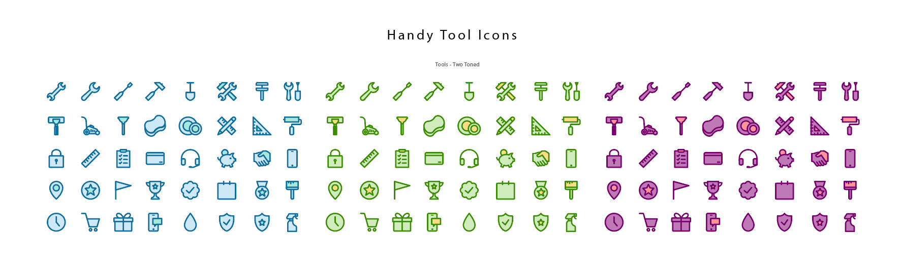
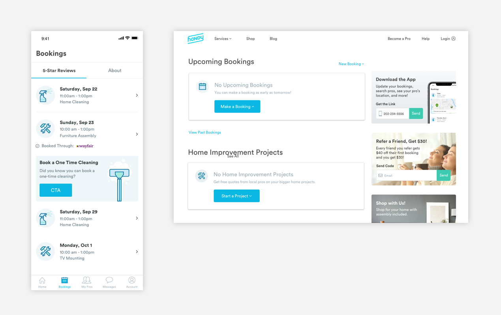
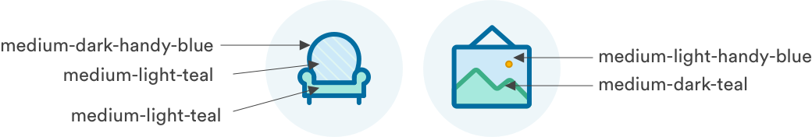
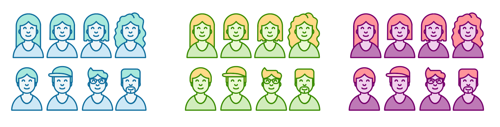
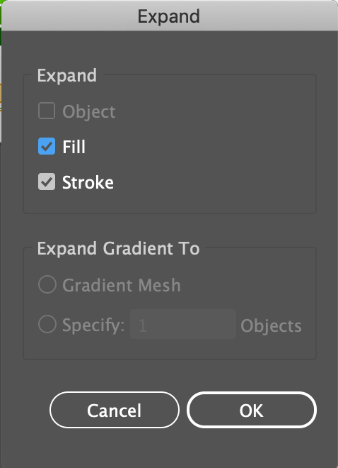
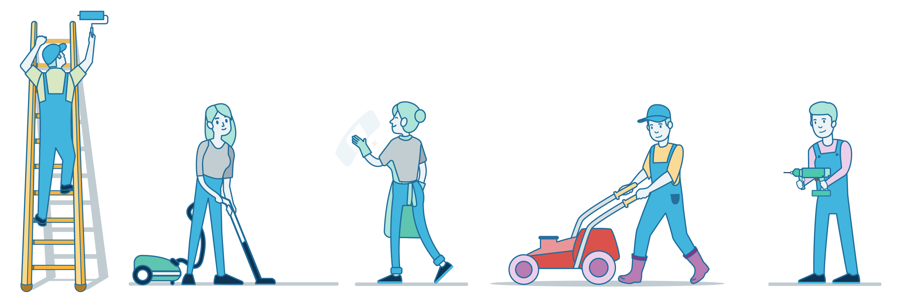

# Expressive Icons

## Two-Tone Icons

These icons have a bit more pop and personality than our standard [line icons](line-icons.md). Textures can be added to create more depth. These icons can be found in areas that need more visuals like on the home page or booking cards. These icons can also be used for marketing purposes.

These icons follow a formula and use a primary and secondary color. Shades of the primary color are used for stroke and fill while secondary colors are used for minor details like a smaller fill area or texture.

### Usage of Two Tone Icons

Two tone icons can be used to represent services, or add color interest. See below for examples from the My Services page on native and web. 

### Creating Two Tone Icons

**1. Reference the Simple Line Icon Set in the shared folder** 

See if you can find what you're looking for. To ensure consistency of shape, please start here before starting from scratch or purchasing on iStock

**2. Recolor the line icon accordingly** 

Strokes use the medium-dark shade of a primary [Handy color](color-system.md). Fills use the medium-light shade of that primary color.  If multiple fill areas, textures, or strokes are needed, the light shade of the secondary color can also to be used.

Secondary color use is at the discretion of the creator.

Here are the recommended color combinations:

Primary Color: Handy Blue  
Secondary Color: Teal

Primary Color: Green  
Secondary Color: Yellow

Primary Color: Purple  
Secondary Color: Re

**3. Expand the shape** 

After creating the new icon \(as a stroke\), copy and paste it over to the corresponding "expanded" artboard and Expand the shape

**4. Transfer icon from Illustrator to Sketch Master file**

Copy paste your icon from Illustrator to a 64px by 64px artboard into the Master Symbols sketch file. Icons do not all have be square, but must not exceed 64px in any way. 

**5. Name and create a new symbol**

Name your icon so it matches the other two tone symbols: 

icon/two\_tone/name of new icon

Hit "Create Symbol" on Sketch to turn the icons into a symbol.

## Full Color Graphics

Product marketing, emails, and ad campaigns can take a more creative approach. As long as the color palette is used and the stroke width and radius are kept consistent, our graphic style can be taken in any direction. Here are some ideas or ways you can use our icons and color palette. These types of graphics should be used for customer-facing interfaces where there is enough space to show details, such as Web and Email. 

### General Rules for Full Color Graphics

There is no exact formula for creating these graphics, but we have created a list of rules around how to build them so they stay consistent from designer to designer. 

1. Scenes should be self-contained. People and objects should be anchored to the same base, and not "floating" in the space. Placement of people and objects should create a sense of foreground and depth. 

2. For the most part, all individual pieces of the scene should have a monochrome fill and be outlined in the same stroke style \(stroke should stay the same color and weight regardless of fill color\)

3. Strive for a sense of fun by using whimsical color combinations and avoiding overly detailed or realistic renderings. Colors should be playful and light. 

4\) Blue-Medium \(\#0BB8E3\) should feature prominently in order to add a sense of consistency and branding to all graphics. If there is a professional in the scene, they should be wearing Handy Blue. 

### Creating New Graphics

All graphics should be created in Illustrator on an 1000px \(width can be variable\) by 1000px artboard. 

All corners should be rounded \(no sharp edges\). Depending on the level of detail - stroke widths should be 4px or 6px.

It is most efficient to buy some basic ESP files and then recolor and edit them to fit the Handy aesthetic. [See our board on iStock](https://www.istockphoto.com/collaboration/boards/iZr2_irslUGw9vD4vtllkA)

If you are able to use parts of previously created scenes, you should integrate them into your graphic \(in the long run this will help us create a Handy "world" where the same plants or objects appear again and again\).

Once finished, add the graphic to the Master Icons File and re-upload the most recent file to Gitbook so it can be used by other designers in the future.

After creating a new icon, it's important to follow these steps so that we can keep our iconography consistent between designers and we can easily proliferate any updates to the design team.

## Downloads



### Master Icon Library



