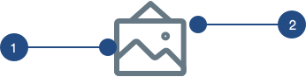
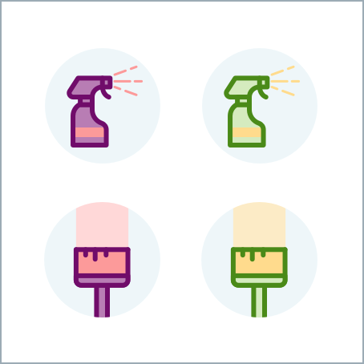
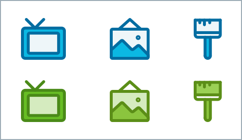

# Iconography

## Iconography

Icons provide visual context and hints of our branding throughout the app. They should communicate meaning and be the recognizable to users. Our icons will be clean, simple and friendly.

We have different levels of fidelity depending on the context of the icon.

## General Style



1. Stroke is always 2px

2. Radius is always 5px

## Line Icons

These icons will be the most basic style of icons. These style of icons will be used for links or inline text.

### Link Icons

Link icons can be found in the header or buttons. Since these icons acts as links, they will be colored in Medium-Handy-Blue like other links.

```text
color: medium-handy-blue
max-width: 20px
max-height: 20px
```

### Inline Text Icons

Inline text icons are mostly illustrative and give more visual elements to a text heavy area. These icons can be found as metadata in pro cards, bookings cards, and cleaning routine lists.


```text
color: medium-dark-slate
max-width: 12px
broder: 1px
```


```text
color: medium-dark-slate
max-width: 24px
```

## Two-Tone Icons

These icons have a bit more pop and personality. Textures can be added to create more depth. These icons can be found in areas that need more visuals like the home page or booking card. These icons can also be used for marketing purposes.


These icons follow a formula and use a primary and secondary color. Shades of the primary color are used for stroke and fill while secondary colors are used for minor details like a smaller fill area or texture.

**Sizes:**

```text
background: light-handy-blue
max-width: 48px (home page)
max-width: 64px (avatar)
```

**Primary Colors:** Strokes use the medium-dark shade of the primary color. Fills use the medium-light shade of a primary color.

**Secondary Colors:** Strokes: medium-dark shade of secondary color. Fill: medium-light shade of secondary color. If multiple fill areas, textures, or strokes are needed, the light shade of the secondary color can also to be used.

Secondary color use is at the discretion of the creator but it must be a small part of the icon.


### Color Combinations

Here are the recommended color combinations:

Primary Color: Handy Blue  
Secondary Color: Teal

Primary Color: Purple  
Secondary Color: Red

Primary Color: Green  
Secondary Color: Yellow



## Marketing Icons

Product marketing, emails, and ad campaigns can take a more creative approach. As long as the color palette is used and the stroke width and radius is kept consistent, icons can be taken in any direction. Here are some ideas or ways you can use our icons and color palette.

### Monochrome

Icons can be monochrome style using this formula. Any color can be used:   
Stroke: medium-dark  
Darker Fill: medium  
Lighter Fill: light



### Full Color

For more creative purposes full color can be used. No formula but please exercise taste!


