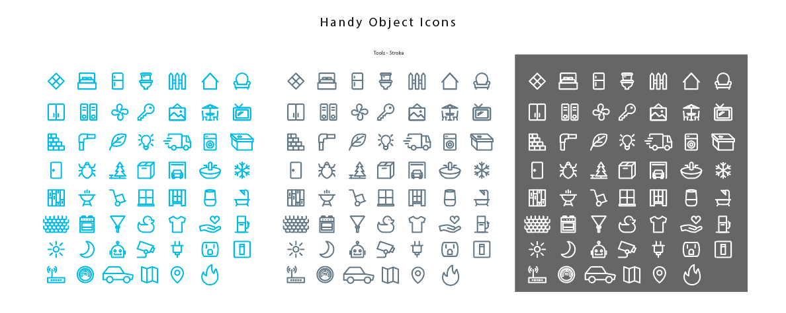
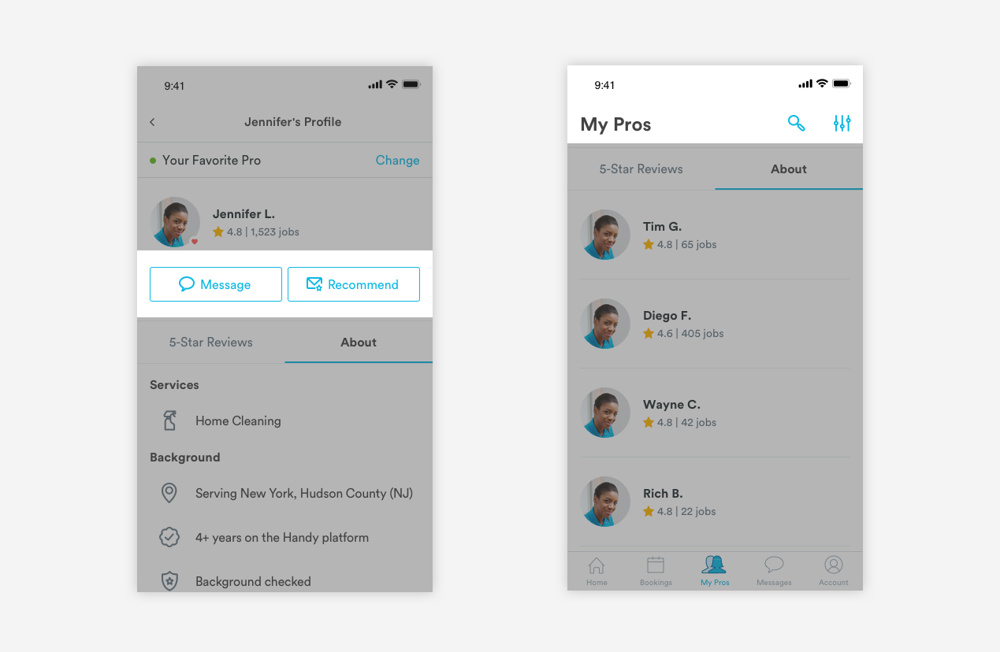
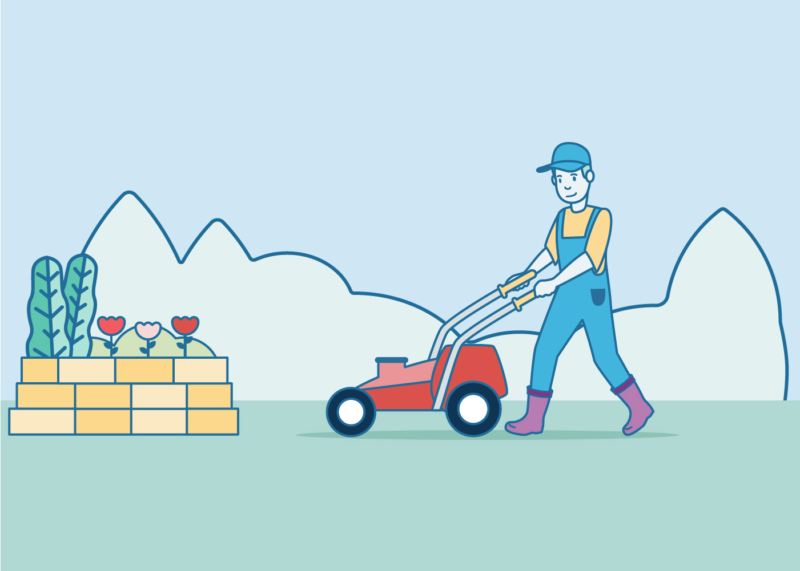

# Iconography

## General Style


1. Stroke is always 2px

2. Radius is always 5px

## Line Icons

These icons will be the most basic style of icons. These style of icons will be used for links or inline text. If a line icon is needed outside links or inline text, please scale proportionally. 



### Link Icons 

Link icons can be found in the headers or buttons. Since these icons acts as links, they will be colored in Blue-Medium like other links.



```text
color: medium-handy-blue
max-width: 20px
max-height: 20px
```

### Inline Text Icons

Inline text icons are mostly illustrative and give more visual elements to a text heavy area. These icons can be found as metadata in pro cards, bookings cards, and cleaning routine lists.


#### Small inline text icons 

```text
color: slate-medium-dark
max-width: 12px
border: 1px
```

#### Large Inline Text Icons

```text
color: slate-medium-dark
max-width: 24px
```

## Two-Tone Icons

These icons have a bit more pop and personality. Textures can be added to create more depth. These icons can be found in areas that need more visuals like the home page or booking card. These icons can also be used for marketing purposes.

These icons follow a formula and use a primary and secondary color. Shades of the primary color are used for stroke and fill while secondary colors are used for minor details like a smaller fill area or texture.


### Usage of Two Tone Icons

Two tone icons can be used to represent services, or add color interest. See below for examples from the My Services page on native and web. 


### Creating Two Tone Icons

**Sizes:**

```text
background: light-handy-blue
max-width: 48px (home page)
max-width: 64px (avatar)
```

**Primary Colors:** Strokes use the medium-dark shade of the primary color. Fills use the medium-light shade of a primary color.

**Secondary Colors:** Strokes: medium-dark shade of secondary color. Fill: medium-light shade of secondary color. If multiple fill areas, textures, or strokes are needed, the light shade of the secondary color can also to be used.

Secondary color use is at the discretion of the creator.


**Color Combinations:**

Here are the recommended color combinations:

Primary Color: Handy Blue  
Secondary Color: Teal

Primary Color: Green  
Secondary Color: Yellow

Primary Color: Purple  
Secondary Color: Re


## Full Color Graphics

Product marketing, emails, and ad campaigns can take a more creative approach. As long as the color palette is used and the stroke width and radius are kept consistent, our graphic style can be taken in any direction. Here are some ideas or ways you can use our icons and color palette. These types of graphics should be used for customer-facing interfaces where there is enough space to show details, such as Web and Email. 





### General Rules for Full Color Graphics

There is no exact formula for creating these graphics, but we have created a list of rules around how to build them so they stay consistent from designer to designer. 

1. Scenes should be self-contained. People and objects should be anchored to the same base, and not "floating" in the space. Placement of people and objects should create a sense of foreground and depth. 

2. For the most part, all individual pieces of the scene should have a monochrome fill and be outlined in the same stroke style \(stroke should stay the same color and weight regardless of fill color\)

3. Strive for a sense of fun by using whimsical color combinations and avoiding overly detailed or realistic renderings. Colors should be playful and light. 

4\) Blue-Medium \(\#0BB8E3\) should feature prominently in order to add a sense of consistency and branding to all graphics. If there is a professional in the scene, they should be wearing Handy Blue. 

### Creating New Graphics

All graphics should be created in Illustrator on an 1000px \(width can be variable\) by 1000px artboard. 

All corners should be rounded \(no sharp edges\). Depending on the level of detail - stroke widths should be 4px or 6px.

It is most efficient to buy some basic ESP files and then recolor and edit them to fit the Handy aesthetic. [See our board on iStock](https://www.istockphoto.com/collaboration/boards/iZr2_irslUGw9vD4vtllkA)

If you are able to use parts of previously created scenes, you should integrate them into your graphic \(in the long run this will help us create a Handy "world" where the same plants or objects appear again and again\).

Once finished, add the graphic to the Master Icons File and re-upload the most recent file to Gitbook so it can be used by other designers in the future.

## How to create new icons 

After creating a new icon, it's important to follow these steps so that we can keep our iconography consistent between designers and we can easily proliferate any updates to the design team.

1. Reference the Simple Line icon set to see if you can find what you're looking for. To ensure consistency of shape, please start here before starting from scratch or purchasing on iStock.

2. Make the icon in blue, slate, white, and all three 2-tone colors.

3. After creating the new icon \(as a stroke\), copy and paste it over to the corresponding "expanded" artboard and Expand the shape. \(skip step for 2-tone icons\) 


4. Copy and paste the icon \(and all of its colored variants\) onto a 64px by 64px artboard into the Master Symbols sketch file. Icons do not all have be square, but must not exceed 64px in any way. 

5. Name your icon \(the group and the artboard\) according to our naming conventions:  
Object Icons: a-object/\[name of new icon\]/\[color\] or a-object/\[name of new icon\]/2-tone/\[color\]   
Tool Icons: a-tool/\[name of new icon\]/\[color\] or a-tool/\[name of new icon\]/2-tone/\[color\] 

6. Hit "Create Symbol" on Sketch to turn the icons into a symbol.

7. If your new icon is not a square, head to the "Symbols" page on the sketch file and change the artboard to 64x64px. Clean up the symbol on the "Consumer Symbols" page by changing the dimensions of your symbol to 64x64px.

8. Upload the new illustrator file onto this Gitbook page. Hit save on the Master Symbols File so that changes will be pushed and synced on Google Drive.  


## Downloads

### Simple Line Icons 



### Master Icon Library




