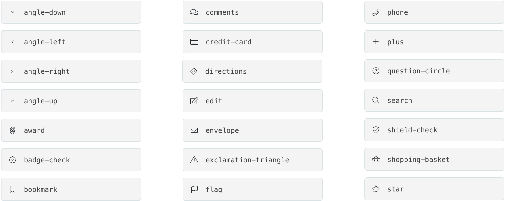
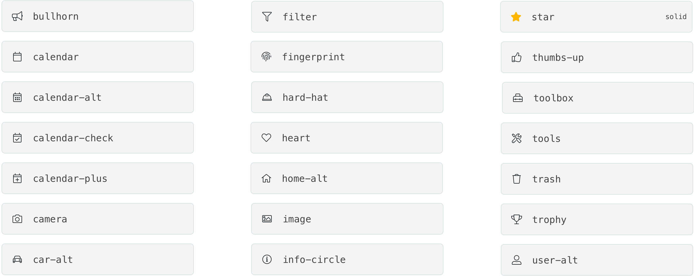
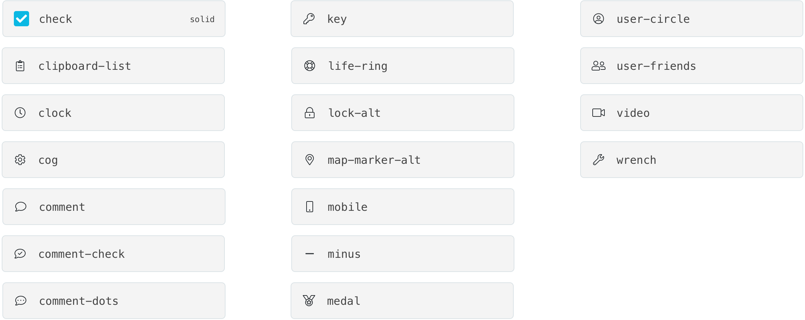
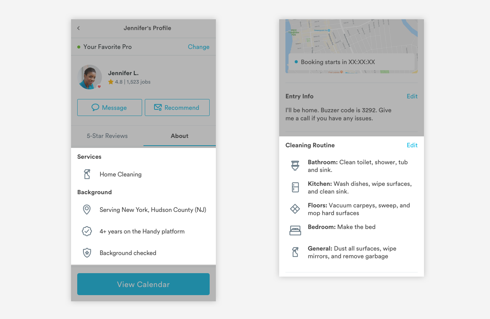
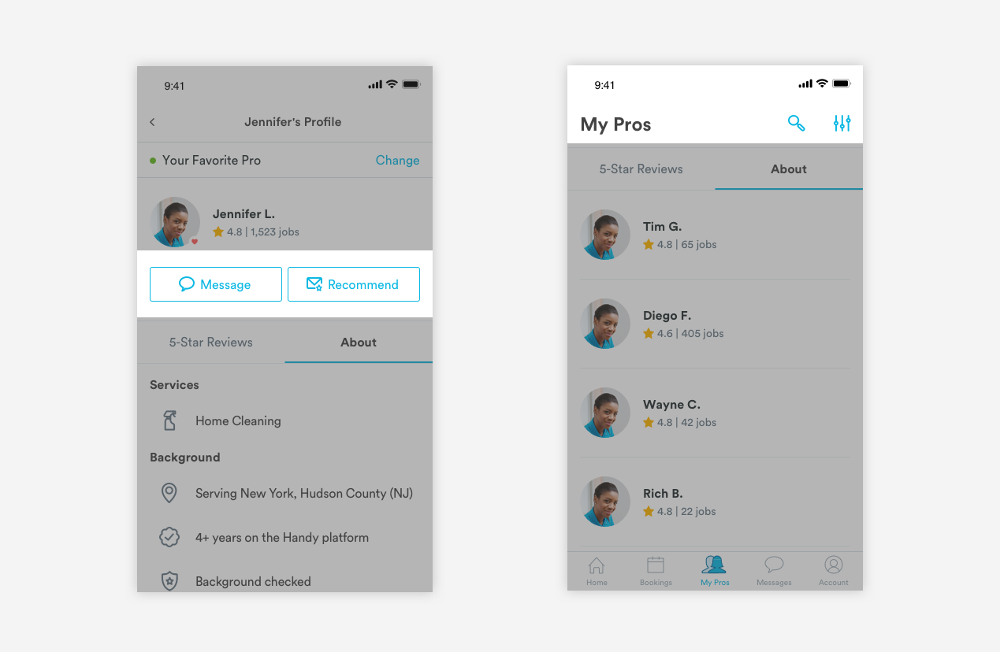

# Line Icons

## FontAwesome Guidelines

The Handy team uses FontAwesome Pro icons for all interface icons and all icons that are set in-line with text.

Handy maintains pro account licenses for each member of the design team & engineering team. This perpetual license allows us to embed Font Awesome Pro on our site and apps, install and use on the desktop \(e.g. Word, Powerpoint, Keynote, etc.\), and download and serve Pro Icons.

You cannot distribute Pro to people not specifically covered by your license \(e.g. you can't provide the files in your open source public repo\).

## Icon List

Basic icons can be found below 

All available icons can be found at [https://fontawesome.com/cheatsheet/pro/light](https://fontawesome.com/cheatsheet/pro/light)

### Inline Text Icons

Inline text icons are mostly illustrative and give more visual elements to a text heavy area. These icons can be found as metadata in pro cards, bookings cards, and cleaning routine lists.

### Link Icons 

Link icons can be found in the headers or buttons. Since these icons acts as links, they will be colored in Blue-Medium like other links.

