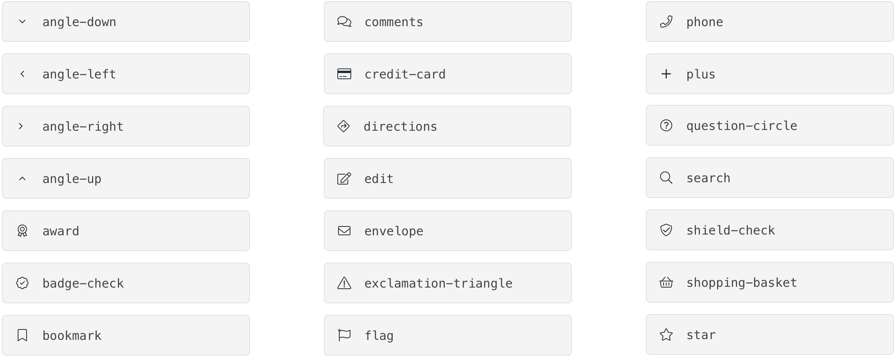
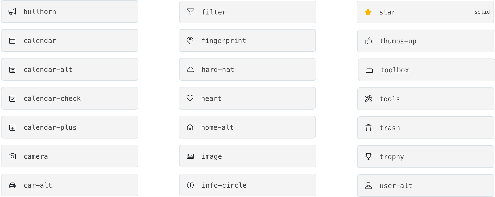
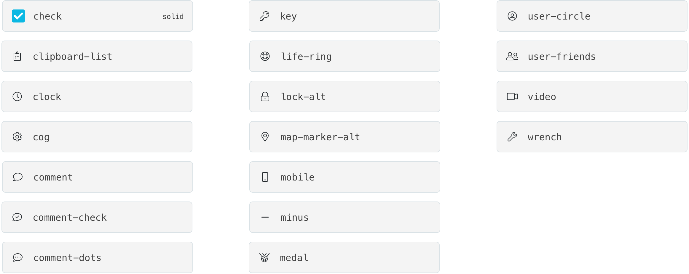

# Line Icons

## FontAwesome Guidelines

The Handy team uses FontAwesome Pro icons for all interface icons and all icons that are set in-line with text.

Handy maintains pro account licenses for each member of the design team & engineering team. This perpetual license allows us to embed Font Awesome Pro on our site and apps, install and use on the desktop \(e.g. Word, Powerpoint, Keynote, etc.\), and download and serve Pro Icons.

You cannot distribute Pro to people not specifically covered by your license \(e.g. you can't provide the files in your open source public repo\).

## Icon List

Basic icons and naming conventions are listed below, but all the FontAwesome icons are fair game for product and marketing usage as long as they are the Light styling.  

All icons can be found at [https://fontawesome.com/cheatsheet/pro/light](https://fontawesome.com/cheatsheet/pro/light)

## Line Icon Usage

### Inline Text Icons

Inline text icons lend a visual element to a text heavy area or draw the eye to a key metadata metrics. Inline icons can be used in pro cards, service cards and lists to add visual cues.

Icons should always be the same font size and color as the inline text they accompany. 

The only exception to this rule is certain filled icons \(using FontAwesome's solid icon library\) can be a different color than their inline text. For example, Instant Pricing is indicated by a filled green icon and star ratings are always shown with a filled yellow-medium star icon. These exceptions should be used sparingly to highlight important information. 

### Link Icons 

Link icons can be found in the header of the app, next to links, or inside buttons. Since these icons acts as links, they will be colored in Blue-Medium like other links.

### Interface Icons

We use FontAwesome for all interface icons. Interface icons enhance usability and allow users to navigate page elements. Interface icons indicate that something is clickable, but they are Text Black or Slate-Medium-Dark because they are ubiquitous to the site and app, and therefore do not need to be blue links. 

