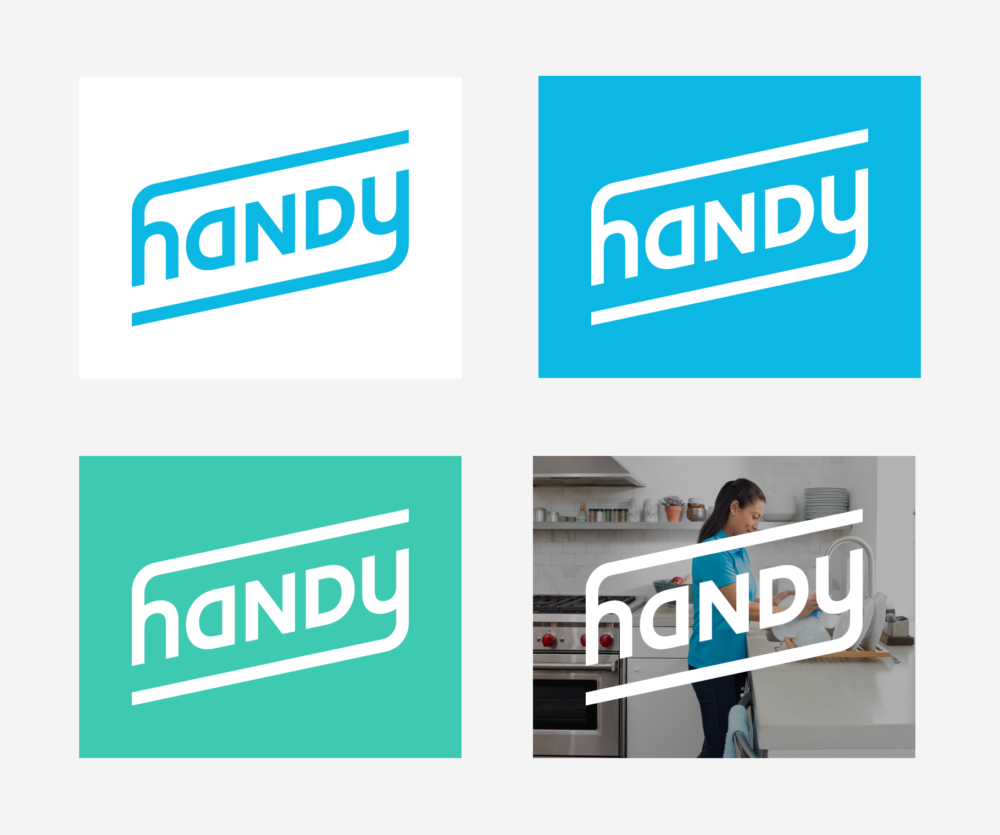
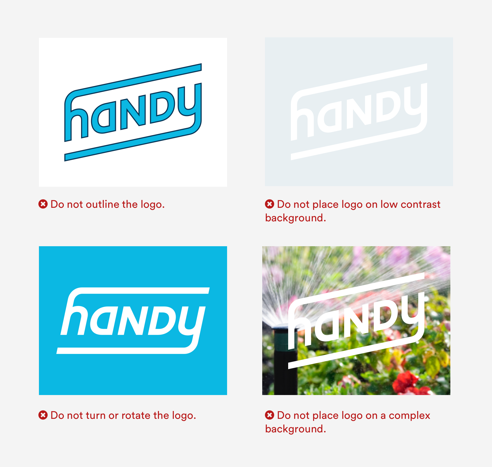

# Logo

## Logo Usage

Use the logo in Handy blue against white, white against a solid color, or white against a darkened image or video. When using the logo in white, make sure there is enough contrast in the background so that the logo remains clear and legible. Be sure to leave enough space around the logo for it to breathe.

### Logo Misuse

In general, do not alter the logo itself beyond changing the fill color. The logo should always be clear and recognizable, the presentation should be neat and simple. 

## Downloads 

#### Illustrator



#### SVG





#### PNG





#### PDF





