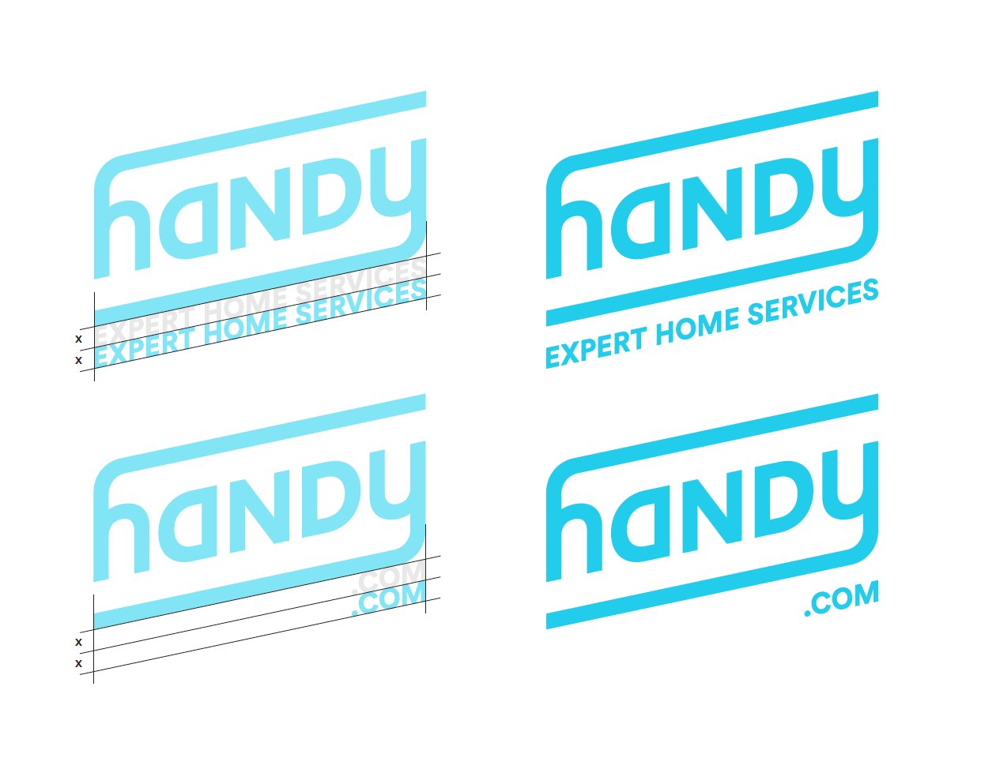

# Logo

## Logo Usage

There are no predetermined sizes for the Handy logo. Scale and proportion should be determined by the available space, aesthetics, function and visibility. There is no preset maximum size for the logo. Minimum sizes are as shown here.

Use the logo in Handy blue against white, white against a solid color, or white against a darkened image or video. When using the logo in white, make sure there is enough contrast in the background so that the logo remains clear and legible. Be sure to leave enough space around the logo for it to breathe.

### Logo Misuse

In general, do not alter the logo itself beyond changing the fill color. The logo should always be clear and recognizable, the presentation should be neat and simple. 

## Logo Add Ons

Logo add ons can be used to add marketing blurbs or to help differentiate Handy properties \(Handy Pro app\). The add on must be in Circular Medium.

## Downloads 

#### Illustrator



#### SVG





#### PNG





#### PDF





