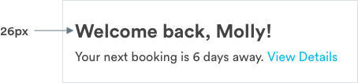
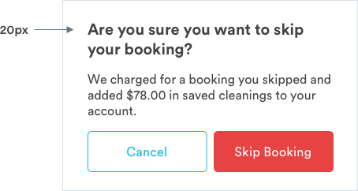
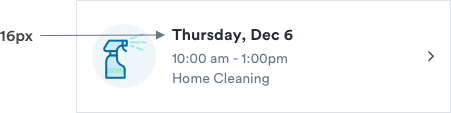
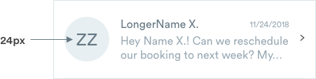
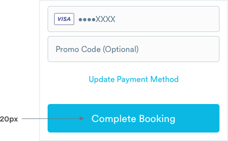
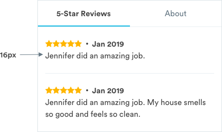
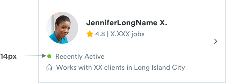
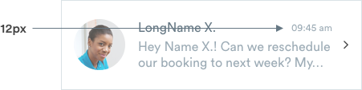
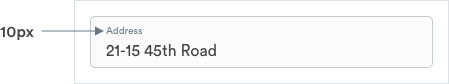

# Native App Typography

## Handy Font

Handy's typography system uses different type weights and sizes of the Circular font \(available for download below\). The systems enables content on pages to be clearly structured and easy to digest.



## Typography System

\*\*\*\*[**1.  Header 1 \(a-text-h1\)**](typography.md#header-1-a-text-h-1)  
****[**2. Header 2 \(a-text-h2\)**](typography.md#header-2-a-text-h-2)  
[**3. Header 3 \(a-text-h3\)**](typography.md#header-3-a-text-h-3)  
[**4. Header 4 \(a-text-h4\)**](typography.md#header-4-a-text-h-4)  
****[**5. Subheader \(a-text-subheader\)**  
](typography.md#subheader-a-text-subheader)\*\*\*\*[**6. Avatar \(a-text-avatar\)**](typography.md#avatar-a-text-avatar)  
****[**7. Button CTA \(a-text-button\)**](typography.md#button-cta-a-text-button)  
[**8. Paragraph \(a-text-paragraph\)**](typography.md#paragraph-a-text-paragraph)  
[**9. Tertiary \(a-text-tert\)**](typography.md#tertiary-a-text-tert)  
[**10. Subtitle 1 \(a-text-subtitle-1\)**](typography.md#subtitle-1-a-text-subtitle-1)  
[**11. Subtitle 2 \(a-text-subtitle-2\)**](typography.md#subtitle-2-a-text-subtitle-2)  
[**12. Label \(a-text-label\)**](typography.md#label-a-text-label)


## Header 1 \(a-text-h1\)

Header 1 styling is used for important content headers on main pages. Can be used on the home page.

```text
font-weight: bold
font-size: 26px
font-color: text-black
```



## Header 2 \(a-text-h2\)

Header 2 styling is used headers for pages. Can be found in m-header-primary.

```text
font-weight: bold
font-size: 24px
font-color: text-black
```


## Header 3 \(a-text-h3\)

Header 3 styling is used as titles on pages. Can be found in general content pages, m-half\_sheet, m-modal

```text
font-weight: bold
font-size: 20px
font-color: text-black
```



## Header 4 \(a-text-h4\)

Header 4 styling is used on cards, tabs, reviews, and product marketing  titles on pages.

```text
font-weight: bold
font-size: 16px
font-color: text-black
```



## Subheader \(a-text-subheader\)

Styling used in subheader \(m-header-secondary\)

```text
font-weight: medium
font-size: 16px
font-color: text-black
```


## Avatar \(a-text-avatar\)

Styling used in default customer avatars on the pro app.  
_Variations: a-text-avatar-slate-dark_

```text
font-weight: book
font-size: 24px

a-text-avatar (regular avatars and m-card-messages-unread):
font-color: text-black

a-text-avatar-slate-dark (m-card-message-read)
font-color: slate-dark
```



## Button CTA \(a-text-button\)

Button CTA styling is used on major CTAs \(m-button-primary, m-button-secondary\)  
_Variations: a-text-button-white, a-text-button-blue-medium_

```text
font-weight: book
font-size: 20px

Primary CTAs (a-text-button-white)
font-color: white

Secondary CTA(a-text-button-blue-medium)
font-color: blue-medium
```



## Paragraph \(a-text-paragraph\)

Paragraph styling is used for body copy on pages. Can be found in a-picker, m-review. m-list, m-text\_field, m-message, m-half\_sheet, m-modal, m-banner, m-prod-marketing. Paragraph styles can be different colors depending on context.   
_Variations: a-text-paragraph-blue-medium, a-text-paragraph-slate-dark, a-text-paragraph-slate-medium-dark, a-text-paragraph-white_

```text
font-weight: book
font-size: 16px

Links (a-button-link):
font-color: blue-medium

Body Copy (m-half_sheet, m-modal, m-banner, m-prod-marketing, m-text_field):
font-color: text-black, slate-dark
line-height: 1.5

Read Message (m-card-message-read):
font-color: slate-medium-dark

Banners (m-banner):
font-color: white
```



## Tertiary \(a-text-tert\)

Tertiary styling used for metadata \(m-metadata\) in cards  
_Variations: a-text-tert-slate-dark, a-text-tert-green-medium_

```text
font-weight: book
font-size: 14px

m-metadata:
font-color: slate-dark

Availability m-metadata
font-color: slate-dark, green-medium
```



## Subtitle 1 \(a-text-subtitle-1\)

Subtitle 1 styling is used for minor details like when a messages is sent \(m-card-message\)

```text
font-weight: medium
font-size: 12px
font-color: text-black
```


## Subtitle 2 \(a-text-subtitle-2\)

Subtitle 2 styling is used read messages \(m-card-message-read\)

```text
font-weight: book
font-size: 12px
font-color: slate-medium-dark
```



## Label \(a-text-label\)

Label styling is used in engaged text fields \(m-text\_field-filled\) or the navigation bar  
_Variations: a-text-label-slate-dark, a-text-label-slate-medium-dark, a-text-label-blue-medium_

```text
font-weight: book
font-size: 10px

Text Field (m-text_field-filled):
font-color: slate-dark

Navigation - Inactive State (m-nav):
font-color: slate-medium-dark

Navigation - Active State (m-nav):
font-color: blue-medium
```



