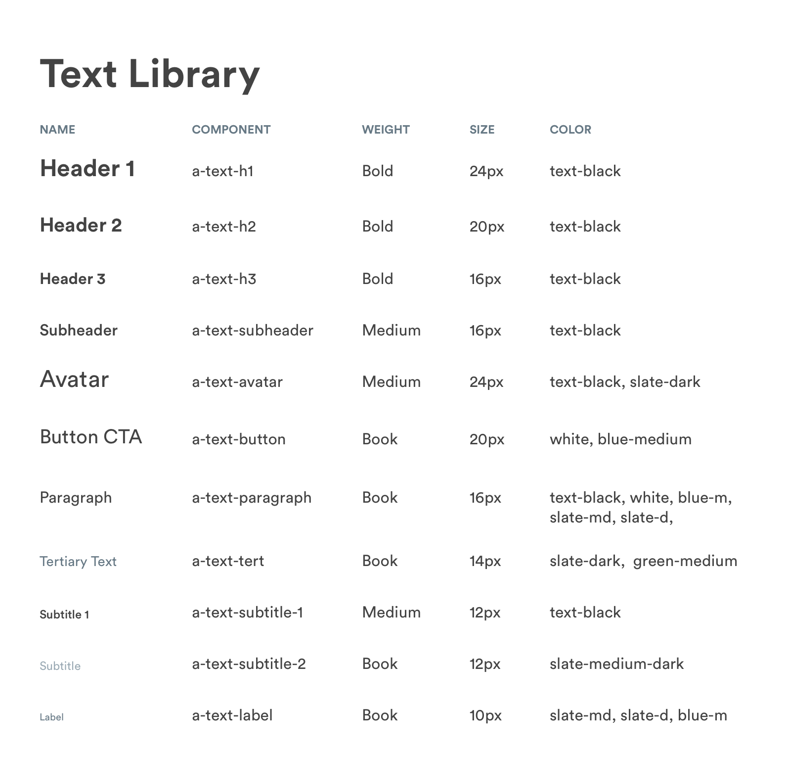

# Typography

## Handy Typography System

Handy's typography system uses different type weights and sizes of the Circular font \(available for download below\). The systems enables content on pages to be clearly structured and easy to digest.



## Typography System



\*\*\*\*[**1. Header 1 \(a-text-h1\)**](typography.md#header-1-a-text-h-1)  
[**2. Header 2 \(a-text-h2\)**](typography.md#header-2-a-text-h-2)  
[**3. Header 3 \(a-text-h3\)**](typography.md#header-3-a-text-h-3)  
[**4. Button CTA \(a-text-button\)**](typography.md#button-cta-a-text-button)  
[**5. Paragraph \(a-text-paragraph\)**](typography.md#paragraph-a-text-paragraph)  
[**6. Tertiary \(a-text-tert\)**](typography.md#tertiary-a-text-tert)  
[**7. Subtitle 1 \(a-text-subtitle-1\)**](typography.md#subtitle-1-a-text-subtitle-1)  
[**8. Subtitle 2 \(a-text-subtitle-2\)**](typography.md#subtitle-2-a-text-subtitle-2)  
[**9. Label \(a-text-label\)**](typography.md#label-a-text-label)

## Header 1 \(a-text-h1\)

Header 1 styling is used headers for pages. Can be found in m-header-primary.

```text
font-weight: bold
font-size: 24px
font-color: text-black
```

## Header 2 \(a-text-h2\)

Header 2 styling is used as titles on pages. Can be found in m-half\_sheet, m-modal

```text
font-weight: bold
font-size: 20px
font-color: text-black
```

## Header 3 \(a-text-h3\)

Header 3 styling is used on cards, tabs, reviews, and subheader titles on pages.

```text
font-weight: bold
font-size: 16px
font-color: text-black
```

## Button CTA \(a-text-button\)

Button CTA styling is used on major CTAs \(m-button-primary, m-button-secondary\)

```text
font-weight: book
font-size: 20px
font-color: white or blue-medium
```

## Paragraph \(a-text-paragraph\)

Paragraph styling is used for body copy on pages. Can be found in a-picker, m-review. m-list, m-text\_field, m-message, m-half\_sheet, m-modal, m-banner, m-prod-marketing. Paragraph styles can be different colors depending on context. 

```text
font-weight: book
font-size: 16px

Links (a-button-link):
font-color: blue-medium

Body Copy (m-half_sheet, m-modal, m-banner, m-prod-marketing, m-text_field):
font-color: text-black, slate-dark

Read Message (m-card-message-read):
font-color: slate-medium-dark

Banners (m-banner):
font-color: white
```

## Tertiary \(a-text-tert\)

Tertiary styling used for metadata \(m-metadata\) in cards

```text
font-weight: book
font-size: 14px

m-metadata:
font-color: slate-dark

Availability m-metadata
font-color: slate-dark, green-medium
```

## Subtitle 1 \(a-text-subtitle-1\)

Subtitle 1 styling is used for minor details like when a messages is sent \(m-card-message\)

```text
font-weight: medium
font-size: 12px
font-color: text-black
```

## Subtitle 2 \(a-text-subtitle-2\)

Subtitle 2 styling is used read messages \(m-card-message-read\)

```text
font-weight: book
font-size: 12px
font-color: slate-medium-dark
```

## Label \(a-text-label\)

Label styling is used in engaged text fields \(m-text\_field-filled\) or the navigation bar

```text
font-weight: book
font-size: 10px

Text Field (m-text_field-filled)
font-color: slate-dark

Navigation - Inactive State (m-nav)
font-color: slate-medium-dark

Navigation - Active State (m-nav)
font-color: blue-medium
```

