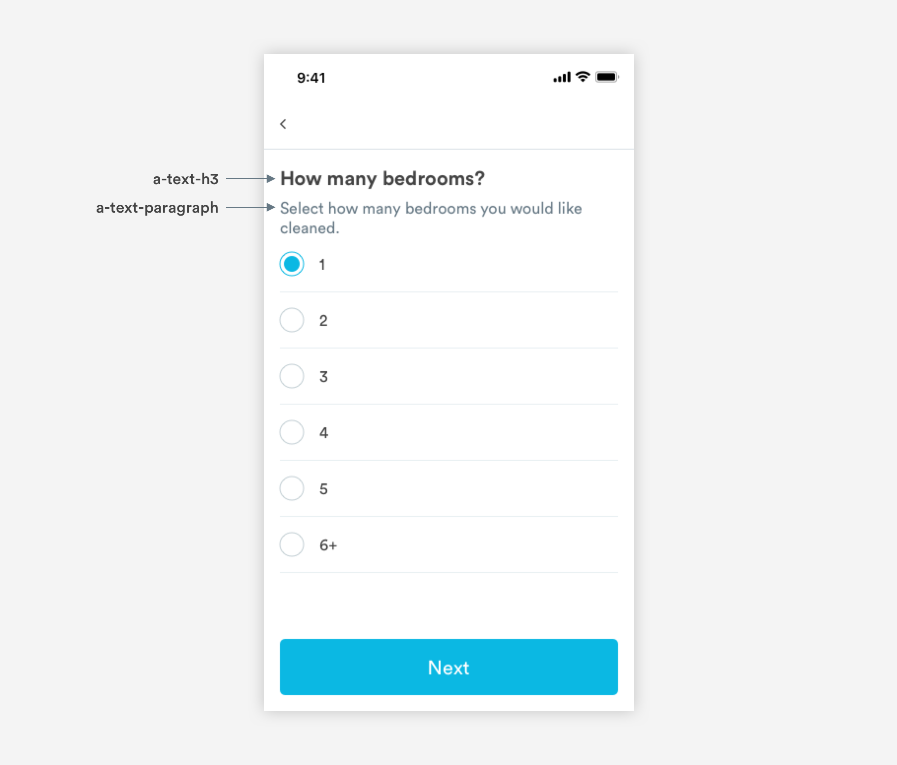
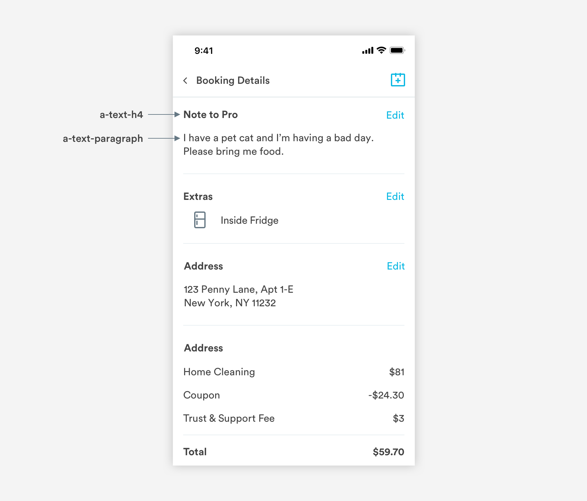
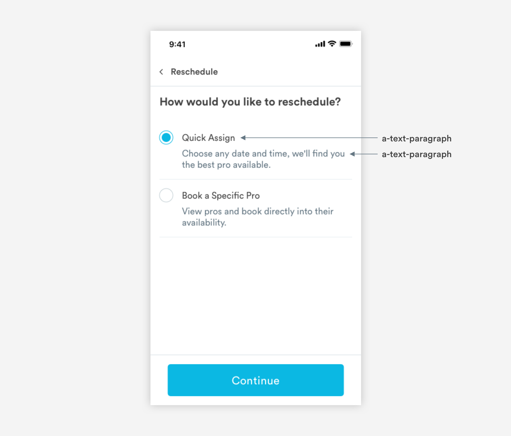
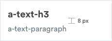
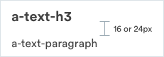
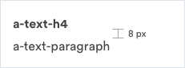
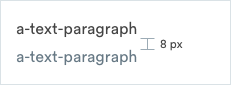

# Text Combinations

## Types of Text Combinations

\*\*\*\*[**1. Content Header**](text-combinations.md#content-header)\*\*\*\*



\*\*\*\*[**2. UI Header**](text-combinations.md#ui-header)\*\*\*\*


\*\*\*\*[**3. Content Subheader**](text-combinations.md#content-subheader)\*\*\*\*



\*\*\*\*[**4. Picker Text**](text-combinations.md#picker-text)\*\*\*\*



## Content Header

Content Header lockups are typically used at the top of a page. Can be found in booking flows, general content pages.



```
a-text-h2:
font-weight: bold
font-size: 20px
font-color: text-black
padding-bottom: 8px

a-text-paragraph
font-weight: book
font-size: 16px
font-color: slate-dark
```

## UI Header

UI Header lockups are typically used in modals and half sheets.



```text
a-text-h2:
font-weight: bold
font-size: 20px
font-color: text-black
padding-bottom (halfsheets): 16px
padding-bottom (modals): 24px

a-text-paragraph
font-weight: book
font-size: 16px
font-color: slate-dark
```

## Content Subheader

Content subheader lockups are used in content pages that need further separation/hierarchy. 



```text
a-text-h2:
font-weight: bold
font-size: 16px
font-color: text-black
padding-bottom: 8px

a-text-paragraph
font-weight: book
font-size: 16px
font-color: text-black
```

## Picker Text

Picker Text lockups are used in radio or checkbox pickers.



```text
a-text-paragraph
font-weight: book
font-size: 16px
font-color: text-black
padding-bottom: 8px

a-text-paragraph
font-weight: book
font-size: 16px
font-color: slate-dark
```

