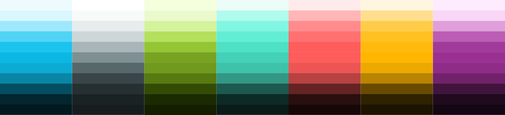

# Color System

Based on the original Handy colors, the color system expands each color to have 11 shades each. The UI / gray colors are a desaturated version of the Handy blue shades.

The original base color is `color50`. See the hex codes and variable names below.































