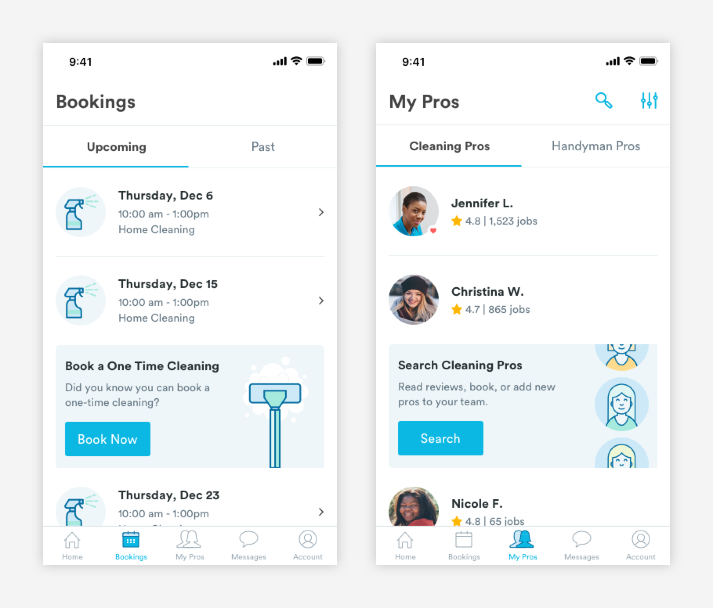
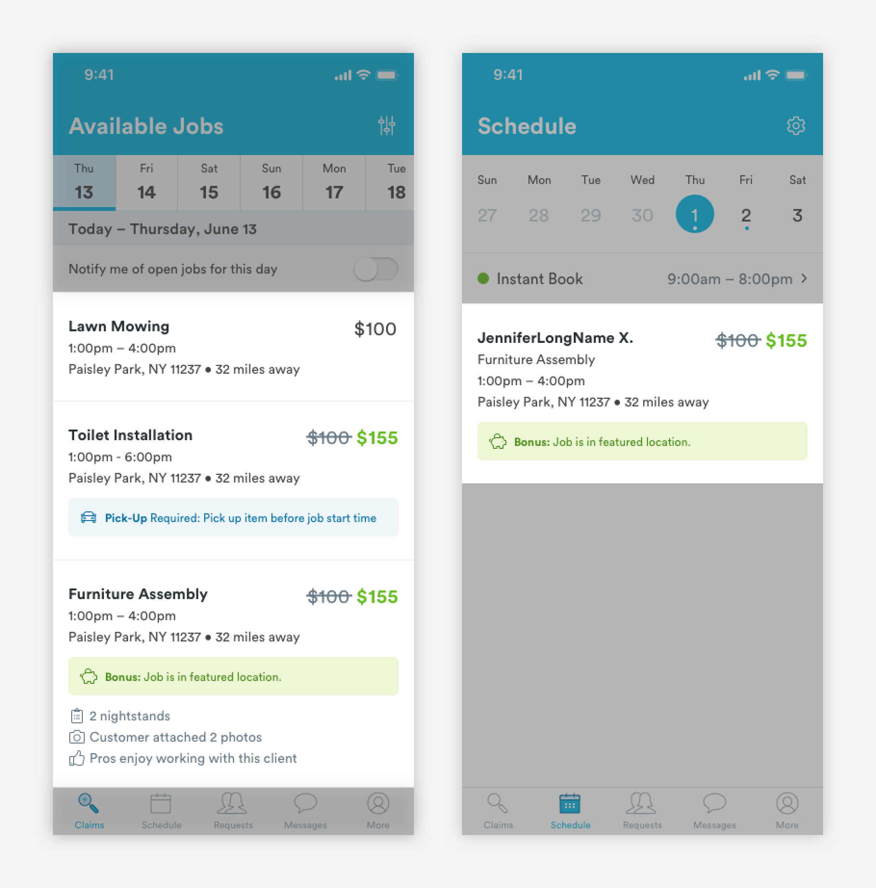

# Action Cards

## Usage of Action Cards

Action cards allow users to access underlying pages or flows. Action cards can be found in the Booking Page a on the customer app and the Claims page and Job Support experience on the pro app.

## Types of Action Cards

There are a few variations of action cards, but all inherit the same basic structure. 

\*\*\*\*[**1. Booking Card \(card-CA-booking\)**](booking-cards.md)  
Booking cards give users key information about a booking. If a booking is active the card will incorporate a map.

[**2. Jobs \(card-PA-job\)**](job-cards.md)  
Job cards show key information about jobs. When a job is claimed, the card includes the name of the client.

[**3. Messages \(card-message\)**](message-cards.md)  
Message cards shows a preview of the last message sent or received. 

[**4. User Card \(card-CA-pro, card-PA-cust\)**](user-cards.md)  
User cards have key informations about customers and professionals. Depending on the context of the card, different kinds of information will be surfaced.

