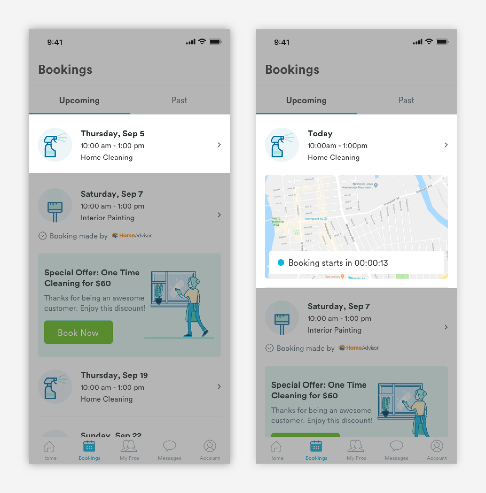

# Action Cards

## Types of Action Cards

There are a few variations of action cards, but all inherit the same basic structure. 

**1.** [**Booking Card \(m-card-booking\)**](booking-cards.md)  
Booking cards give users key information about a booking. If a booking is active the card will incorporate a map.

**2.** [**Pro Card \(m-card-pro\)**](pro-cards.md)  
Pro cards give users key information about a professional. Depending of the context of the pro card, information like the pro's availability will be surfaced.

**3.** [**Messages \(m-card-message\)**](message-cards.md)  
Message cards reflect key information about the message received.

