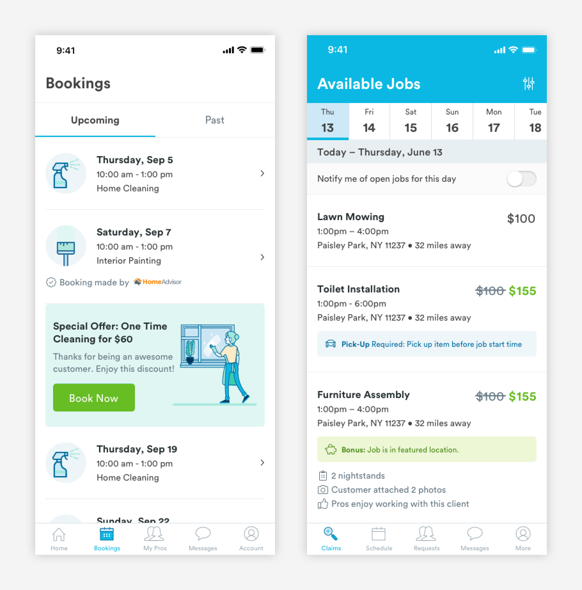

# Action Cards

## Usage of Action Cards

Action cards allow users to access underlying pages or flows. Action cards can be found in the Booking Page a on the customer app and the Claims page and Job Support experience on the pro app.

## Types of Action Cards

There are a few variations of action cards, but all inherit the same basic structure. 

\*\*\*\*[**1. Account \(card-account\)**]()  
Account cards show the name of the owner of the account.

\*\*\*\*[**2. Booking Card \(card-CA-booking\)**](booking-cards.md)  
Booking cards give users key information about a booking. If a booking is active the card will incorporate a map.  
  
[**3. Jobs \(card-PA-job\)**](job-cards.md)  
Job cards show key information about jobs.  
  
[**4. List \(card-list\)**]()  
List cards are list items that have underlying flows or pages. Can be shown with or without an icon.  
  
[**5. Messages \(card-message\)**](message-cards.md)  
Message cards shows a preview of the last message sent or received.   
  
[**6. User Card \(card-CA-pro, card-PA-cust\)**](user-cards.md)  
User cards have key informations about customers and professionals. Depending on the context of the card, different kinds of information will be surfaced.

