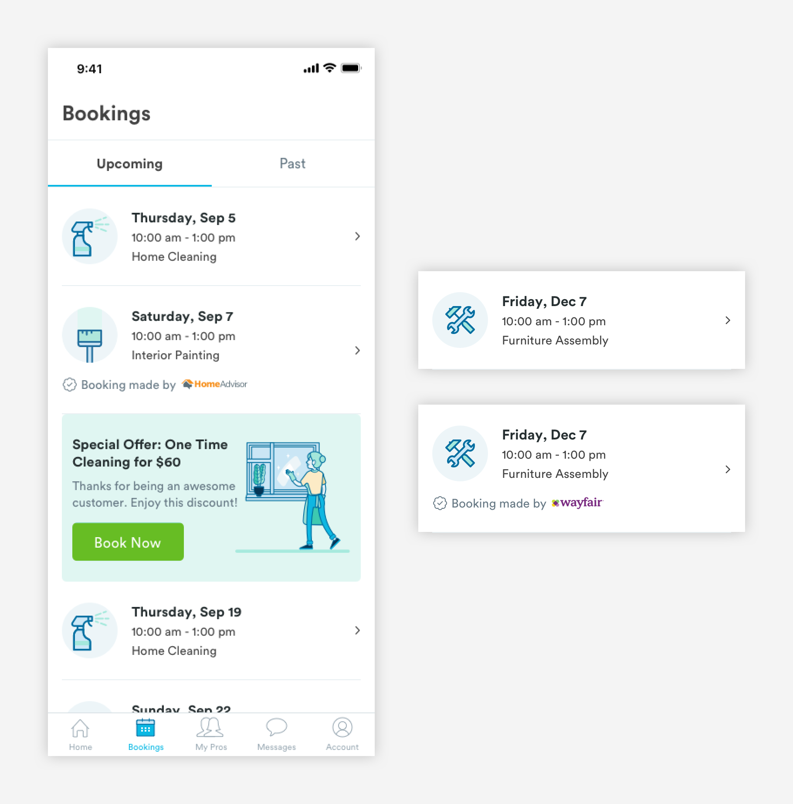
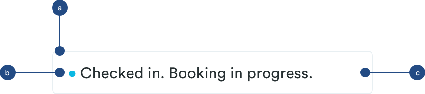

# Booking Cards

## Usage of Booking Cards

Booking lists are made up of booking cards. Booking cards are used to represent a single booking \(can be an upcoming or past booking\). When a user is viewing a booking card, they will see key information like type of service and date/time of that booking.

### Booking Card Types

**1.** [**Booking Card \(m-card-booking\)**](booking-cards.md#anatomy-of-booking-card-m-card-booking)\*\*\*\*



**2.** [**Active Booking Card \(m-card-booking-active\)**](booking-cards.md#anatomy-of-active-booking-states-m-card-booking-active)\*\*\*\*


## Anatomy of Booking Card \(m-card-booking\)


**1. Booking Image \(a-avatar-bookings\)**  
Adds a visual element to the card and represents the service. This image will change based on the service. Adopts avatar styling.

```text
a-avatar-bookings:
max-height: 64px
max-width: 64px

padding-left: 16px
padding-right: 16px
padding-top: 24px
padding-bottom: 16px
```

**2. Booking Information \(a text-h3, a-text-tert\)**  
Reflects key information about the booking. [**H1 styling**](../typography/#h1-style) for the Date and [**Tertiary styling**](../typography/#tertiary-styling) for the Time and Service Name.

```text
a-text-h3:
font-size: 16px
font-weight: bold
font-color: text-black
padding-bottom: 4px

a-text-tert:
font-size: 14px
font-weight: book
font-color: slate-medium-dark
padding-bottom: 4px
```

**3. Metadata \(m-metadata-partner, a-text-tert, a-icon-metadata\)**  
[**Tertiary styling**](../typography/#tertiary-styling) is used for metadata. Metatdata is only shown  if the booking is made through one of Handy's partners \(Wayfair, Walmart, HomeAdvisor, etc\). Partner bookings will be differentiated by the partner's logo. 

```text
a-text-tert:
font-size: 14px
font-weight: book
font-color: slate-dark-medium

a-icon-metadata-partner:
max-width: 12px
padding-right: 8px
```

**4. Divider \(a-divider-light\)**  
For easy viewing and consumption, booking cards will have divider lines.

```text
a-divider-light:
max-width: 343px
max-height: 1px
color: slate-light
padding-top: 24px
```

## Anatomy of Active Booking States \(m-card-booking-active\)

On the day of the booking, the booking card will have a map component added to it that will give the customer updates about their booking.


**1. Booking Card \(m-card-booking\)**  
[**Booking Card**](booking-cards.md#anatomy-of-booking-card) component is reused here. The H1 will be updated with "Today"  

**2. Map \(a-map\)**  
Visualization of the status of the booking. 

```text
a-map:
max-width: 343px
max-height: 193px
padding-top: 24px
```

**3. Status Bar \(m-status\)**  
Reflects the status of the booking and pro's ETA



a. Container

```text
max-width: 327px
max-height:  44px
padding-left: 16px
padding-right: 16px
padding-top: 24px
padding-bottom: 24px
margin: 8px
```

b. Status Indicator \(a-indicator\)

```text
a-indicator:
max-width: 8px
max-height: 8px
padding-left: 16px
padding-right: 8px

a-indicator colors:
red-medium or blue-medium
```

c. Status Text \(a-text-paragraph\)

```text
a-text-paragraph:
font-weight: book
font-size: 16px
font-color: text-black
```

