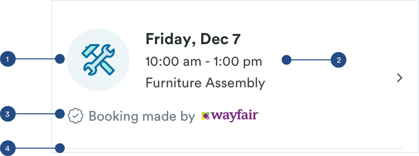
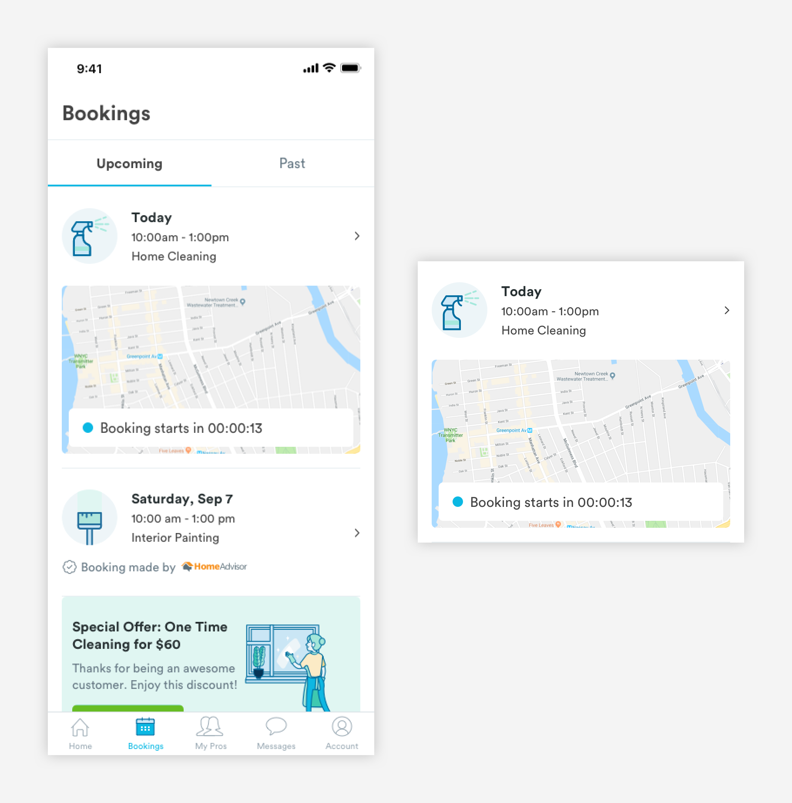

# Booking Cards

## Usage of Booking Cards

Booking lists are made up of booking cards. Booking cards are used to represent a single booking \(can be an upcoming or past booking\). When a user is viewing a booking card, they will see key information like type of service and date/time of that booking.


## Booking Card Types

**1.** [**Booking Card \(card-booking-basic\)**](booking-cards.md#anatomy-of-booking-card-m-card-booking)  
**2.** [**Active Booking Card \(card-booking-active\)**](booking-cards.md#anatomy-of-active-booking-states-m-card-booking-active)\*\*\*\*

## Anatomy of Booking Card \(card-booking\)




**1. Booking Avatar \(avatar-bookings\)**  
Adds a visual element to the card and represents the service.

```text
avatar-bookings:
max-height: 64px
max-width: 64px

padding-left: 16px
padding-right: 16px
padding-top: 24px
padding-bottom: 16px
```

**2. Booking Information \(text-h3, text-tert\)**  
Reflects key information about the booking. [**H1 styling**](../typography/#h1-style) for the Date and [**Tertiary styling**](../typography/#tertiary-styling) for the Time and Service Name.

```text
text-h3:
font-size: 16px
font-weight: bold
font-color: text-black
padding-bottom: 4px

text-tert:
font-size: 14px
font-weight: book
font-color: text-black
padding-bottom: 4px
```

**3. Metadata \(a-text-tert\)**  
Font Awesome and [**tertiary styling**](../typography/#tertiary-styling) is used for metadata icon and text. Metadata is only shown  if the booking is made through one of Handy's partners \(Wayfair, Walmart, HomeAdvisor, etc\). Partner bookings will be differentiated by the partner's logo. 

```text
text-tert:
font-size: 14px
font-weight: book
font-color: slate-dark

font awesome:
font-size: 14px
font-weight: book
font-color: slate-dark
padding-right: 4px
```

**4. Divider \(a-divider-light-343\)**  
For easy viewing and consumption, booking cards will have divider lines.

```text
a-divider-light:
max-width: 343px
max-height: 1px
color: slate-light
padding-top: 24px
```

## Anatomy of Active Booking States \(card-booking-active\)

On the day of the booking, the booking card will have a map component added to it that will give the customer updates about their booking.




**1. Booking Card \(card-booking\)**  
[**Booking Card**](booking-cards.md#anatomy-of-booking-card) component is reused here. The H1 will be updated with "Today"  

**2. Map \(a-card-map\)**  
Visualization of the status of the booking. 

```text
a-map:
max-width: 343px
max-height: 193px
padding-top: 24px
padding-bottom: 24px
```

**3. Status Bar \(a-card-booking-status\)**  
Reflects the status of the booking and pro's ETA


a. Container

```text
max-width: 327px
max-height:  44px
margin: 8px
```

b. Status Indicator \(a-icon-indicator\)

```text
a-icon-indicator:
max-width: 12px
max-height: 12px
padding-left: 16px
padding-right: 8px
padding-top: 16px
padding-bottom: 16px

a-indicator colors:
blue-medium - on time
red-medium - late
slate-dark - status unknown
```

c. Status Text \(a-text-paragraph\)

```text
a-text-paragraph:
font-weight: book
font-size: 16px
font-color: text-black

padding-left: 8px
padding-right: 16px
padding-top: 16px
padding-bottom: 16px
```

