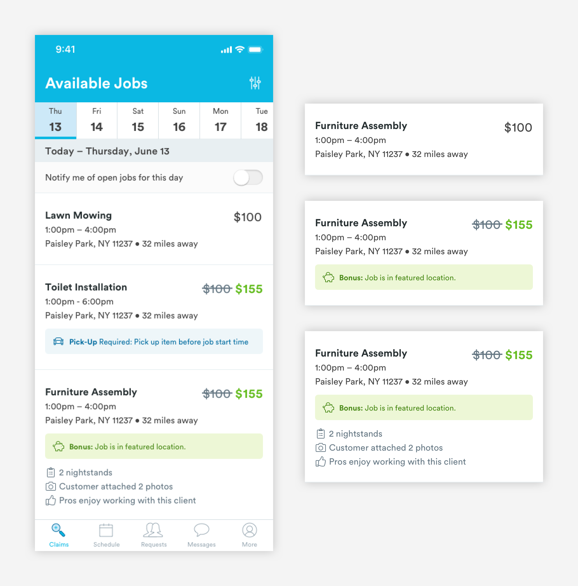
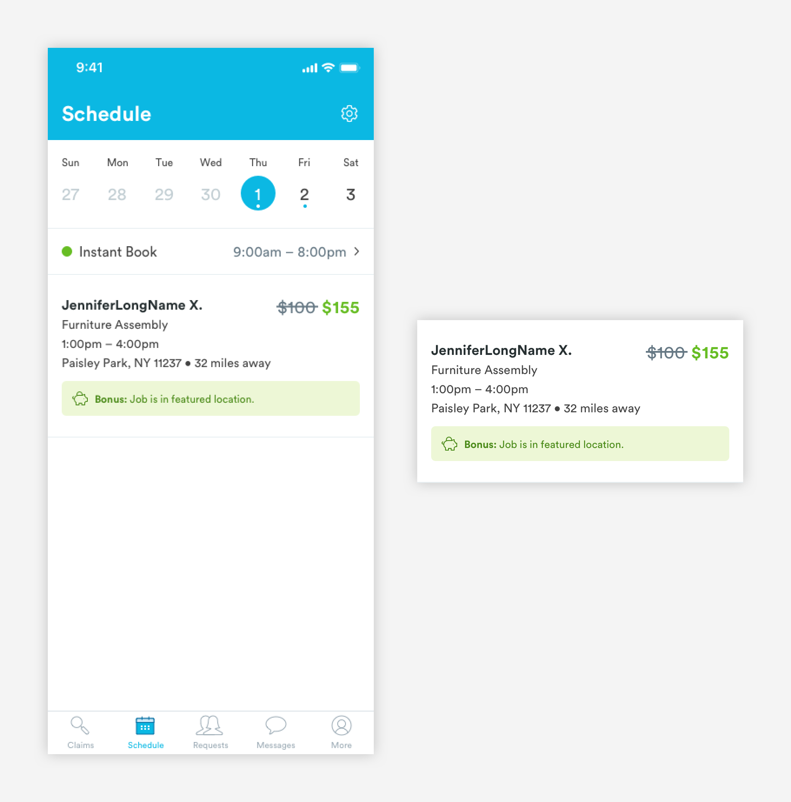
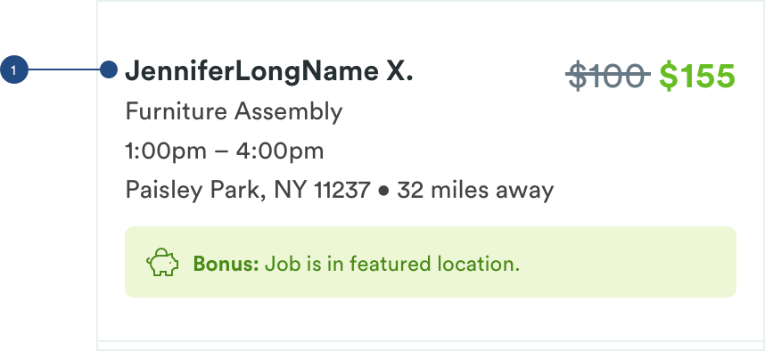

# Job Cards

## Usage of Job Cards

The Claims and Schedule page are made up of jobs cards. Jobs cards are used to represent a single job. When a user is viewing a job card, they will see key information like type of service and date/time of that job.


## Job Card Types

\*\*\*\*[**1. Pre-Claim Job Card \(card-PA-job-pre-claim\)**](job-cards.md#anatomy-of-pre-claim-job-card-card-pa-job-pre-claim)\*\*\*\*



  
****[**2. Claimed Job Card \(card-PA-job-claimed\)**](job-cards.md#anatomy-of-claimed-job-card-card-pa-job-claimed)\*\*\*\*



## Anatomy of Pre-Claim Job Card \(**card-PA-job-pre-claim**\)

The pre-claim job card lives in the Claims tab where pros look for jobs that they can manually claim. Pre-claim job cards are stacked vertically and organized by the date and time of the booking. 


**1. Job Information \(text-h3, text-tert\)**  
Reflects key information about the job. [**H1 styling**](../typography/#h1-style) for the Service Name and [**Tertiary styling**](../typography/#tertiary-styling) for secondary job information like Time and Location.

```text
H1 - Service Name (text-h3):
font-size: 16px
font-weight: bold
font-color: text-black
padding-bottom: 4px

Secondary Job Info (text-tert):
font-size: 14px
font-weight: book
font-color: text-black
padding-bottom: 4px
```

**2. Pricing**  
Reflects the pay of a specific job. Different styling is applied when there is a bonus attache to the booking.

```text
BONUSED JOB:

Original Pay - 
font-size: 20px
font-weight: book
font-color: slate-dark
padding-top: 24px
padding-right: 4px

Original Pay Crossout- 
color: slate-dark
padding-right: 4px
max-height: 1px

Bonused Pay -
font-size: 20px
font-weight: bold
font-color: green-medium
padding-top: 24px
padding-right: 16px
```

```text
NON-BONUSED JOB:
font-size: 20px
font-weight: book
font-color: 
```

**3. Callout \(a-card-callout\)**  
Jobs can have [**callouts**](../callouts.md) to bring attention to important things like bonuses or if there's a pick up involved. 

```text
padding-top: 12px

With Metadata:
padding-bottom: 12px

Without Metadata:
padding-bottom: 24px
```

**4. Metadata \(a-text-tert\)**  
Metadata gives pros more context about the job. Each job card can have up to 3 piece of metadata. [**Font Awesome \(a-icon-line\)**](../../brand-guidelines/line-icons.md#fontawesome-guidelines) and [**tertiary styling**](../typography/#tertiary-styling) is used for metadata icon and text. 

```text
text-tert:
font-size: 14px
font-weight: book
font-color: slate-dark

font awesome:
font-size: 14px
font-weight: book
font-color: slate-dark
padding-right: 4px
```

**5. Divider \(a-divider-light-75\)**  
For easy viewing and consumption, cards will have divider lines.

```text
max-width: 375
max-height: 1px
color: slate-light
padding-top: 24px
```

## Anatomy of Claimed Job Card \(card-PA-job-claimed\)

After a job is claimed and on a pro's schedule, the job card changes so that the H1 is replaced with the client's name. Like Pre-claim job cards, Claimed job cards are also stacked vertically and organized by the date and time of the booking. 




**1. Job Information \(text-h3, text-tert\)**  
Reflects key information about the job. [**H1 styling**](../typography/#h1-style) for the Client Name and [**Tertiary styling**](../typography/#tertiary-styling) for secondary job information like Service Name, Time, and Location.

```text
H1 - Client Name (text-h3):
font-size: 16px
font-weight: bold
font-color: text-black
padding-bottom: 4px

Secondary Job Info (text-tert):
font-size: 14px
font-weight: book
font-color: text-black
padding-bottom: 4px
```

