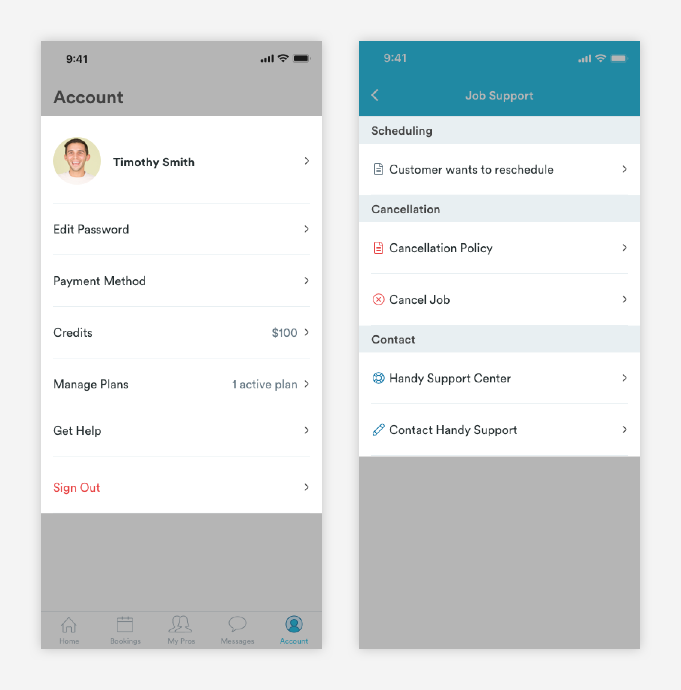
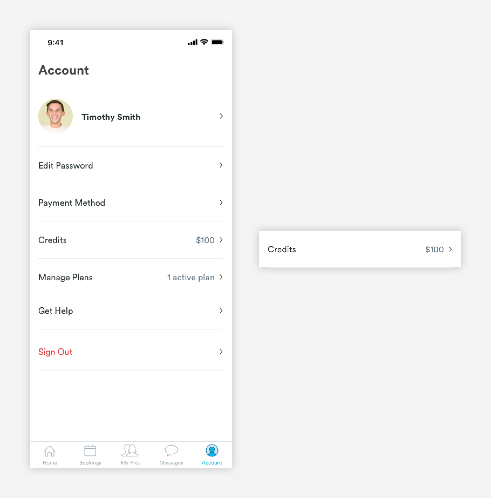
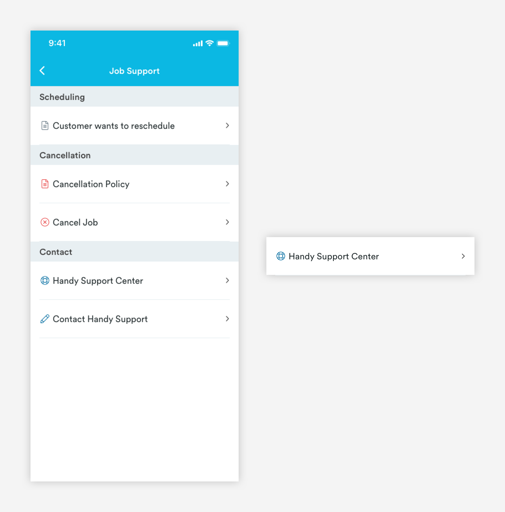

# List Cards

## Usage of List Cards

List cards can be stacked on pages where users can take multiple actions or view content. Each card should represent a single idea/concept and have a corresponding label that is clear. Overall the list should be easy to scan. 



## List Card Types

\*\*\*\*[**1. Basic \(card-list-basic\)**](list-cards.md#anatomy-of-basic-list-card)\*\*\*\*


\*\*\*\*[**2. Icon \(card-list-icon\)**](list-cards.md#anatomy-of-icon-list-card-card-list-icon)\*\*\*\*


## Anatomy of Basic List Card \(card-list-basic\)

The most basic variation of the list card.




**1. Label \(a-text-paragraph\)**

```text
font-weight: book
font-size: 16px
font-color: text-black or red-medium

padding-left: 16px
pading-top: 24px
padding-bottom: 24px
max-width: 65.89% (226px)
```

**2. Supporting Information \(optional\):**

```text
font-size: 16px
font-weight: book
font-color: slate-dark
padding-right: 8px

max-width: 27.4% (94px)
```

**3. Divider \(a-divider-light-343\)**

```text
a-divider-light:
max-width: 343px
max-height: 1px
color: slate-light

padding-top: 24px
```

## Anatomy of Icon List Card \(card-list-icon\)

To add visual interest to pages consisting only of list cards \(like the Job Support pages in the pro app\), the icon variation can be used.




**1. Label Icon**  
[**Font Awesome \(a-icon-line\)**](../../brand-guidelines/line-icons.md#fontawesome-guidelines) is used for the label icon.

```text
font: font-awesome
font-size: 16px
font-weight: light
font-color: slate-dark, blue-medium-dark, red-medium

padding-left: 16px
padding-right: 4px
```

**2. Label**

```text

font-weight: book
font-size: 16px
font-color: text-black

padding-right: 16px
pading-top: 24px
padding-bottom: 24px
padding-right: 8px
```

**3. Divider \(a-divider-light-343\)**

```text
a-divider-light:
max-width: 343px
max-height: 1px
color: slate-light

padding-top: 24px
```

