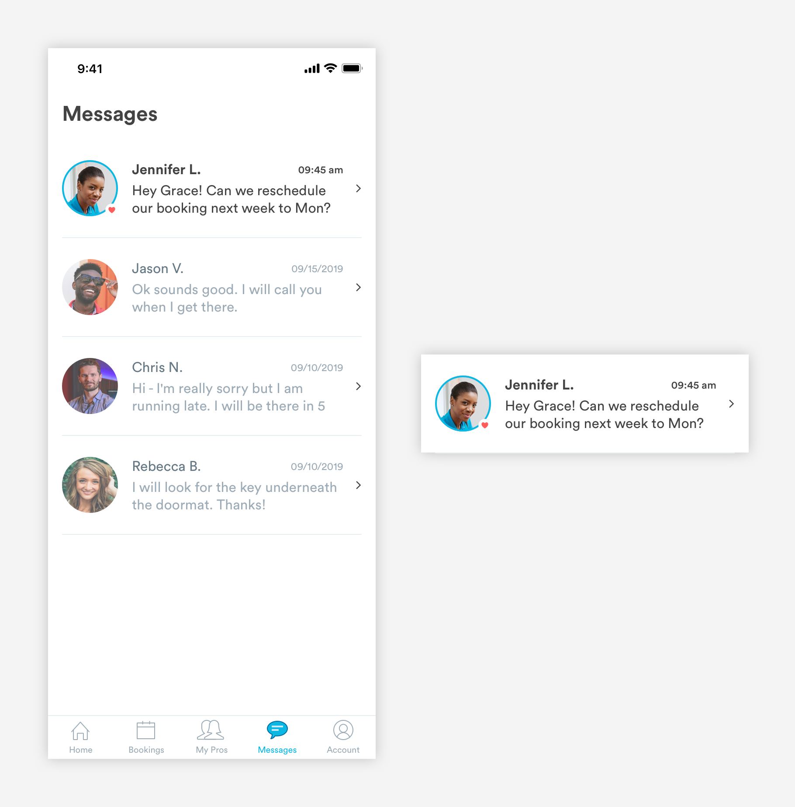
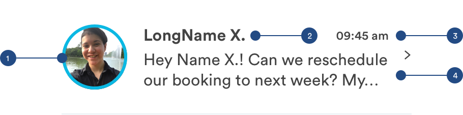
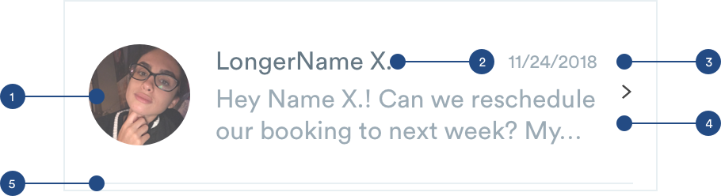

# Message Cards

## Messages

Message cards are found in the messages tab. It will reflect key information like the image of the person who sent the message, the time the message was sent, and a preview of the message. 

### Types of Message Cards

**1.** [**Unread Message Card \(m-card-message-unread\)**](message-cards.md#unread-message)\*\*\*\*



**2.** [**Read Message Card \(m-card-message-read\)**](message-cards.md#read-message)\*\*\*\*


## Unread Message



**1. Unread Indicator \(a-avatar-unread\)**  
If the message is unread, the avatar will have an outline around it to indicate that the message is unread.

```text
a-avatar-unread:
max-height: 64px
max-width: 64px
border-color: blue-medium
border-width: 3px
padding-right: 16px
```

**2. Sender Name \(a-text-paragraph-bold\)**

```text
a-text-paragraph-bold:
font-size: 16px
font-weight: bold
font-color: text-black
```

**3. Time \(a-text-subtitle-medium\)**  
Reflects when the last message was sent.

```text
a-text-subtitle-medium:
font-size: 12px
font-weight: medium
font-color: text-black
padding-right: 32px
```

**4. Message: \(a-text-paragraph\)**  
This area will house the preview the first 2 lines of the message.

```text
a-text-paragraph:
font-size: 16px
font-weight: book
font-color: text-black

Padding:
padding-left: 16px
padding-right: 16px
```

**5. Divider Line \(a-divider-light\)**  
For easy viewing and consumption, booking cards will have divider lines.

```text
a-divider-light:
max-width: 343px
max-height: 1px
color: slate-light
```

## Read Message

Read messages will adopt a lot of the spacing and structure of the unread message. The only differences will be text treatment.



**1. Read Avatars \(a-avatar-read\)**  
Will adopt the same avatar styling but with no blue indicator

```text
a-avatar-read:
max-height: 64px
max-width: 64px
opacity: 75%
padding-right: 16px
```

**2. Sender Name \(a-text-paragraph\)**

```text
a-text-paragraph-tert:
font-size: 16px
font-weight: book
font-color: slate-dark
```

**3. Time** \(**a-text-subtitle\)**

```text
a-text-subtitle:
font-size: 12px
font-weight: book
font-color: slate-medium-dark
padding-right: 32px
```

**4. Message \(a-text-paragraph-tert\)**

```text
a-text-paragraph-tert:
font-size: 16px
font-weight: book
font-color: slate-medium-dark

Padding:
padding-left: 16px
padding-right: 16px
```

**5. Divider Line \(a-divider-light\)**  
For easy viewing and consumption, booking cards will have divider lines.

```text
a-divider-light:
max-width: 343px
max-height: 1px
color: slate-light
```

