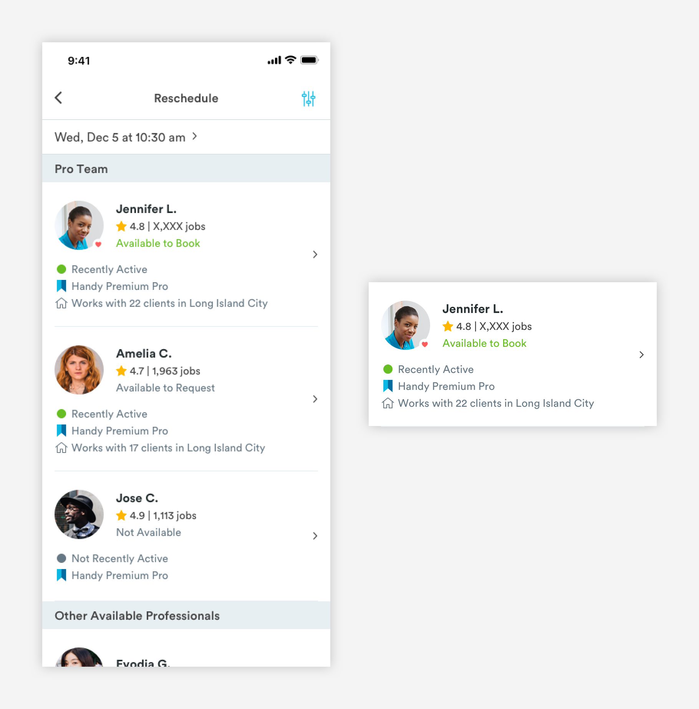

# Pro Cards

## Usage of Pro Cards

Pro lists are made up of booking cards. Pro cards are used to give users a basic overview of each pro like name, star rating, and the number of jobs the pro has completed. Depending on the context of the pro card, there will be extra information about their availability and neighborhood the pro is active in.

### Types of Pro Cards

**1.** [**Basic Pro Card \(m-card-pro\)**](pro-cards.md#anatomy-of-basic-pro-card-m-card-pro)\*\*\*\*


**2.** [**Pro Search Card \(m-card-pro-search\)**](pro-cards.md#anatomy-of-pro-search-card-m-card-pro-search)\*\*\*\*


**3.** [**Pro Search with Availability Card \(m-card-pro-availability\)**](pro-cards.md#pro-search-with-time)\*\*\*\*



## Anatomy of Basic Pro Card \(m-card-pro\)

Basic Pro Cards are found on the My Pros page. This page is a list of a user's pro team members.


**1. Avatar \(a-avatar-standard\)**

```text
a-avatar-standard:
max-height: 64px
max-width: 64px
padding-left: 16px
padding-right: 16px
padding-top: 24px
padding-bottom: 24px
​
a-heart (optional):
max-height: 14px
max-width: 14px
```

**2. Pro Name \(a-text-h3\)**

```text
a-text-h3:
font-size: 16px
font-weight: bold
font-color: text-black
padding-bottom: 4px
```

**3. Pro Stats \(a-text-tert, a-icon-star\)**

```text
a-text-tert:
font-size: 14px
font-weight: book
font-color: slate-medium-dark

a-icon-star:
max-width: 14px
max-height: 14px
color: yellow-medium
```

**4. Divider Line \(a-divider-light\)**  
For easy viewing and consumption, pro cards will have divider lines.

```text
a-divider-light:
max-width: 343px
max-height: 1px
color: slate-light
```

## Anatomy of Pro Search Card \(m-card-pro-search\)

Users can access pro search by clicking through from the My Pros page. They can access pro profiles through pro search list component to book or add to their pro team. Pro list components have the minimum requirements of a pro card but also have some metadata \(max of 2\) to help customers differentiate pros from one another.


**1.** [**Basic Pro Card**](pro-cards.md#anatomy-of-basic-pro-card-m-card-pro)\*\*\*\*

```text
padding-bottom: 16px
```

**2. Active Status \(m-metadata-active, a-indicator, a-text-tert\)**

```text
a-indicator:
max-width: 8px
max-height: 8px
padding-left: 18px
padding-right: 10px

a-indicator colors:
-active: green-medium
-not_active: slate-medium-dark

a-text-tert:
font-size: 14px
font-weight: book
font-color: slate-medium-dark
```

**3a. Metadata - Neighborhood \(m-metadata-neighborhood, a-icon-metadata, a-text-tert\)**

```text
a-icon-metadata-neighbor:
max-width: 12px
padding-left: 16px
padding-right: 8px

a-text-tert:
font-size: 14px
font-weight: book
font-color: slate-medium-dark
```

**3b. Metadata- Handy Pro Premium \(m-metadata-premium, a-icon-metadata, a-text-tert\)**

```text
a-icon-metadata-premium:
max-width: 12px
padding-left: 16px
padding-right: 8px

a-text-tert:
font-size: 14px
font-weight: book
font-color: slate-medium-dark
```

**4. Divider Line \(a-divider-light\)**  
For easy viewing and consumption, pro cards will have divider lines.

```text
a-divider-light:
max-width: 343px
max-height: 1px
color: slate-light
padding-top: 24px
```

## Pro Search with Availability Card \(m-card-pro-availability\)

User can do a pro search from a flows like the reschedule or change pro from the booking details page. These cards are very similar to the [pro search cards](pro-cards.md#anatomy-of-pro-search-card-m-card-pro-search) above but includes information about the pro’s availability and metadata section has a max of 3.


These cards have an extra bit of metadata but do not always adopt the Metadata styling.

**1. Available to Book \(a-text-tert-green\)** 

```text
a-text-tert-green:
font-size: 14px
font-weight: book
font-color: green-medium
```

**2. Request or Not Available \(a-text-tert-slate-dark-medium\)**

```text
a-text-tert:
font-size: 14px
font-weight: book
font-color: slate-dark-medium
```

**3. Divider Line \(a-divider-light\)**  
For easy viewing and consumption, pro cards will have divider lines.

```text
a-divider-light:
max-width: 343px
max-height: 1px
color: slate-light
padding-top: 24px
```

