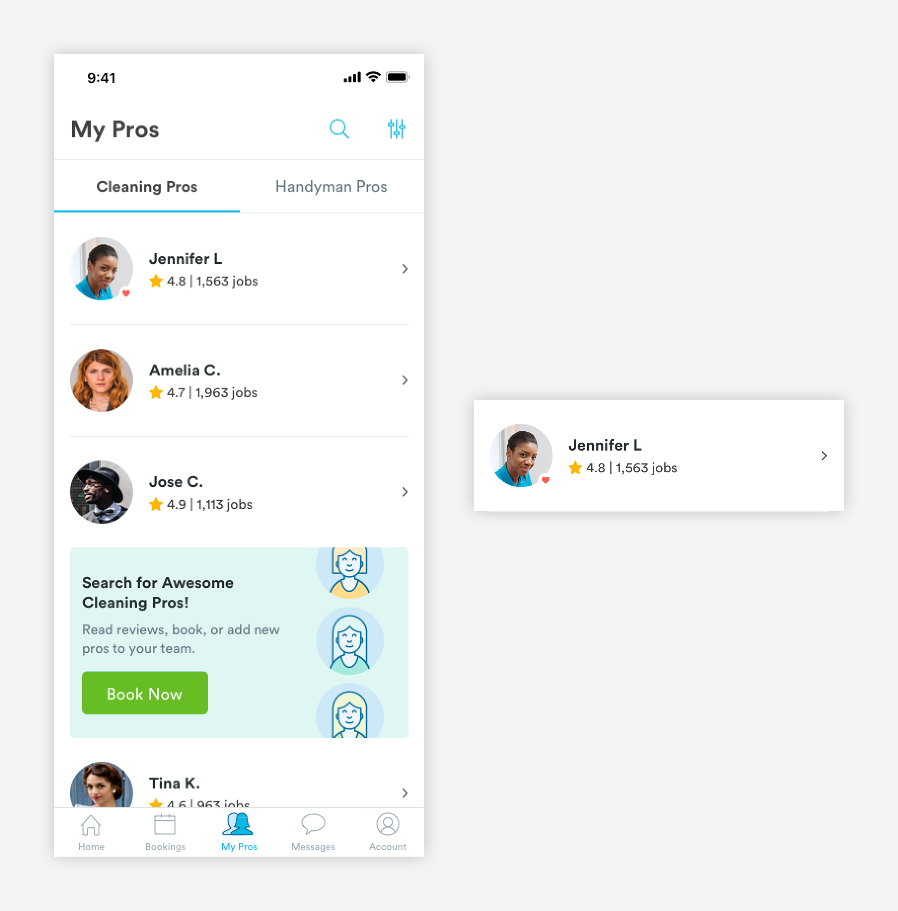

# User Cards

## Usage of User Cards

User cards are used to represent customers on the pro app and pros on the consumer app. The cards give a basic overview of pros and customers like name, star rating, number of jobs completed, location, and date of recent booking. Depending on the context of the card,  metadata will be used to give extra information about that user their availability \(consumer app\) or the neighborhood of a customer's home \(pro app\).


### Types of User Cards

\*\*\*\*[**1. Basic Pro Card \(card-CA-pro\)**](user-cards.md#anatomy-of-basic-pro-card-card-ca-pro)\*\*\*\*



\*\*\*\*[**2. Pro Search Card \(card-CA-pro-search\)**](user-cards.md#anatomy-of-pro-search-card-card-pro-search)\*\*\*\*


\*\*\*\*[**3. Pro Search with Availability Card \(card-CA-pro-search\)**](user-cards.md#anatomy-of-a-pro-search-with-availability-card-card-pro-search)\*\*\*\*


\*\*\*\*[**4. Client Card \(card-PA-cust\)**](user-cards.md#anatomy-of-client-card-card-pa-cust)\*\*\*\*


\*\*\*\*[**5. Account Card \(card-account\)**](user-cards.md#anatomy-of-account-card)\*\*\*\*


## Anatomy of Basic Pro Card \(card-ca-pro\)

Basic Pro Cards are found on the My Pros page. This page is a list of a user's pro team members.


**1. Avatar \(a-avatar-standard\)**

```text
a-avatar-standard:
max-height: 64px
max-width: 64px
padding-left: 16px
padding-right: 16px
padding-top: 24px
padding-bottom: 24px
​
a-heart (only if the pro is a "Favorite"):
max-height: 14px
max-width: 14px
[*aligned to the bottom and right of the avatar.]
```

**2. Pro Name \(a-text-h4\)**

```text
a-text-h4:
font-size: 16px
font-weight: bold
font-color: text-black
padding-bottom: 4px
```

**3. Pro Stats \(a-text-tert\)**  
Pro stats take on metadata styling : [**font Awesome \(a-icon-line\)**](../../brand-guidelines/line-icons.md#fontawesome-guidelines) is used for the star icon and tertiary text.

```text
a-text-tert:
font-size: 14px
font-weight: book
font-color: slate-dark

star:
font: font-awesome-regular
font-size: 14px
font-color: yellow-medium
```

**4. Divider Line \(a-divider-light\)**  
For easy viewing and consumption, cards have divider lines.

```text
a-divider-light:
max-width: 343px
max-height: 1px
color: slate-light
padding-top: 24px
```

## Anatomy of Pro Search Card \(card-pro-search\)

Pro Search cards allow users to access pro profiles so that users can book or add a particular pro to their pro team. They are found in the pro search experience \(users can navigate to this experience from the My Pros page\). The Pro Search Card has the same basic structure of the [**Basic Pro card**](user-cards.md#anatomy-of-basic-pro-card-card-ca-pro) but it includes metadata \(max of 2\) to help customers differentiate pros from one another.


**1.** [**Basic Pro Card**](user-cards.md#anatomy-of-basic-pro-card-m-card-pro)\*\*\*\*

```text
padding-bottom: 16px
```

**2. Icon Metadata \(Activity Status\)**  
The first piece of metadata shown in a Pro Search card is the activity of the pro. A pro can be active or inactive. 

```text
a-indicator:
max-width: 12px
max-height: 12px
margin: 3px
padding-right: 4px

a-indicator colors:
-active: green-medium
-not_active: slate-dark

a-text-tert:
font-size: 14px
font-weight: book
font-color: slate-dark

padding-bottom: 4px
```

**3. Icon Metadata**  
The second piece of metadata show in a Pro Search card is between a Premium badge or a Neighborhood indicator. If a pro is a Handy Premium Pro, the Premium badge takes precedence over the Neighborhood indicator \[which uses [**Font Awesome \(a-icon-line\)**](../../brand-guidelines/line-icons.md#fontawesome-guidelines)\].

```text
ICONOGRAPHY:
Neighborhood
[font awesome code: home-alt]
font-size: 14px
font-weight: book
font-color: slate-dark
padding-right: 4px

Handy Premium [custom icon]
max-height: 18px
max-width: 18px

padding-left: 16px
padding-right: 4px
padding-top: 4px
padding-bottom: 24px

text-tert:
font-size: 14px
font-weight: book
font-color: slate-dark
```

**4. Divider Line \(a-divider-light\)**  
For easy viewing and consumption, cards have divider lines.

```text
a-divider-light:
max-width: 343px
max-height: 1px
color: slate-light
padding-top: 24px
```

## Anatomy of a Pro Search with Availability Card \(card-pro-search\)

The Pro Search with Availability  card is shown when a user accesses the pro search experience from a reschedule or change pro flow. It is very similar to the [**pro search card**](user-cards.md#anatomy-of-pro-search-card-m-card-pro-search) ****but includes information about the pro’s availability status for a specific date and time and up to 3 pieces of metadata.

The metadata used is the same as the ones used in the [**pro search card**](user-cards.md#anatomy-of-pro-search-card-m-card-pro-search) but a pro can have all 3 pieces shown at once.


**1. Availability Information \(a-text-tert\) - Available**

```text
a-text-tert:
font-size: 14px
font-weight: book


font-color: green-medium
```

**2. Availability Information \(a-text-tert\) -  Request or Not Available**

```text
a-text-tert:
font-size: 14px
font-weight: book

font-color: slate-dark
```

**3. Divider Line \(a-divider-light\)**  
For easy viewing and consumption, cards have divider lines.

```text
a-divider-light:
max-width: 343px
max-height: 1px
color: slate-light
padding-top: 24px
```

## Anatomy of Client Card \(card-PA-cust\)

The Client Card has the same structure as the [**basic pro card**](user-cards.md#anatomy-of-basic-pro-card-card-ca-pro). Client cards can be found on the Client page in the pro app.


**1. Avatar**

```text
a-avatar-standard:
max-height: 64px
max-width: 64px
padding-left: 16px
padding-right: 16px
padding-top: 24px
padding-bottom: 24px
```

**2. Customer Information**

```text
a-text-h4:
font-size: 16px
font-weight: bold
font-color: text-black
padding-bottom: 4px

a-text-tert:
font-size: 14px
font-weight: book
font-color: text-black
padding-bottom: 4px
```

**3. Divider Line \(a-divider-light\)**  
For easy viewing and consumption, cards have divider lines.

```text
a-divider-light:
max-width: 343px
max-height: 1px
color: slate-light
padding-top: 24px
```

## Anatomy of Account Card

The most basic user card. Account cards represent the owner of the account and can be found on account pages. 


**1. Avatar**

```text
max-height: 64px
max-width: 64px
padding-left: 16px
padding-right: 16px
padding-top: 24px
padding-bottom: 24px
```

**2. Account Name**

```text
a-text-h3:
font-size: 16px
font-weight: bold
font-color: text-black
padding-left: 16px
padding-right: 8px
```

**3. Divider Line \(a-divider-light\)**  
For easy viewing and consumption, cards have divider lines.

```text
a-divider-light:
max-width: 343px
max-height: 1px
color: slate-light
padding-top: 24px
```

