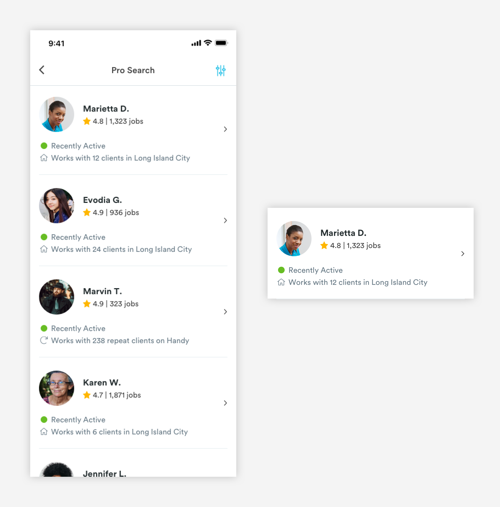
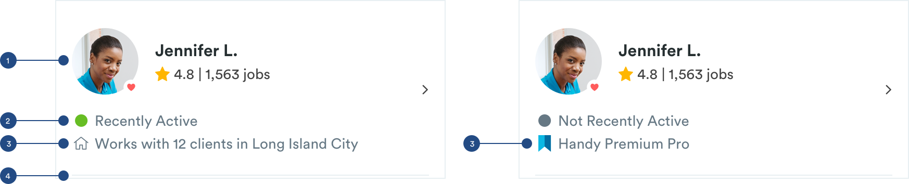

# User Cards

## Usage of User Cards

User cards are used to represent customers on the pro app and pros on the customer app. The cards give a basic overview of pros and customers like name, star rating, number of jobs completed, location, and date of recent booking. Depending on the context of the card, there will be extra information about that user such as a pro's availability and neighborhood.


### Types of User Cards

**1.** [**Basic Pro Card \(card-**](user-cards.md#anatomy-of-basic-pro-card-m-card-pro)[**CA-**](user-cards.md#pro-search-with-time)[**pro\)**](user-cards.md#anatomy-of-basic-pro-card-m-card-pro)\*\*\*\*


**2.** [**Pro Search Card \(card-**](user-cards.md#anatomy-of-pro-search-card-m-card-pro-search)[**CA-**](user-cards.md#pro-search-with-time)[**pro-search\)**](user-cards.md#anatomy-of-pro-search-card-m-card-pro-search)\*\*\*\*



**3.** [**Pro Search with Availability Card \(card-CA-pro-search\)**](user-cards.md#pro-search-with-time)\*\*\*\*


\*\*\*\*[**4. Client Card \(card-PA-cust\)**](user-cards.md#anatomy-of-client-card-card-pa-cust)\*\*\*\*


## Anatomy of Basic Pro Card \(card-ca-pro-pro-lis\)

Basic Pro Cards are found on the My Pros page. This page is a list of a user's pro team members.


**1. Avatar \(a-avatar-standard\)**

```text
a-avatar-standard:
max-height: 64px
max-width: 64px
padding-left: 16px
padding-right: 16px
padding-top: 24px
padding-bottom: 24px
​
a-heart (only if the pro is a "Favorite"):
max-height: 14px
max-width: 14px
```

**2. Pro Name \(a-text-h3\)**

```text
a-text-h3:
font-size: 16px
font-weight: bold
font-color: text-black
padding-bottom: 4px
```

**3. Pro Stats \(a-text-tert\)**

```text
a-text-tert:
font-size: 14px
font-weight: book
font-color: slate-dark

star:
font: font-awesome-regular
font-size: 14px
```

**4. Divider Line \(a-divider-light-343\)**  
For easy viewing and consumption, pro cards will have divider lines.

```text
a-divider-light:
max-width: 343px
max-height: 1px
color: slate-light
```

## Anatomy of Pro Search Card \(card-pro-search\)

Users can access pro search by clicking through from the My Pros page. They can access pro profiles through pro search list component to book or add to their pro team. Pro list components have the minimum requirements of a pro card but also have some metadata \(max of 2\) to help customers differentiate pros from one another.



**1.** [**Basic Pro Card**](user-cards.md#anatomy-of-basic-pro-card-m-card-pro)\*\*\*\*

```text
padding-bottom: 16px
```

**2. Active Status**

```text
a-indicator:
max-width: 12px
max-height: 12px
margin: 3px
padding-right: 4px

a-indicator colors:
-active: green-medium
-not_active: slate-dark

a-text-tert:
font-size: 14px
font-weight: book
font-color: slate-dark
```

**3. Metadata**

```text
text-tert:
font-size: 14px
font-weight: book
font-color: slate-dark

font awesome:
font-size: 14px
font-weight: book
font-color: slate-dark
padding-right: 4px
```

**4. Divider Line \(a-divider-light\)**  
For easy viewing and consumption, pro cards will have divider lines.

```text
a-divider-light:
max-width: 343px
max-height: 1px
color: slate-light
padding-top: 24px
```

## Pro Search with Availability Card \(card-pro-search\)

User can do a pro search from a flows like the reschedule or change pro from the booking details page. These cards are very similar to the [pro search cards](user-cards.md#anatomy-of-pro-search-card-m-card-pro-search) above but includes information about the pro’s availability and metadata section has a max of 3.


These cards have an extra bit of metadata but do not always adopt the Metadata styling.

**1. Available to Book \(a-text-tert-green\)** 

```text
a-text-tert-green:
font-size: 14px
font-weight: book
font-color: green-medium
```

**2. Request or Not Available \(a-text-tert\)**

```text
a-text-tert:
font-size: 14px
font-weight: book
font-color: slate-dark
```

**3. Divider Line \(a-divider-light\)**  
For easy viewing and consumption, pro cards will have divider lines.

```text
a-divider-light:
max-width: 343px
max-height: 1px
color: slate-light
padding-top: 24px
```

## Anatomy of Client Card \(card-PA-cust\)

Very similar to the basic pro card. Client cards can be found on the Client page in the pro app.


**1. Avatar \(a-avatar-standard\)**

```text
a-avatar-standard:
max-height: 64px
max-width: 64px
padding-left: 16px
padding-right: 16px
padding-top: 24px
padding-bottom: 24px
```

**2. Customer Information**

```text
a-text-h3:
font-size: 16px
font-weight: bold
font-color: text-black
padding-bottom: 4px

a-text-tert:
font-size: 14px
font-weight: book
font-color: text-black
```

