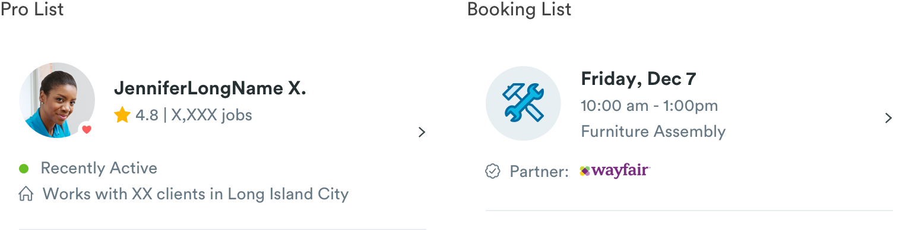

# Action Lists

## Action List Variations

There are a few variations of action lists which depend on the context of the list item. But many of the variations have the same basic structure.

1. Pro
2. Bookings
3. Messages
4. Settings



## Shared Stylings

Some of the few things action lists will share styles across like typography and avatars. 

### Avatars:

Many action list components will have an avatar or image component tied to it \(Pro and Booking lists\). All pro and booking lists will share the same styling for avatars.


```text
Body:
max-height: 64px
max-width: 64px

Status (optional):
max-height: 14px
max-width: 14px
```

### Typography

#### H1 Style

H1 styling in list components are used for things like names and booking time.

```text
font-color: #434343;
font-size: 16px
font-weight: bold
```

#### Paragraph Style

Paragraph styling in list components are used for things like pro stats, meta data, availability status, etc. There are exceptions for paragraph stylings - unless explicitly said, this styling will apply to all.  

```text
font-color: #667884;
font-size: 14px
font-weight: book
```

#### Metadata Style

Metadata will incorporate an icon and text with paragraph styling.


```text
Icon:
max-width: 12px
padding-right: 8px
```

Activity Tag is a type of metadata but the styling is a bit different because of the indicator dot.


```text
Indicator Dot:
max-width: 8px
max-height: 8px
padding-right: 10px
padding-left: 18px
```


