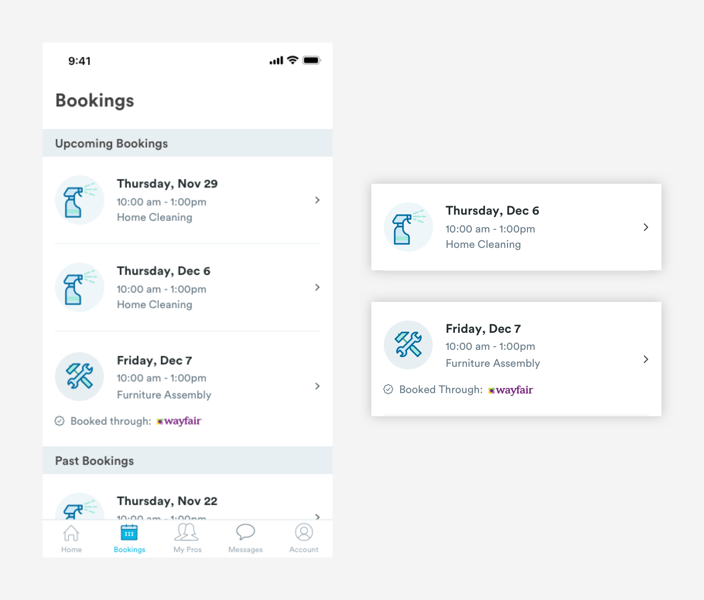
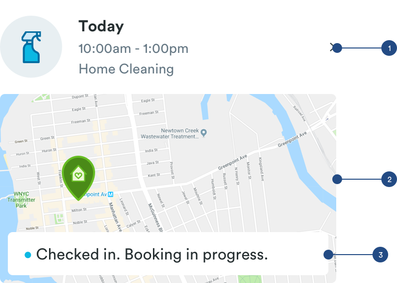

# Booking Lists

## Booking Lists

Booking lists live in the booking tab where customers can view their upcoming/past bookings and view key information about a booking. The structure of the booking lists are very similar to the pro cards.



1. Booking Image - Adds a visual element to the card and represents the service. This image will change based on the service. Adopts avatar styling.

2. Booking Information - Reflects key information about the booking. H1 styling for the Date and Paragraph styling for the Time and Service Name

3. Metadata - Adopts metadata styling. Logo styling :

```text
max-height: 14px
```

### Active Booking States

On the day of the booking, the booking card will have a map component added to it that will give the customer updates about their booking.



1. Booking List Component.

2. Map

```text
max-width: 343px
max-height:  193px
```

3. Status Bar : reflects the status of the booking and pro's ETA

```text
Status Bar:
max-width: 327px
max-height:  44px
padding-left: 16px
padding-right: 16px
padding-top: 24px
padding-bottom: 24px
margin: 8px
```

```text
Status Indicator:
max-width: 8px
padding-right: 8px
```

```text
Status Text:
font-color: #434343
font-size: 16px
font-weight: book
```

