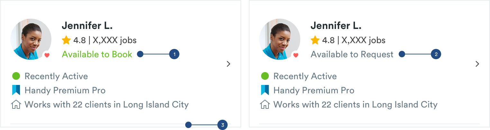

# Pro Lists

## Pro Lists

Pro Lists have multiple variations depending on what context it’s in. A pro list at the very minimum has a Pro Avatar, name and stats of a pro. This style of list is used in the My Pros tab where users can view a list of their pro team members.


1. Avatar: Depending on the context of the card the avatar could have a Favorite Pro status.

2. Pro Name: Will adopt H1 List Styles

3. Pro Stats: Will adopt Paragraph List Styles  
Star Image on Pro Stat:

```text
max-width: 14px
max-height: 14px
color: #FFB600
```

### Pro Search List

Users can access pro search by clicking through from the My Pros page. They can access pro profiles through pro search list component to book or add to their pro team. Pro list components hae the minimum requirements of a pro card but also have some meta data to help customers differentiate pros from one another.


1. Activity Tag

2. Metadata 

### Pro Search with Time

User can do a pro search from a flows like the reschedule or change pro from the booking details page. These cards are very similar to the pro search cards above but includes information about the pro’s availability.



These cards have an extra bit of metadata but do not always adopt the Metadata styling.

1. Available to Book or Instant Book Tag 

```text
font-size: 14px
font-weight: book
font-color: #67BD24
```

2. Available to Request or Not Available : adopts paragraph styling

