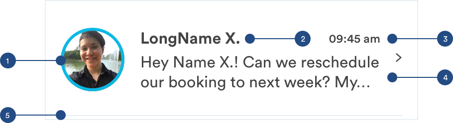
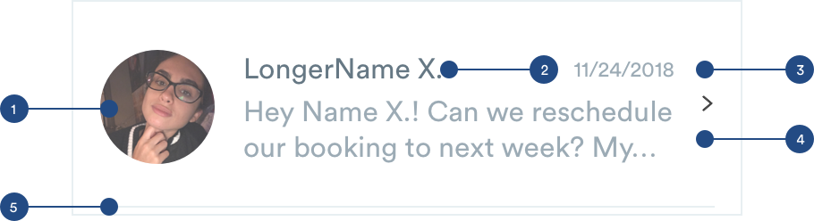

# Messages

## Messages

Message cards will be found in the messages tab. It will refelect key information like the image of the person who sent image, the time the message was sent, and a preview of the message. These cards will lead the customer to a message thread.

### Unread Message



1. Unread Indicator: If the message is unread, the avatar will have an outline around it to indicate that the message is unread.

```text
max-height: 64px
max-width: 64px
border: #0BB8E3
border-width: 3px
```

2. Name - use H1 styling.

```text
padding-left: 16px
```

3. Time: Reflects when the last message was sent.

```text
font-size: 12px
font-weight: medium
font-color: #434343
padding-right: 32px
```

4. Message: This area will house the preview \(the first 2 lines of the message\)

```text
font-size: 16px
font-weight: book
font-color: #434343
padding-left: 16px
padding-right: 16px
```

### Read Message

Read messages will adopt a lot of the spacing and structure of the unread message. The only differences will be text treatment.




1. Read Avatars: Will adopt the same avatar styling but with no blue indicator

```text
opacity: 75%
```

2. Name:

```text
font-size: 16px
font-weight: book
font-color: #434343
```

3. Time:

```text
font-size: 12px
font-weight: book
font-color: #9CABB5
```

4. Message:

```text
font-size: 16px
font-weight: book
font-color: #9CABB5
padding-left: 16px
padding-right: 16px
```

