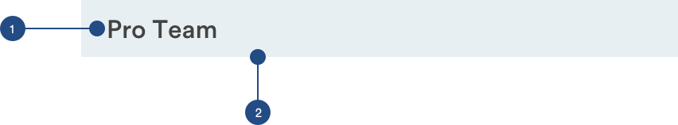

# Section Headers

## Section Headers

Section headers denote the start of an action list. They are pinned to the top as users scroll 



```text
background: Light-Neutral;
font-size: 16px;
font-weight: medium
padding-top: 8px
padding-bottom: 8px
padding-left: 16px
padding-right: 16px
```


