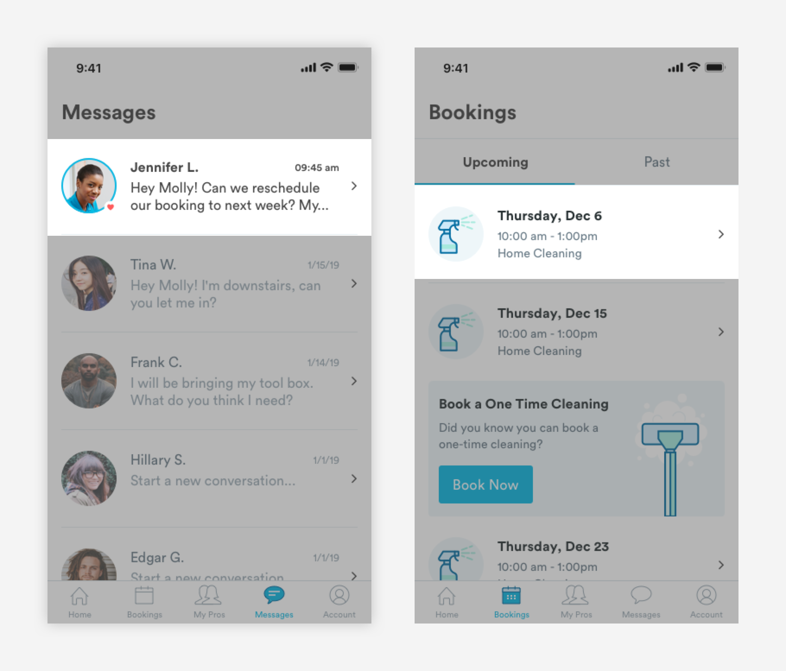
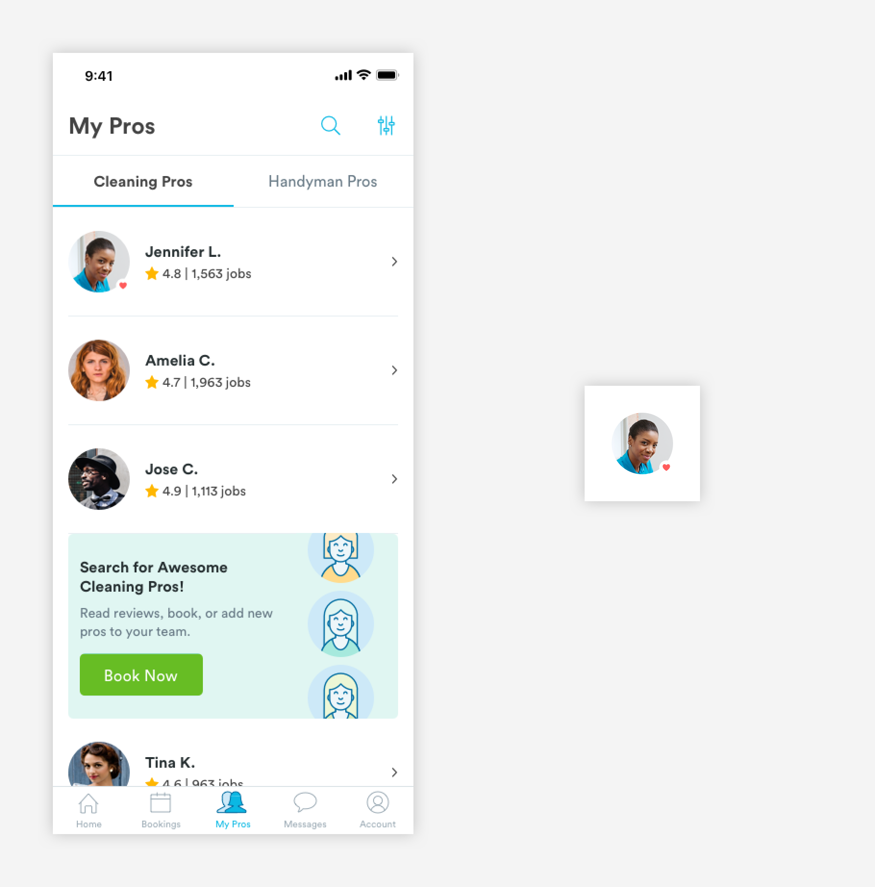
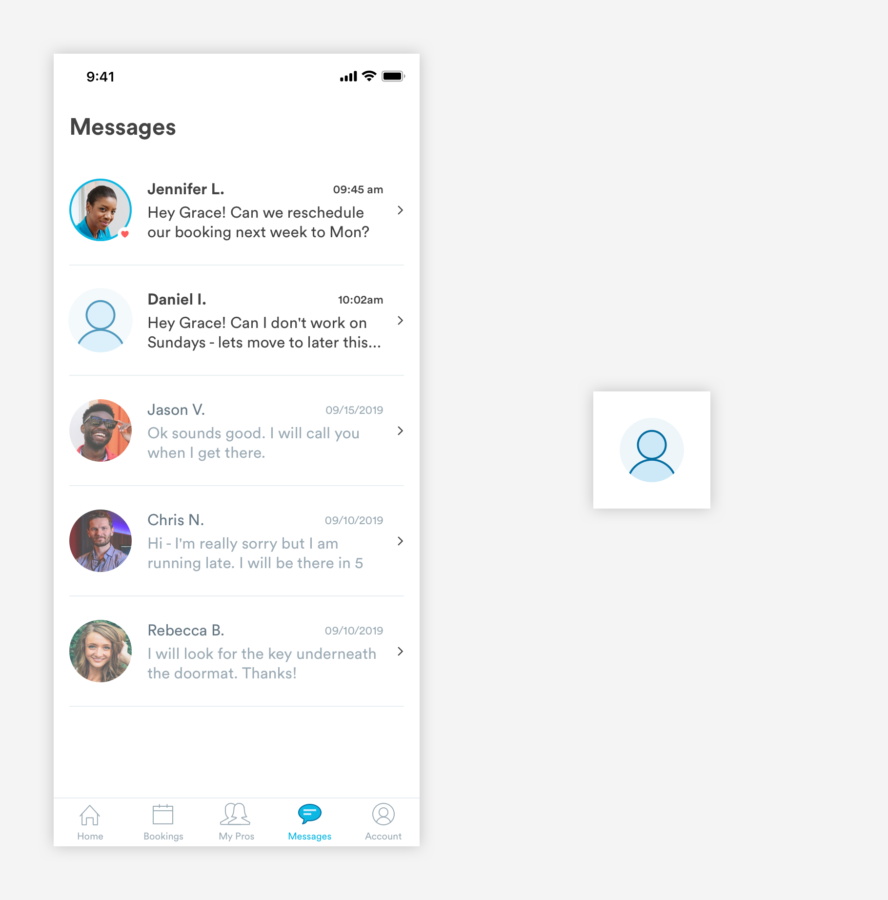
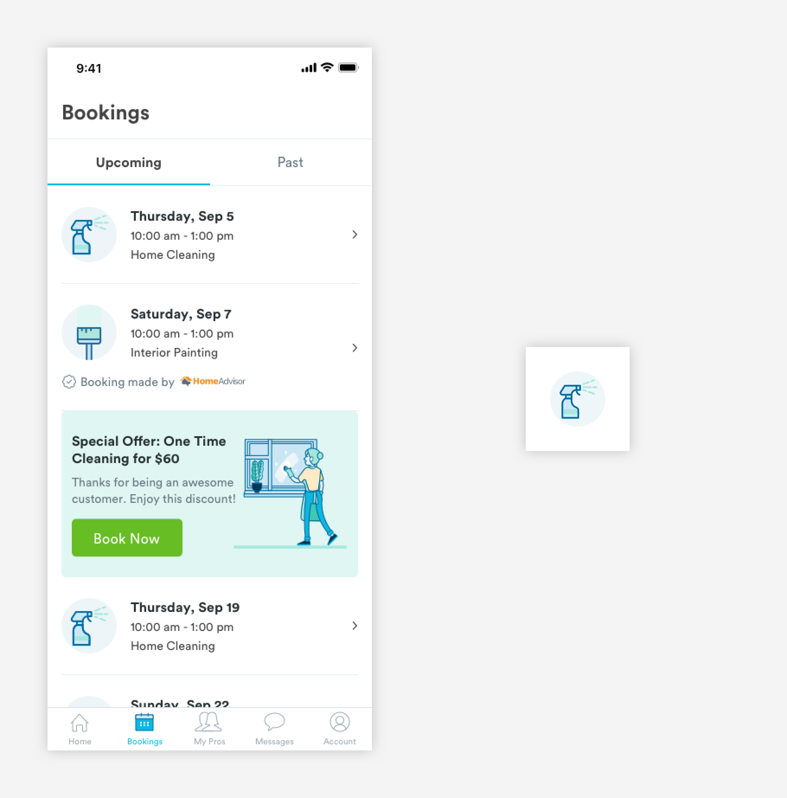
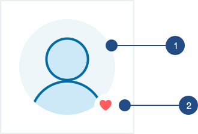

# Avatars

## Usage of Avatars

Avatars house an image that represent the user \(profile picture or user's initials\). 



## Types of Avatars

\*\*\*\*[**1. Pro Avatar \(a-avatar\)**](avatars.md#pro-avatars-a-avatar)



\*\*\*\*[**2. Default Avatar \(a-avatar-pro-default\)**](avatars.md#default-avatars)\*\*\*\*



\*\*\*\*[**3. Booking Avatar \(a-avatar-booking\)**](avatars.md#booking-avatar-a-avatar-bookings)\*\*\*\*



## Pro Avatars \(a-avatar\)

Pro avatars are used to represent the pro. Pro Image avatars can be found on the My Pros and Messages pages. 


1. Body: The image that represents the user. 

```text
max-width: 64px
max-height: 64px
```

2. Status: When a pro is favorited, the status will be represented by a heart. 

```text
max-width: 14px
max-height: 14px
```

## Default Avatars \(a-avatar-pro-default\)

Default Avatars are used when a pro does not have a profile picture.



1. Body

```text
max-width: 64px
max-height: 64px
background-color: blue-light
```

2. Status: When a pro is favorited, the status will be represented by a heart. 

```text
max-width: 14px
max-height: 14px
```

## Booking Avatar \(a-avatar-bookings\)

Booking avatars are used in m-card-bookings to represent the service. The icon in the avatar will correspond with the service.  


1. Body

```text
max-width: 64px
max-height: 64px
background-color: blue-light
```

