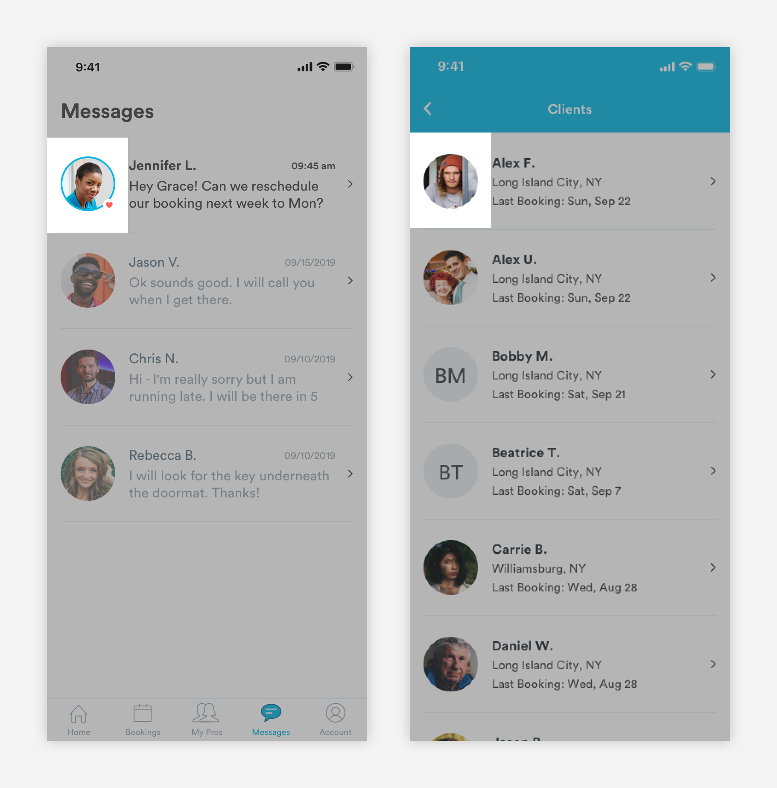

# Avatars

## Usage of Avatars

Avatars house an image that represent the user \(profile picture or user's initials\). 



## Types of Avatars

\*\*\*\*[**1. Image Avatar \(avatar-human\)**](avatars.md#pro-avatars-a-avatar)


\*\*\*\*[**2. Default Avatar - Pros \(avatar-pro-default\)**](avatars.md#default-avatars)\*\*\*\*


**3. Default Avatar - Customer \(avatar-customer-default\)**


\*\*\*\*[**4. Booking Avatar \(avatar-booking\)**](avatars.md#booking-avatar-a-avatar-bookings)\*\*\*\*


## Pro Avatars \(a-avatar\)

Image avatars are used to represent pros and customers.


1. Body: The image that represents the user. 

```text
max-width: 64px
max-height: 64px
```

2. Customer app only - When a pro is favorited, the status will be represented by a heart. 

```text
max-width: 14px
max-height: 14px
```

## Default Avatars - Pros \(avatar-pro-default\)

Default Avatars are used when a pro does not have a profile picture.


1. Body

```text
max-width: 64px
max-height: 64px
background-color: blue-light
```

2. Status: When a pro is favorited, the status will be represented by a heart. 

```text
max-width: 14px
max-height: 14px
```

## Default Avatars - Customer \(avatar-customer-default\)

Default Avatars are used when a customer does not have a profile picture.


1. Customer Initials

```text
font-size: 24px
font-weight: book
font-color: text-black
```

2. Body

```text
max-width: 64px
max-height: 64px
background-color: slate-light
```

## Booking Avatar \(a-avatar-bookings\)

Booking avatars are used in m-card-bookings to represent the service. The icon in the avatar will correspond with the service and will take on the [**two-tone styling**](../brand-guidelines/iconography.md#usage-of-two-tone-icons).  


1. Body

```text
max-width: 64px
max-height: 64px
background-color: blue-light
```

