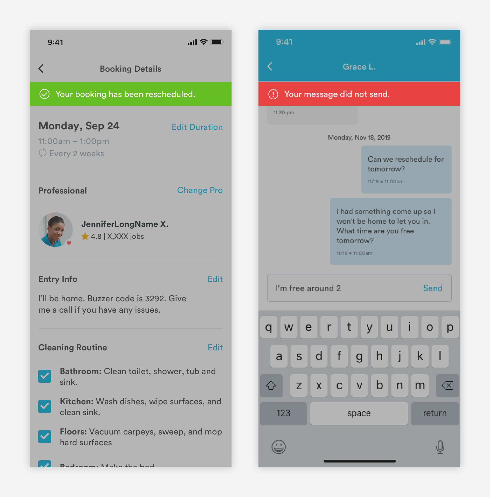

# Banners

## Usage of Banners

Banners are used to confirm an action taken or reflect a status.  Banners can be sticky or temporary banners and will share the same styling.



## Anatomy of Banners \(banner\)

Banners use color and iconography to indicate the nature of the action or call out


**1. Label Icon - Font Awesome**

```text
font: font-awesome
font-size: 16px
font-weight: light
font-color: white or slate-dark
padding-left: 16px
padding-right: 8px
```

**2. Text \(a-text-paragraph\)**

```text
font-weight: book
font-size: 16px
font-color: white or slate-dark
padding-left: 8px
padding-right: 16px
padding-top: 12px
padding-bottom: 12px
```

**3. Container**

```text
max-width: 100%

Confirmations: green-medium
Warnings: yellow-medium-dark
Errors: red-medium
Neutral: off-white
```

## Temporary Banner Animation

Temporary banners will slide under the header and slide back up. 


