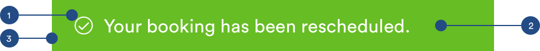

# Banners

## Usage of Banners

Banners are used to confirm an action taken or reflect a status.  Banners can be sticky or temporary banners and will share the same styling.


## Banners \(m-banner\)

Banners use color and iconography to indicate the nature of the action or call out



1. Icon

```text
max-width: 24px
padding-left: 16px
padding-right: 12px
```

2. Text \(a-text-paragraph\)

```text
font-weight: book
font-size: 16px
font-color: white
padding-right: 16px
padding-top: 12px
padding-bottom: 12px
```

3. Container

```text
max-width: 100%
max-height: 44px

Confirmations: green-medium
Warnings: yellow-medium-dark
Errors: red-medium
```

## Neutral Banners \(m-banner\)

Banners with neutral messaging will have a white background.


### Neutral Banner Styling


1. Icon

```text
max-width: 24px
padding-left: 16px
padding-right: 12px
```

2. Text \(a-text-paragraph\)

```text
font-weight: book
font-size: 16px
font-color: slate-dark

padding-right: 16px
padding-top: 12px
padding-bottom: 12px
```

3. Container

```text
max-width: 100%
max-height: 44px

background-color: white
```

4. Divider Line

```text
a-divider-darl:
max-width: 100%
max-height: 1px
color: slate-medium-light
```

## Temporary Banner Animation

Temporary banners will slide under the header and slide back up. 


