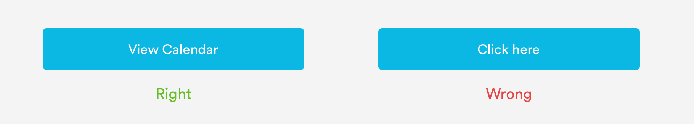
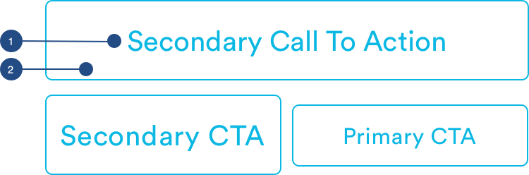

# Buttons

## Usage of Buttons

Buttons allow users to trigger an action. They may take the form of buttons or text links.


## General Button Guidelines

1. Labels are always title case 
2. Labels clear and succinct 
3. Labels are verbs or adverbs that express the action the button will trigger
4. Icons links should only be used when representing common paradigms
5. Buttons can be disabled but need to be conveyed by lowering the opacity to .4



## Types of Buttons

\*\*\*\*[**1. Primary Button**](buttons.md#anatomy-of-primary-button-button-size-primary)\*\*\*\*


\*\*\*\*[**2. Scroll Button**](buttons.md#anatomy-of-scroll-button)\*\*\*\*


\*\*\*\*[**3. Secondary Button**](buttons.md#anatomy-of-secondary-button-button-size-secondary)\*\*\*\*


\*\*\*\*[**4. Icon Button**](buttons.md#anatomy-of-icon-button)\*\*\*\*


\*\*\*\*[**5. Link CTAs**](buttons.md#anatomy-of-link-cta)\*\*\*\*


## Anatomy of Primary Button \(button-\[size\]-primary\)

Opaque, primary buttons are used for the most important action on a page. There should only be one primary button per page. Primary button come in 3 sizes: Large, Half Size, Small. 


**1. Label \(a-text-button\)**  
Label text must follow the [**General Button Guidelines**](buttons.md#general-button-guidelines)**.**

```text
Large and Half Size:
font-weight: book
font-size: 20px;
font-color: white

padding: 16px 

Small Size:
font-weight: book
font-size: 16px;
font-color: white

padding-left: 16px
padding-right: 16px
padding-top: 12px
padding-bottom: 12px
```

**2. Container**  
Primary CTAs can have 3 different container sizes: Large, Half Size, Small

```text
radius: 5px
color: blue-medium

Large:
max-width: 100% (343px)
max-height: 57px
margin: 16px

Half Size:
max-width: 50% (168px)
max-height: 57px

Small:
max-width: 50% (168px)
max-height: 44px
```

## Anatomy of Scroll Button 

When the content is longer than the page and scroll is enabled, primary buttons can sit in a container that sticks at the bottom of the page.


**1. Divider Line \(a-divider-dark\)**  
For easy viewing and separation, scroll buttons have a divider line.

```text
a-divider-dark:
max-width: 375px
max-height: 1px
color: slate-medium-light
padding-bottom: 16px
```

**2. Container**

```text
max-height: 89px
padding: 16px
background-color: *match to page background*
```

**3.** [**Primary CTA**](buttons.md#anatomy-of-primary-button-button-size-primary)\*\*\*\*

**4. Supporting Info \(Optional\)**  
When a scroll CTA has corresponding support information like the PreClaim state of the JDP,  the container can be split with copy and Half Size Primary CTA. The copy must have a title \(a-text-h3\) and supporting copy like pricing.

## Anatomy of Secondary Button \(button-\[size\]-secondary\) 

Transparent secondary CTA buttons are used for subordinate actions. There can be multiple secondary CTAs per page. 




**1. Label \(a-text-button\)**  
Label text must follow the [**General Button Guidelines**](buttons.md#general-button-guidelines)**.**

```text
Large and Half Size:
font-weight: book
font-size: 20px
font-color: blue-medium

padding: 16px 

Small Size:
font-weight: book
font-size: 16px
font-color: blue-medium

padding-left: 16px
padding-right: 16px
padding-top: 12px
padding-bottom: 12px
```

**2. Container**  
Secondary CTAs can have 3 different container sizes: Large, Half Size, Small

```text
radius: 5px
border-width: 1px
border-color: blue-medium

Large:
max-width: 100% (343px)
max-height: 57px
margin: 16px

Half Size:
max-width: 50% (168px)
max-height: 57px

Small:
max-width: 50% (168px)
max-height: 44px
```

## Anatomy of Icon Button

To give half size or small secondary buttons more visual interest, icons \(that represent the label\) can be used.


**1. Label**[  
**Font Awesome \(a-icon-line\)**](../brand-guidelines/line-icons.md#fontawesome-guidelines) is used for the icon. The size of the Font Awesome icon must match the size of the label text.

```text
Large and Half Size:
font-weight: book
font-size: 20px
font-color: blue-medium

padding: 16px 

Small Size:
font-weight: book
font-size: 16px
font-color: blue-medium

padding-left: 16px
padding-right: 16px
padding-top: 12px
padding-bottom: 12px

font-awesome codes:
[comment] - used for messaging actions
[envelope] - used for email actions (reccomendation, sending an invite)
[phone] - used for calling actions
```

**2. Container**  
Icon Buttons can have 2 different container sizes: Half Size, Small

```text
radius: 5px
border-width: 1px
border-color: blue-medium

Half Size:
max-width: 50% (168px)
max-height: 57px

Small:
max-width: 50% (168px)
max-height: 44px
```

## Anatomy of Link CTA

Link CTAs are used for non-essential actions, like changes to existing content. 


**1. Label \(a-text-paragraph\)**  
Label text must follow the [**General Button Guidelines**](buttons.md#general-button-guidelines)**.**

```text
font-weight: book
font-size: 16px
font-color: blue-medium
```


#### 

