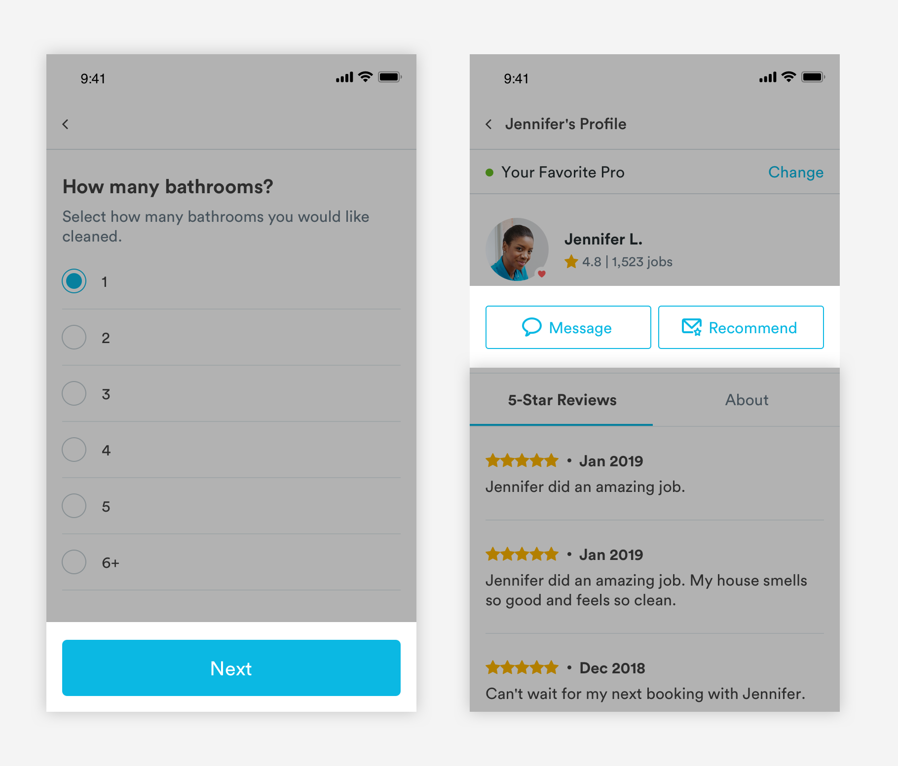
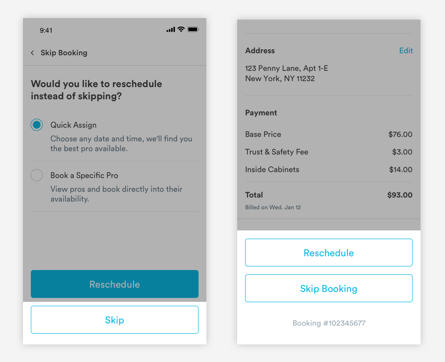
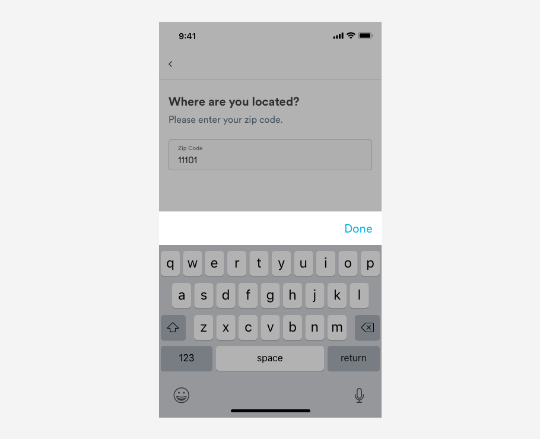

# Buttons

## Usage of Buttons

Buttons allow users to trigger an action. They may take the form of buttons, text links, or icon links. 



## General Button Guidelines

1. Labels are always title case 
2. Labels clear and succinct 
3. Labels are verbs or adverbs that express the action the button will trigger
4. Icons links should only be used when representing common paradigms


## Button CTAs

### Primary Button CTAs

Opaque, primary buttons are used for the most important action on a page. There should only be one primary button per page. When the content is longer than the page and scroll is enabled, primary buttons sit in a container that sticks to the bottom of the page. 


#### Button Properties \(Enabled\)

```text
max-width: 100% (343px)
max-height: 57px
radius: 5px
color: blue-medium

font-family: Circular
font-size: 20px;
font-color: #FFFFFF
```

#### Button Properties \(Disabled\)

If an action must be take on a page before moving onto the next page, buttons need to be disabled. We need to convey to the user that an action must be taken before moving forward.

```text
color: blue-medium
opacity: 0.4
```

#### Sticky Container Properties

```text
max-height: 89px
padding: 16px
background-color: *match to page background*

Dividing Line: (a-divider-dark-375)
border: 1px
color: slate-medium-light
width: 100% (375px)
padding-top: 16px
```

### 

### Secondary Button CTAs

Transparent secondary CTA buttons are used for subordinate actions. There can be multiple secondary CTAs per page. 



#### Button Properties

```text
max-width: 343px
max-height: 57px
border-radius: 5px
border: 1px
border-color: blue-medium
font-family: Circular
font-size: 20px;
font-color: blue-medium
```

#### Button Properties \(Disabled\)

 If an action must be take on a page before moving onto the next page, buttons need to be disabled. We need to convey to the user that an action must be taken before moving forward.

```text
border-color: blue-medium
font-color: blue-medium
opactiy: 0.4
```

### 

### Small Buttons CTAs

In instances where primary and secondary CTAs need to be smaller, these styles can be used.

#### Half-Size Buttons

```text
max-height: 44px
width: 167.5px
border-radius: 3px
border: 1px
font-family: Circular
font-size: 16px;
```

#### Small Buttons

```text
max-height: 44px
width: 109px
border-radius: 3px
border: 1px
font-family: Circular
font-size: 16px
```

## Other Types of CTAs

### Text Links

Text links are used for non-essential actions, like changes to existing content. 


```text
font: Circular-Book
font-size: 16px
font-color: blue-medium
```

### 

### Icon Links

Icon links are used in the header of certain pages to communicate the ability to execute common tasks, such as filtering a list. 


```text
height: 20px 
width: 20px
color: blue-medium
```

### 

### Keyboard CTA

In flows where the keyboard is activated, there will be a custom button that moves the user forward in the low.



#### Container

```text
Background: white
max-height: 57px

Dividing Line: (a-divider-dark-375)
border: 1px
color: slate-medium-light
width: 100% (375px)
padding-top: 16px
```

#### Text

```text
font-size: 20px
font-color: blue-medium
```

