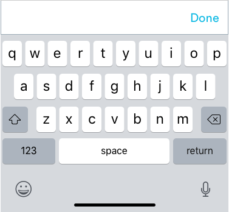

# Buttons


## Usage of Buttons

 Buttons allow users to trigger an action. They may display text, icons, or both. They are either static or stick to the bottom of a page.  


## Anatomy of Buttons


1. Clear label in title case
2. Icons can be used to convey meaning.

### Writing Labels

Button labels are title case and have to clearly explain what happens when the button is activated.


### Primary CTAs

The filled-out Primary CTA buttons are used for the most important action on a page. These button styles are used for primary CTAs:

```text
max-width: 343px
max-height: 57px
border-radius: 5px
color: #0BB8E3

font-family: Circular
font-size: 20px;
font-color: #FFFFFF
```


### Secondary CTA

The transparent secondary button with a thin stroke is used for subordinate actions.

```text
max-width: 343px
max-height: 57px
border-radius: 5px
border: 1px
border-color: #0BB8E3

font-family: Circular
font-size: 20px;
font-color: #0BB8E3
```


### Sizes for Primary & Secondary CTAs

In instances where primary and secondary CTAs need to be smaller, these styles can be used.

```text
Primary:
max-width: 167.5px
max-height: 44px
border-radius: 5px
border: 1px
border-color: #0BB8E3

font-family: Circular
font-size: 20px;
font-color: #0BB8E3
```

### Link CTAs

The text button is applied as a subtle call to action.

```text
font: Circular-Book
font-size: 16px
font-color: #0BB8E3
```


### Disabled Buttons

If an action must be take on a page before moving onto the next page, buttons need to be disabled. We need to convey to the user that an action must be taken before moving forward.


## Tertiary Button Sizes

For product marketing components and small touch points throughout the app.

Small:

```text
font-size: 16px
height: 44px
width: 109px
```


Medium:

```text
font-size: 16px
height: 44px
width: 167.5px
```


## Button Groups

There are some instances where there are multiple actions on a single page. The number of buttons should be easy for the user to grasp.

### Primary & Secondary Button Groups

A single, important action can be emphasized as the primary button in order to guide the user.


### Secondary Button Groups

Unlike primary CTAs, secondary CTAs can be combined together.


## Other CTA Styles

We have button styles in set for certain types of pages.

### Scroll Page

In pages that have a scroll view \(Pro Profiles\), the primary CTA will be in a container and the content on the page will scroll underneath it.


1. Container:
   * Background: Container background will always adapt to the background of the page the component is on.

```text
max-height: 89px. 
padding: 16px
border-top: #E8EFF2
```

  2. Button: Primary button styles will be applied here


### Keyboard CTA

In flows where the keyboard is activated, there will be a custom button that moves the user forward in the low.


1. Container:

```text
Background: #FFFFFF.
max-height: 57px
border-top: #E8EFF2
```

   2. Button

```text
font-size: 20px
font-color: #0BB8E3
```



