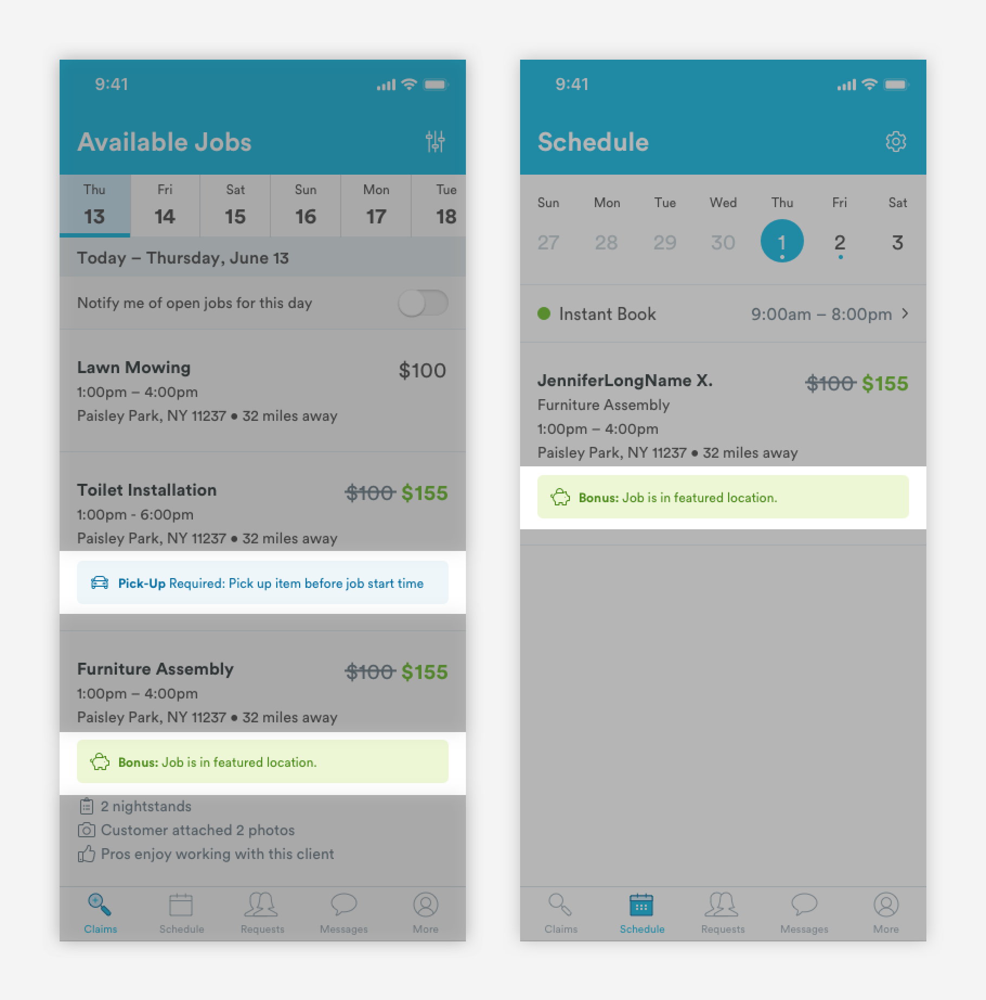
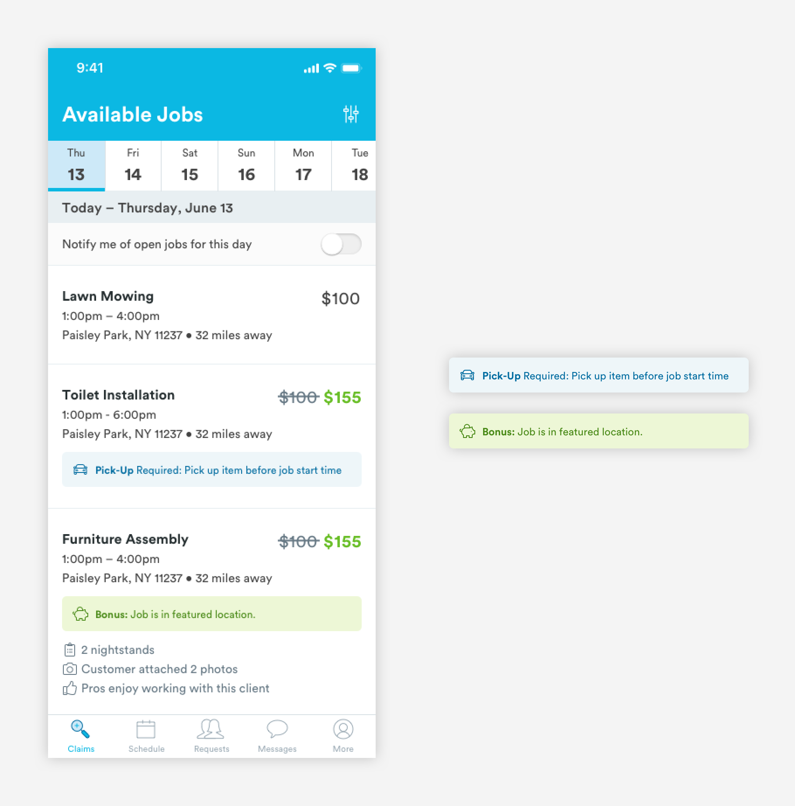
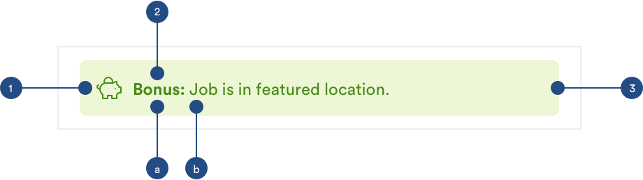

# Callouts

## Usage of Callouts

Callouts are used to differentiate cards that have important messaging.



## Anatomy of Callouts

Callouts used color and iconography to indicate the nature of content and differentiate between callouts. The icon and container must be in the same color family.





**1. Label Icon**  
[**Font Awesome \(a-icon-line\)**](../brand-guidelines/line-icons.md#fontawesome-guidelines) is used for the label icon**.**

```text
font-awesome
font-size: 16px
font-weight: light
font-color: [any color]-dark
padding-left: 16px
padding-right: 8px

font-awesome codes:
[piggy-bank] - used for bonused jobs
[car] - used for errors or negative actions
```

**2. Text**   
_a. Title \(a-text-h4_\)

```text
font-weight: bold
font-size: 16px
font-color: [any color]-dark
```

_b. Content \(a-text-paragraph\)_

```text
font-weight: book
font-size: 16px
font-color: [any color]-dark
```

_Text Spacing_

```text
padding-left: 8px
padding-right: 12px
padding-top: 12px
padding-bottom: 12px
```

**3. Container**

```text
max-width: 100% (343px)
font-color: [any color]-light
```

