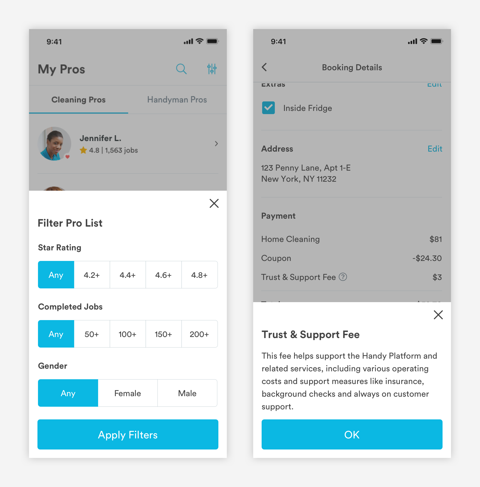

# Half Sheets

## Usage of Half Sheets

Half sheets display supplementary actions \(filtering a list\) or content \(from tool tips\). Half sheets slide up from the bottom of the screen.



## Types of Half Sheets

\*\*\*\*[**1. Action Half Sheet \(half-sheet-action\)**](half-sheets.md#action-half-sheet-m-half_sheet-action)\*\*\*\*


\*\*\*\*[**2. Informational Half Sheet \(half-sheet-info\)**](half-sheets.md#informational-half-sheet-m-half_sheet-info)\*\*\*\*


## Action Half Sheet \(half-sheet-action\)

Users can take actions like filtering list views or changing the status of a pro on action half sheet. Actions will be taken once a user selects an option and hits the CTA.

```text
Background-color: #00000; Opacity: 0.3
```


**1. Title \(a-text-h3\)**

```text
font-weight: bold
font-size: 20px
font-color: text-black
padding-left: 16px
padding-right: 16px
padding-top: 48px
padding-bottom: 24px
```

**2. Exit**

```text
max-width: 16px
max-height-:16px
color: text-black
border-width: 2px
padding-top: 16px
padding-right: 16px
```

**3. Content**  
Can use filter, radio, or checkbox pickers

```text
Title (a-text-h4):
font-weight: bold
font-size: 16px
font-color: text-black #434343

padding-left: 16px
padding-right: 16px
padding-top: 24px
padding-bottom: 16px


Pickers:
padding-bottom: 24px
```

**4. Link CTA \(a-text-paragraph\)**  
The Link CTA can take the user down another flow or expand the half sheet with more content.

```text
font-weight: book
font-size: 16px
font-color: blue-medium

padding-top: 24px
padding-bottom: 24px

expansion:
padding-top: 24px
padding-bottom: 24px
```

**5. Primary CTA \(a-button-primary\)**

```text
max-height: 57px
border-radius: 5px
padding-left: 16px
padding-right: 16px
padding-top: 24px
padding-bottom: 16px
color: blue-medium
​
CTA Text (a-text-button)
font-weight: book
font-size: 20px
font-color: white
padding: 16px
```

## Informational Half Sheet \(half-sheet-info\)

Users can view more information about features on an informational half sheet by tapping on a tool tip.

```text
Background-color: #00000; Opacity: 0.3
```


**1. Title \(a-text-h3\)**

```text
font-weight: bold
font-size: 20px
font-color: text-black
padding-left: 16px
padding-right: 16px
padding-top: 48px
padding-bottom: 24px
```

**2. Exit**

```text
max-width: 16px
max-height-:16px
color: text-black
border-width: 2px
padding-top: 16px
padding-right: 16px
```

**3. Content**

```text
Body Copy (a-text-paragraph):
font-weight: book
font-size: 16px
font-color: text-black
line-height: 1.5

padding-left: 16px
padding-right: 16px
padding-top: 16px
padding-bottom: 16px
```

4. Primary CTA \(a-button-primary\)

```text
max-height: 57px
border-radius: 5px
padding-left: 16px
padding-right: 16px
padding-top: 24px
padding-bottom: 16px
color: blue-medium
​
CTA Text (a-text-button)
font-weight: book
font-size: 20px
font-color: white
padding: 16px
```

