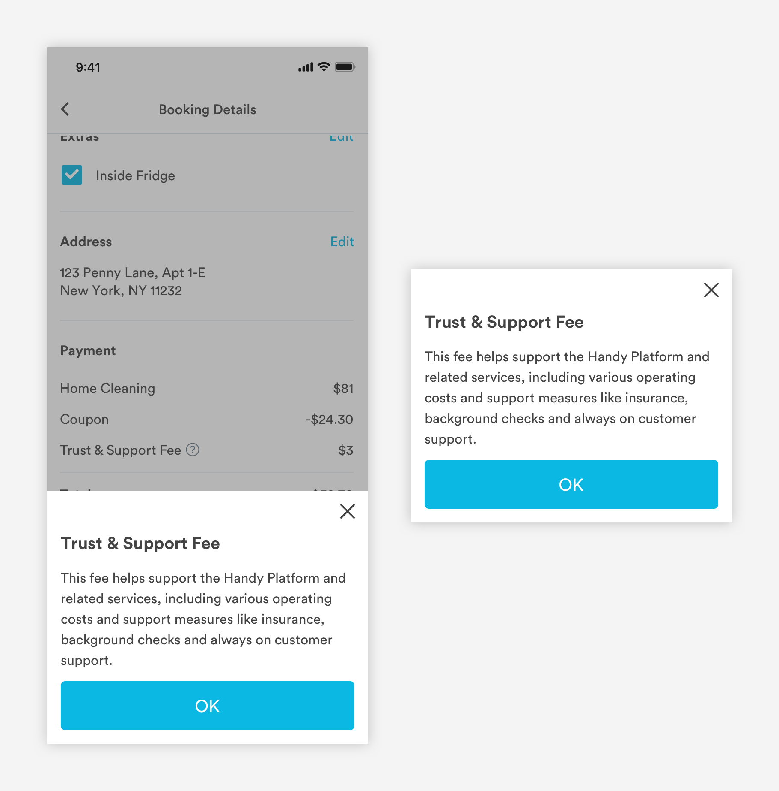

# Half Sheets

## Usage of Half Sheets

Half sheets display supplementary actions \(filtering a list\) or content \(from tool tips\). Half sheets slide up from the bottom of the screen.


## Types of Half Sheets

\*\*\*\*[**1. Action Half Sheet \(m-half\_sheet-action\)**](half-sheets.md#action-half-sheet-m-half_sheet-action)\*\*\*\*


\*\*\*\*[**2. Informational Half Sheet \(m-half\_sheet-info\)**](half-sheets.md#informational-half-sheet-m-half_sheet-info)\*\*\*\*



## Action Half Sheet \(m-half\_sheet-action\)

Users can take actions like filtering list views or changing the status of a pro on action half sheet. Actions will be taken once a user selects an option and hits the CTA.

```text
Background-color: #00000; Opacity: 0.3
```


1. Half Sheet Title \(a-text-h2\)

```text
font-weight: bold
font-size: 20px
font-color: text-black #434343

padding-left: 16px
padding-right: 16px
padding-top: 48px
```

2. Exit

```text
max-width: 16px
max-height-:16px
color: text-black #434343
border-width: 2px
padding-top: 16px
padding-right: 16px
```

3. Content  
Can use filter, radio, or checkbox pickers

```text
Title (a-text-h3)
font-weight: bold
font-size: 16px
font-color: text-black #434343

Pickers
padding-bottom: 24px
```

4. Primary CTA \(a-button-primary\)

```text
max-height: 57px
border-radius: 5px
padding-left: 16px
paddin-right: 16px
color: blue-medium #0BB8E3
​
Text (a-text-button)
font-family: Circular
font-size: 20px
font-color: white #FFFFFF
padding: 16px
```

5. Divider Line

```text
line-color: slate-medium-light #DAE2E6
line-thickness: 1px
padding-left: 16px
padding-right: 16px
```

6. Link Text

```text
font-size: 16px
font-weight: book
font-color: text-black #434343
padding-left: 16px
padding-top: 16px
padding-bottom: 16px
```

7. Cancel Link Text

```text
font-size: 16px
font-weight: book
font-color: red-medium #E74343
padding-left: 16px
padding-top: 16px
padding-bottom: 16px
```

## Informational Half Sheet \(m-half\_sheet-info\)

Users can view more information about features on an informational half sheet by tapping on a tool tip.

```text
Background-color: #00000; Opacity: 0.3
```


1. Half Sheet Title \(a-text-h2\)

```text
font-weight: bold
font-size: 20px
font-color: text-black

padding-left: 16px
padding-right: 16px
padding-top: 48px
```

2. Exit

```text
max-width: 16px
max-height-:16px
color: text-black
border-width: 2px
padding-top: 16px
padding-right: 16px
```

3. Content

```text
Body Copy (a-text-paragraph):
font-weight: bold
font-size: 16px
font-color: text-black
line-height: 1.5

padding-left: 16px
padding-right: 16px
padding-top: 16px
padding-bottom: 16px
```

4. Primary CTA \(a-button-primary\)

```text
max-width: 343px
max-height: 57px
border-radius: 5px
color: blue-medium
​
Text (a-text-button)
font-family: Circular
font-size: 20px
font-color: #FFFFFF
padding: 16px
```

