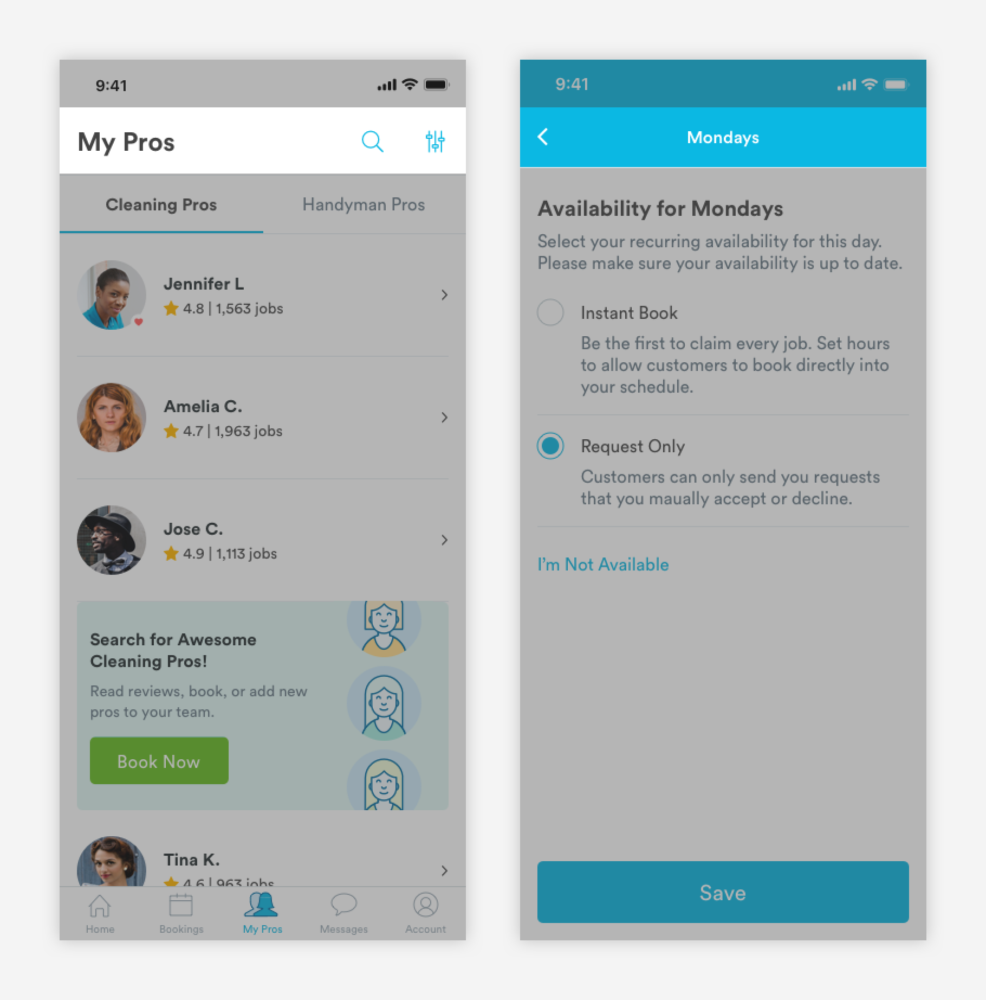
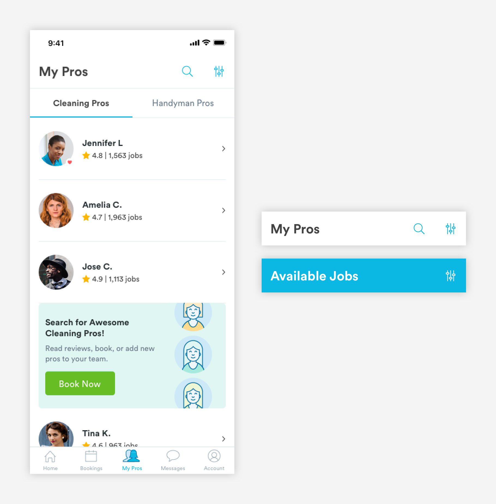

# Headers

## Usage of Headers

Headers are used to communicate what page \(tab\) a user is on. The header component can be combined with actions like searching, filtering a list, or changing a setting.



## Types of Headers

**1.** [**Main Headers \(m-header-primary\)**](headers-1.md#main-headers)\*\*\*\*



**2.** [**Secondary Header \(m-header-secondary\)**](headers-1.md#secondary-headers)\*\*\*\*


**3.** [**Section Header \(m-header-section\)**](headers-1.md#section-headers)\*\*\*\*


**4.** [**Time Subheader \(m-subheader-time\)**](headers-1.md#time-subheader)\*\*\*\*


## Main Headers

Main Headers are components used on main pages like Bookings, My Pros, Messages, and Account. Main headers will scroll with the content of the page.


**1. Header Label \(a-text-h1\)**

```text
a-text-h1:
font-family: bold
font-size: 24px;
font-color: text-black

padding-left: 16px;
padding-right: 16px;
padding-top: 16px;
```

**2.  Action Icons \(a-header-icon\)**  
Action icons lead users to other flows and pages or allow users to make decisions on half sheets. They are optional.

```text
a-header-icon:
max-height: 20px
max-width: 20px
```

## Secondary Headers

Sub-headers are subpages or flows that are navigated to from a main tab page. Examples include Booking Detail Pages, Pro Search, Pro Profile, or a Message Thread. Unlike main headers, sub-headers will stick to the top so users have a way to navigate away from the page.


**1. Navigation \(a-nav\)**  
Helps user navigate away from the page they are currently on. 

```
a-nav [a-nav-left will be left aligned in the 16px column]:
max-width: 16px
color: text-black

padding-left: 16px
padding-right: 8px
```

**2. Header Label \(a-text-h4\)**

```text
a-text-h4:
font-size: 16px
font-weight: medium
font-color: text-black
```

**3. Divider Line \(a-divider-dark\)**  
For easy viewing and consumption, subheaders will have divider lines.

```text
a-divider-light:
max-width: 343px
max-height: 1px
color: slate-light-medium
```

**4.  Action Icons \(a-header-icon\)**  
Action icons lead users to other flows and pages or allow users to make decisions on half sheets. They are optional.

```text
a-header-icon:
max-height: 20px
max-width: 20px
```

## Section Headers


**1. Header Label \(a-text-paragraph-medium\)**

```text
a-text-paragraph-medium:
font-size: 16px
font-weight: medium
font-color: text-black
```

**2. Container**

```text
color: slate-light
max-width: 100% 
```

## Time Subheader


**1. Date & Time \(a-text-paragraph\)**  
Reflects the time chosen on the native time picker.

```text
a-text-paragraph:
font-size: 16px
font-weight: book
font-color: text-black
```

**2. Divider Line \(a-divider-dark\)**  
For easy viewing and consumption, subheaders will have divider lines.

```text
a-divider-light:
max-width: 343px
max-height: 1px
color: slate-light-medium
```

