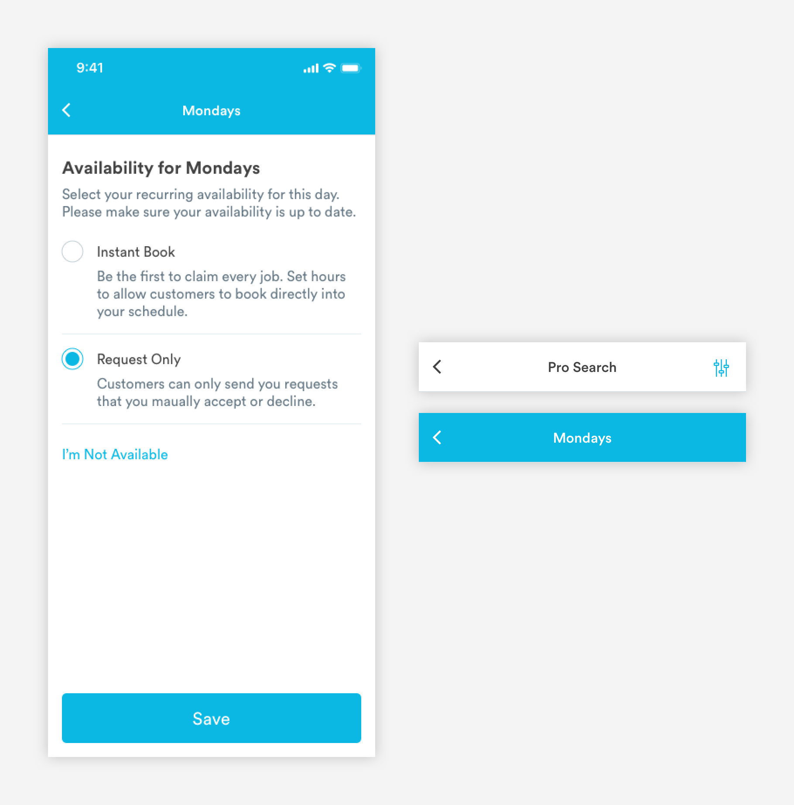
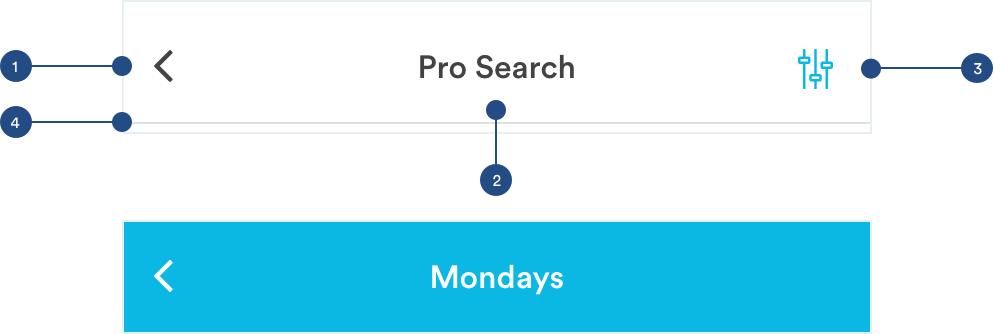
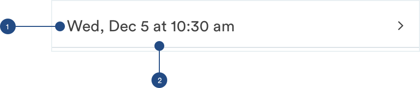

# Headers

## Usage of Headers

Headers are used to communicate what page \(tab\) a user is on. The header component can be combined with actions like searching, filtering a list, or changing a setting. Depending on the app, the header will be different colors:  
Consumer App: White  
Pro App: Blue-Medium


## Types of Headers

\*\*\*\*[**1. Primary Headers \(header-primary\)**](headers-1.md#main-headers)\*\*\*\*


\*\*\*\*[**2. Secondary Header \(header-secondary\)**](headers-1.md#anatomy-of-secondary-headers)\*\*\*\*



\*\*\*\*[**3. Section Header \(header-section\)**](headers-1.md#anatomy-of-section-headers)\*\*\*\*


\*\*\*\*[**4. Time Subheader \(subheader-time\)**](headers-1.md#anatomy-of-time-subheader)\*\*\*\*


[**5. Dropdown Subheader \(header-dropdown\)**](headers-1.md#anatomy-of-dropdown-header)\*\*\*\*


## Anatomy of Primary Headers \(header-primary\)

Primary Headers are components used on main app pages. Main headers will scroll with the content of the page.


**1. Header Label \(a-text-h2\)**

```text
a-text-h2:
font-family: bold
font-size: 24px;
font-color: text-black or white

padding-left: 16px;
padding-right: 16px;
padding-top: 16px;
```

**2.  Action Icons**  
[**Font Awesome \(a-icon-line\)**](../brand-guidelines/line-icons.md#fontawesome-guidelines) is used for the action icons**.** Action icons lead users to other flows and pages or allow users to make decisions on half sheets. They are optional. 

```text
font: font-awesome
font-size: 20px
font-weight: light
font-color: blue-medium or white

Icon 1:
padding-right: 34px

Icon 2:
padding-right: 16px

font-awesome codes:
[search] - used for search
[sliders-v] - used for filtering
[cog] - used for settings
[calendar-plus] - used for adding to calendar
```

## Anatomy of Secondary Headers

Sub-headers are used on subpages or flows that are navigated to from a main tab page. Unlike main headers, sub-headers will stick to the top so users have a way to navigate away from the page.




**1. Navigation \(a-nav\)**  
Helps user navigate away from the page they are currently on. It would either be a back arrow or exit.  

```
font awesome: angle-left
font-weight: regular
font-size: 24px
font-color: text-black or white

max-width: 16px
color: text-black

padding-left: 16px
padding-right: 8px
```

**2. Header Label \(a-text-subheader\)**

```text
a-text-subheader:
font-weight: medium
font-size: 16px
font-color: text-black or white

padding-left: 8px
padding-right: 8px
padding-top: 18px
padding-bottom: 18px
```

**2.  Action Icons**  
[**Font Awesome \(a-icon-line\)**](../brand-guidelines/line-icons.md#fontawesome-guidelines) is used for the action icons**.** Action icons lead users to other flows and pages or allow users to make decisions on half sheets. They are optional. 

```text
font: font-awesome
font-size: 20px
font-weight: light
font-color: blue-medium or white

Icon:
padding-right: 16px

font-awesome codes:
[search] - used for search
[sliders-v] - used for filtering
[cog] - used for settings
[calendar-plus] - used for adding to calendar
```

**4. Divider Line \(a-divider-dark\)**  
For easy viewing and consumption, subheaders will have divider lines.

```text
a-divider-dark:
max-width: 343px
max-height: 1px
color: slate-medium-light

padding-top: 18px
```

## Anatomy of Section Headers

Section Headers are used to differentiate and organize large amounts of content. These headers can stick to the top and get pushed up by the subsequent section header or scroll with content.  


**1. Header Label \(a-text-subheader\)**

```text
a-text-subheader:
font-weight: medium
font-size: 16px
font-color: text-black

padding-left: 16px
padding-right: 16px
padding-top: 8px
padding-bottom: 8px
```

**2. Container**

```text
color: slate-light
max-width: 100% 
```

## Anatomy of Time Subheader

Time Subheaders are used to allow users access the native time picker and to reflect the time chosen. They can be found in pro search experiences. 




**1. Date & Time \(a-text-paragraph\)**  
Reflects the time chosen on the native time picker.

```text
a-text-paragraph:
font-size: 16px
font-weight: book
font-color: text-black

padding-left: 16px
padding-right: 8px
padding-top: 12px
padding-bottom: 12px
```

**2. Divider Line \(a-divider-dark\)**  
For easy viewing and consumption, subheaders will have divider lines.

```text
a-divider-dark:
max-width: 375px
max-height: 1px
color: slate-medium-light
```

## Anatomy of Dropdown Header

Dropdown headers, like [**Section Headers**](headers-1.md#anatomy-of-section-headers), organize large amounts of content and can stick or scroll with the page. The only difference is that dropdown headers allow users to expand or hide the content. 


**1. Label \(a-text-h4\)**  
Reflects the time chosen on the native time picker.

```text
a-text-h4:
font-size: 16px
font-weight: bold
font-color: text-black

padding-top: 24px
padding-bottom: 24px
padding-left: 16px
padding-right: 8px
```

**2. Supporting Text**  
Any supporting copy like count can live here.

```text
a-text-paragraph:
font-size: 16px
font-weight: book
font-color: slate-dark

padding-top: 24px
padding-bottom: 24px
padding-left: 8px
padding-right: 8px
```

**3. Caret**  
To indicate state \(closed vs open\) the caret will change.

```text
font: font-awesome (angle-down & angle-up)
font-size: 16px
font-weight: light
font-color: slate-dark

padding-top: 24px
padding-bottom: 24px
padding-left: 8px
padding-right: 16px
```

**4. Container**

```text
color: off-white

width: 100% (375px)
max-height: 68px
```

**5. Divider Line \(a-divider-dark\)**  
For easy viewing and consumption, dropdown headers will have divider lines.

```text
a-divider-light:
max-width: 343px
max-height: 1px
color: slate-medium-light
```

