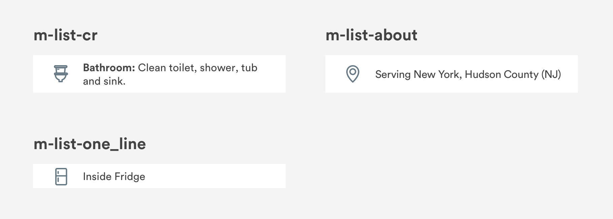
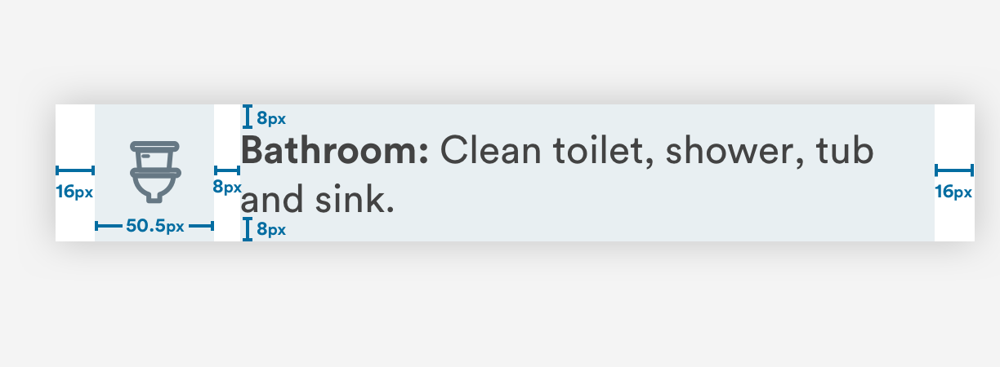

# Icon Lists

## Usage of Icon Lists

Icon lists are unordered lists with a line icon component placed to the left. The icon used should be the most accurate visual representation of the information on the list. 


## Sketch Library Components

Naming conventions for icon lists in the Sketch Master Symbols file.



## Anatomy of Icon Lists



### 1. Icon \(a-cr\_icons/...\)

```text
max-width: 50.5px
padding-left: 16px
padding-right: 8px
fill-color: #667884
```

### 2. Text

Optional: Bold text for list item title

```text
top-padding: 8px
bottom-padding: 8px
padding-right: 16px
font-size: 16pt
font-color: #434343
```


