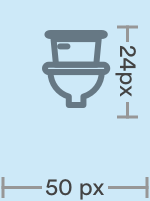

# Icon Lists

## Usage of Icon Lists

Icon lists are unordered lists with a line icon component to the left. The icon used should be the most accurate visual representation of the information on the list. 


## Sketch Library Components

Naming conventions for icon lists in the Sketch Master Symbols file.


## Anatomy of Icon Lists


### 1. Icon \(a-cr\_icons/...\)

```text
max-width: 51px
padding-left: 16px
padding-right: 16px
fill-color: #667884
```



### 2. Text


```text
padding-right: 16px
```


