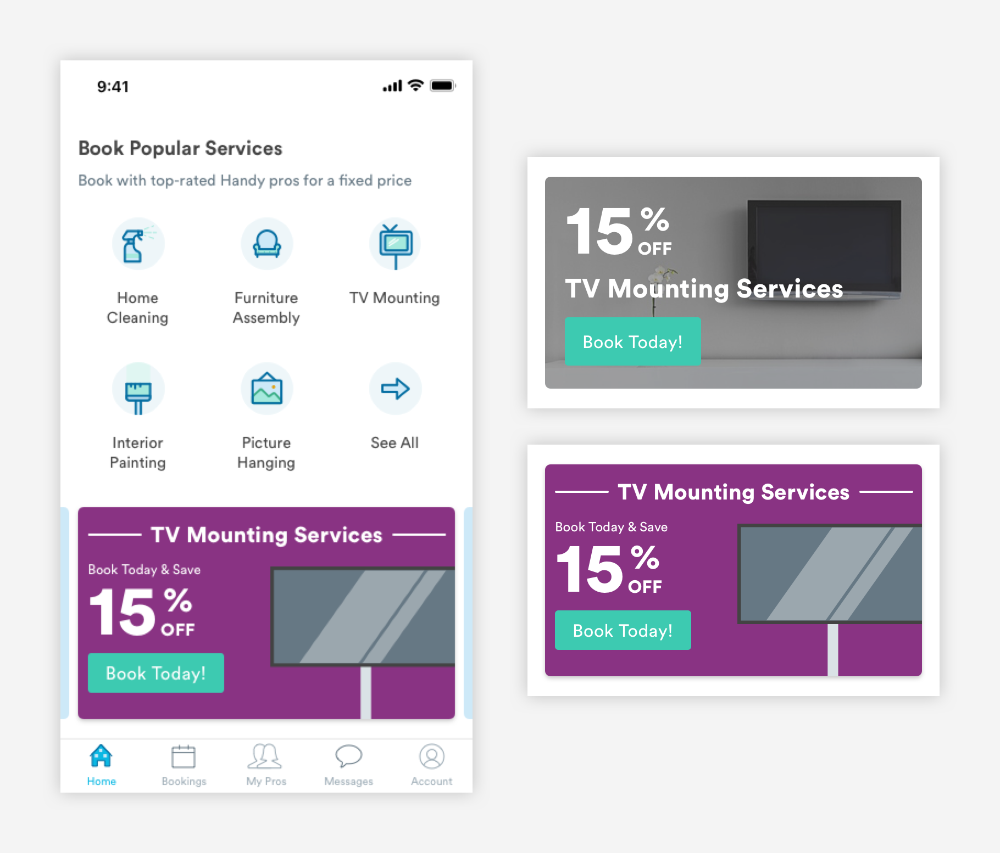

# Marketing

## Usage of Marketing Components

Marketing components are used to highlight different feature of the app or advertise a promotion. 


## Types of Marketing Components

\*\*\*\*[**1. Announcements \(m-marketing-announcement\)** ](marketing.md#announcements-m-marketing-announcement)



\*\*\*\*[**2. Feature \(m-marketing-feature\)**](marketing.md#feature-marketing-m-marketing-feature)


## Announcements \(m-marketing-announcement\)

Announcement components are used for promotional content like discounts on services. The design can be illustration or photography and it must contain clear copy and a CTA.


1. Container

```text
max-width: 100% (343px)
max-height: 193px
```

2. Copy for the announcement must be very clear. For promotions, the discount must be emphasized.

3. CTA  
The Small Size buttons can be used in the creative. The color can be anything in the Handy palette.

```text
max-height: 44px
width: 109px
border-radius: 3px
border: 1px
font-family: Circular
font-size: 16px
```

## Feature Marketing \(m-marketing-feature\) 

Product Marketing components are used to promote different features of the app, such as Pro Search or one-time cleaning bookings.


1. Container

```
background-color: blue-light 
max-width: 100% (343px)
```

2. Header \(a-text-h3\)

```text
font-weight: bold
font-size: 16px
font-color: text-black
max-width: 62.39% (214px)

padding-top: 16px
padding-bottom: 8px
padding-right: 8px
padding-left: 12px
```

3. Text \(a-text-tert\)

```text
font-weight: book
font-size: 14px
font-color: slate-dark

padding-bottom: 16px
padding-right: 8px
padding-left: 12px
```

4. Button \(a-button-tertiary-small\)

```text
max-width:  31.78% (109px)
max-height: 44px
background-color: blue-medium

font-weight: book
font-size: 16px
font-color: white
padding-top: 12px
padding-bottom: 12px
```

5. Image

```text
width: 28.28% (97px)
```

