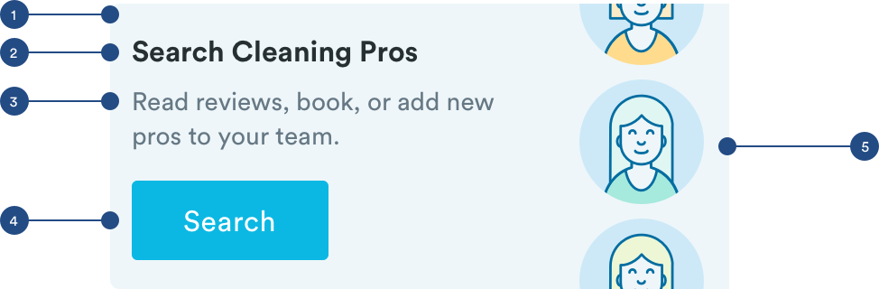

# Marketing

## Usage of Marketing Components

Marketing components are used to highlight different feature of the app or advertise a promotion. 

## Announcements \(m-marketing-announcement\)

Announcement components are used for promotional content like discounts on services.

## Product Marketing \(m-marketing-feature\) 

Product Marketing components are used to promote different features of the app, such as Pro Search or one-time cleaning bookings.



1. Container

```
background-color: blue-light 
max-width: 100% (343px)
```

2. Header \(a-text-h3\)

```text
font-weight: bold
font-size: 16px
font-color: text-black
max-width: 62.39% (214px)

padding-top: 16px
padding-bottom: 8px
padding-right: 8px
padding-left: 12px
```

3. Text \(a-text-tert\)

```text
font-weight: book
font-size: 14px
font-color: slate-dark

padding-bottom: 16px
padding-right: 8px
padding-left: 12px
```

4. Button \(a-button-tertiary-small\)

```text
max-width:  31.78% (109px)
max-height: 44px
background-color: blue-medium

font-weight: book
font-size: 16px
font-color: white
padding-top: 12px
padding-bottom: 12px
```

5. Image

```text
width: 28.28% (97px)
```

