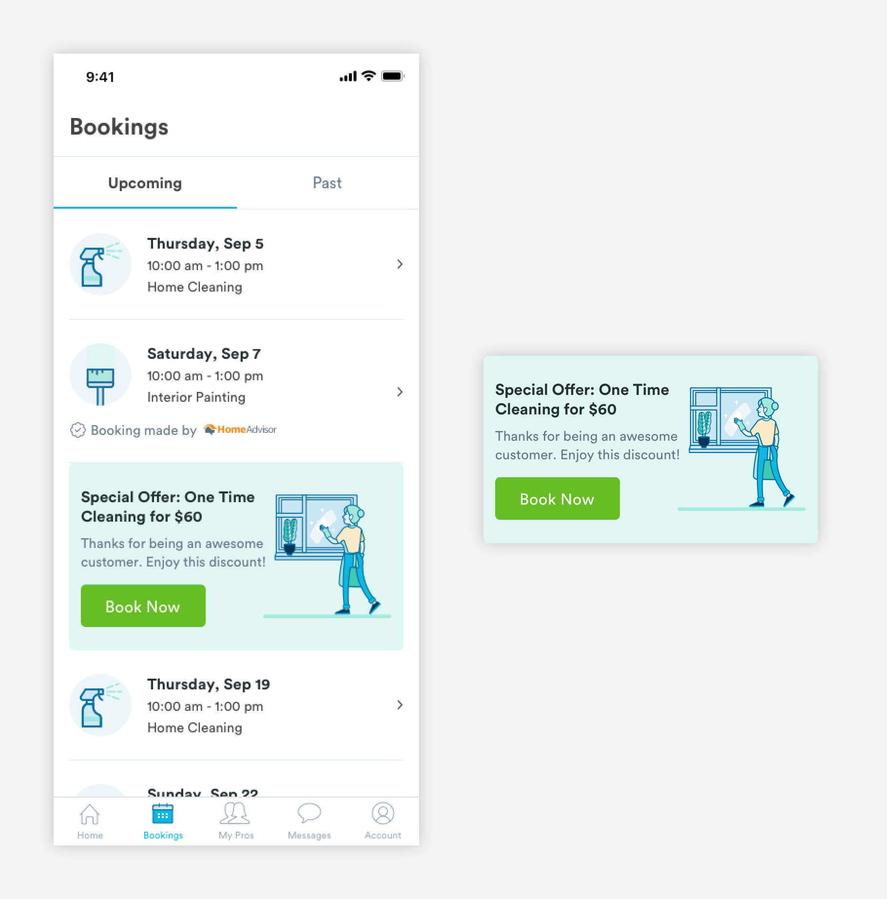

# Marketing

## Usage of Marketing Cards

Marketing components are used to highlight different feature of the app or advertise a promotion. 


## Anatomy of Marketing Cards

Product Marketing components are used to promote different features of the app or a promotional offer, such as Pro Search or one-time cleaning bookings.




**1. Container**

```
background-color: any color of Handy palette.
max-width: 100% (343px)
```

**2. Header \(a-text-h4\)**

```text
font-weight: bold
font-size: 16px
font-color: text-black
max-width: 62.39% (214px)

padding-top: 24px
padding-bottom: 8px
padding-left: 12px
```

**3. Text \(a-text-tert\)**

```text
font-weight: book
font-size: 14px
font-color: slate-dark

padding-bottom: 16px
padding-right: 8px
padding-left: 12px
```

**4. CTA \(a-button-small-primary-50\)**

```text
max-width:  50% (168px)
    - (Can be variable width to accomodate imagery)
max-height: 44px
background-color: green-medium

font-weight: book
font-size: 16px
font-color: white
padding-top: 12px
padding-bottom: 12px
```

**5. Image**  
Image must be included to give the card visual interest. No specified width but cannot exceed past the container or bleed into the text.

