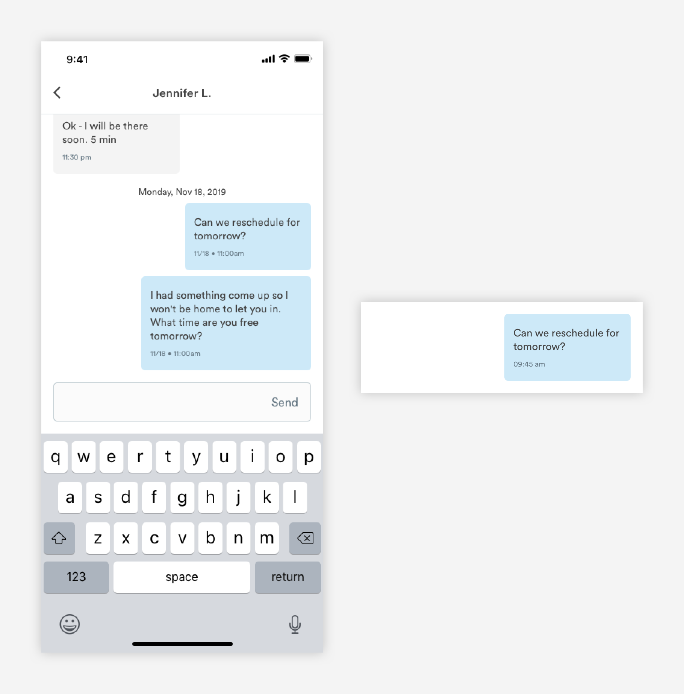
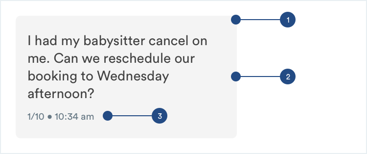

# Message Bubbles

## Usage of Message Bubbles

Message bubbles include the message from the user and the time it was sent. Depending on the context and length of the messages, the style of message bubble changes.


## Types of Message Bubbles

[**1. Sent Messages \(m-message-sent\)**](message-threads.md#sent-messages-m-message-sent)\*\*\*\*



\*\*\*\*[**2. Received Messages \(m-message-received\)**](message-threads.md#received-messages-m-message-received)


## Sent Messages \(m-message-sent\)

When a user is sending the message to another message, that message will be populated in the chat detail view. Depending on the length of the message, the UI's max width will change.


1. Background

```text
background: blue-light 
border-radius: 5px

m-message-sent-long:
max-width: 66.667% (excluding margins)

m-message-sent-medium:
max-width: 50% (excluding margins)

m-message-sent-short:
max-width: 33.333% (excluding margins)
```

2. Message Text \(a-text-paragraph\)

```text
font-weight: book
font-size: 16px
font-color: text-black

padding-top: 16px
padding-left: 12px
padding-right: 12px
padding-bottom: 8px
```

3. Time Stamp \(a-text-label\)

```text
font-weight: book
font-size: 10px
font-color: slate-dark

padding-bottom: 16px
```

## Received Messages m-message-received

Received messages will adopt most of the stylings of sent messages.



1. Background

```text
background: dark-white 
border-radius: 5px

m-message-sent-long:
max-width: 66.667% (excluding margins)

m-message-sent-medium:
max-width: 50% (excluding margins)

m-message-sent-short:
max-width: 33.333% (excluding margins)
```

2. Message Text \(a-text-paragraph\)

```text
font-weight: book
font-size: 16px
font-color: text-black

padding-top: 16px
padding-left: 12px
padding-right: 12px
padding-bottom: 8px
```

3. Time Stamp \(a-text-label\)

```text
font-weight: book
font-size: 10px
font-color: slate-dark

padding-bottom: 16px
```

