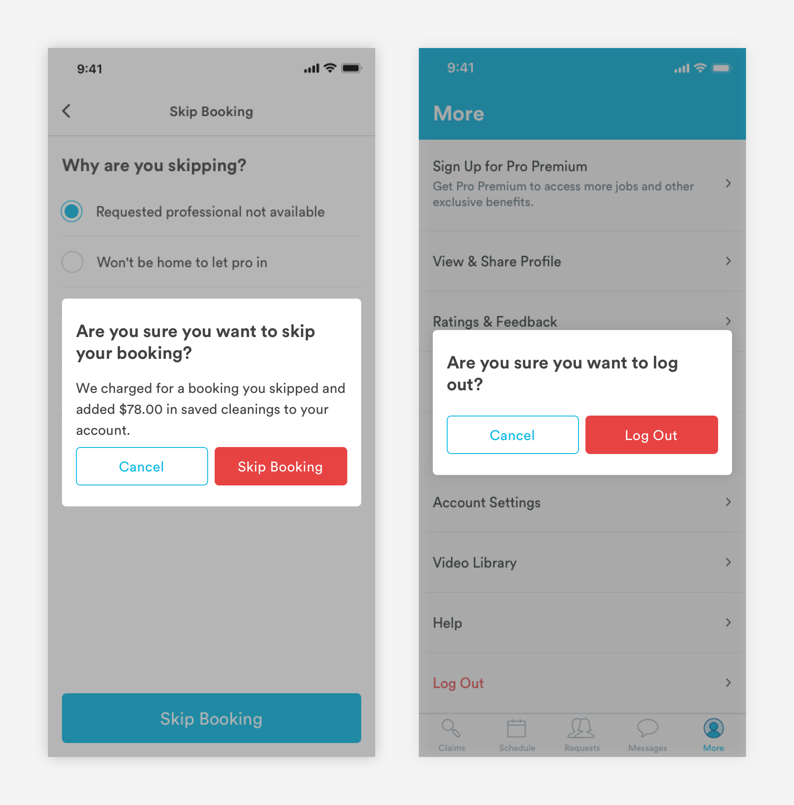
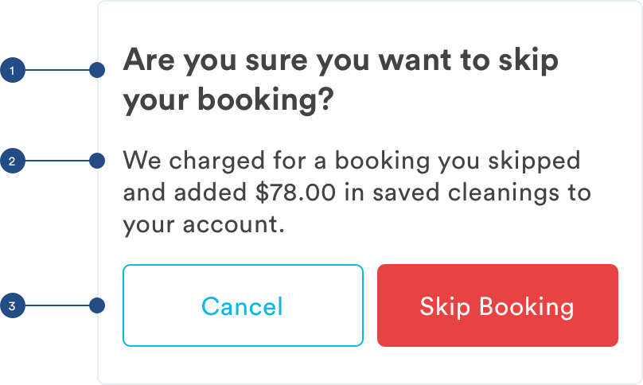

# Modal

## Usage of Modals

Modals disable all app functionality and remain on the screen until a required action has been taken. 



## Anatomy of Modals \(m-modal\)

Due to its disruptive nature, modals should be used sparingly. Examples include abandoned checkout,  Handy Select booking cancellation, late fees, plan cancellation, and sign out.



1. Modal title \(a-text-h2\)

```text
font-weight: bold
font-size: 24px;
font-color: text-black

padding-left: 16px
padding-right: 16px
padding-top: 24px
```

2. Content \(a-text-paragraph\)

```text
font-weight: book
font-size: 16px
font-color: text-black
line-height: 1.5
padding: 16px
```

3. CTA Group

```text
Primary CTA:
max-width: 151.5px
max-height: 52px
border-radius: 5px
color: red-medium
​
font-family: book
font-size: 16px;
font-color: white
padding: 16px

Secondary CTA:
max-width: 151.5px
max-height: 52px
border: 1px
border-radius: 5px
color: blue-medium
​
font-family: book
font-size: 16px;
font-color: blue-medium
padding: 16px
```

