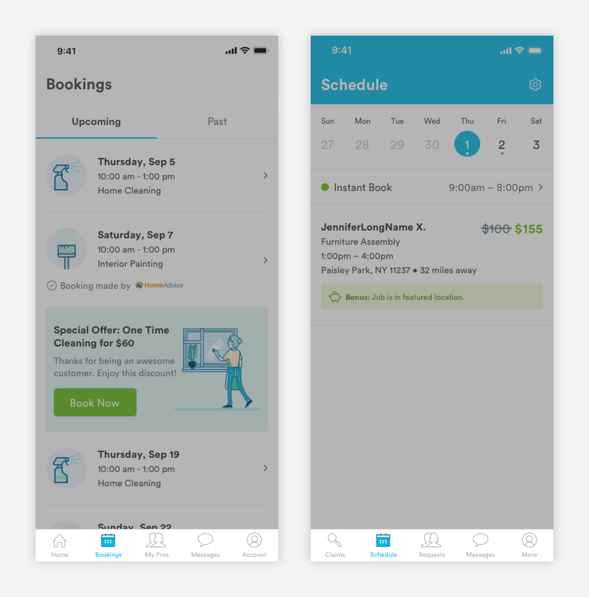

# Navigation

## Usage of Navigation

The navigation bar is anchored to the bottom of the screen and allows users to navigate between major places on the app. The navigation bar slides down when a user goes through a flow or a subpage. 



## Anatomy of Navigation Bar


1. Selected: When a user is on a page, icon will be replaced with it's active state.

```text
a-text-label-blue:
font-color: blue-medium
```

2. Unselected: Default state of icon

```text
a-text-label-slate:
font-color: slate-medium
```

3. Structure: 

```text
max-width: 100%
max-height: 50px
border-top: 1px, slate-light-medium
```

### Active Icon States

Folders include PNGs, SVG, and PDF files of each icon.











### Inactive Icon States

Folders include PNGs, SVG, and PDF files of each icon.











